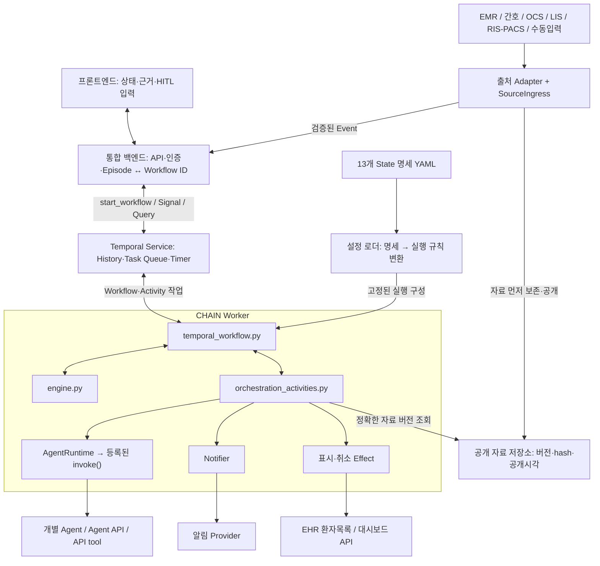

# CHAIN Temporal v0.3

CHAIN은 외부 기록·검사 Event를 받아 Context와 State를 관리하고 Agent 호출과
의료진 확인(HITL)을 진행하는 Orchestrator다. 실행 흐름과 권한은 YAML로 정의하며,
Temporal Workflow와 Worker가 Event·Activity·Timer를 처리한다.

Screening과 tPA는 입력별 합성 출력 파일을 사용한다. Summary는 요청 범위의 구조화 자료를
조합하고, 알림과 EHR 표시·취소는 SQLite에 Mock 기록을 남긴다.
HTTP API, 사용자 인증, 프론트엔드와 병원 시스템 연결은 별도 구현이 필요하다.

데모 실행기·가상 병원·콘솔은 `demo/`에 있다. 백엔드 연결에는 `chain_demo.worker`와
Temporal Client의 Workflow 시작·Signal·Query를 사용한다.

| 내용 | 문서 |
|---|---|
| 설치와 Workflow 실행 | [설치](#3-설치와-worker-실행), [데모](#4-데모로-전체-workflow-실행) |
| Episode 생성·상태 조회·HITL 응답 | [백엔드·프론트엔드 연결](#5-백엔드와-프론트엔드-연결) |
| Agent 입출력·구현 등록 | [Agent 연결](#6-agent-구현-연결) |
| 자료 수집·알림·EHR 표시 | [병원 API](#7-병원-apiapi-tool-연결), [Notifier](#8-notifier-연결), [표시·취소](#83-ehr-표시대시보드-활성화와-취소) |
| State·전이조건·Agent·Tool 변경 | [YAML 사용법](#9-yaml로-state분기agent를-바꾸기) |

## 1. 작업별 참고 코드

| 작업 | 참고 코드 | 연결·수정 지점 |
|---|---|---|
| Workflow·Worker 구성 | [worker.py](chain_demo/worker.py), [orchestration_activities.py](chain_demo/orchestration_activities.py) | `create_worker()`에서 Runtime·Store·Notifier·표시 Adapter 조립, Activity 등록 |
| Episode 생성·상태 조회 | [temporal_workflow.py](chain_demo/temporal_workflow.py), [source_contracts.py](chain_demo/source_contracts.py) | 초기 입력 검증, `start_workflow()`, `snapshot` Query |
| Event 수신·자료 조회 | [adapters/ingress.py](chain_demo/adapters/ingress.py), [contracts.py](chain_demo/contracts.py) | `SourceIngress.receive()`, `submit_event` Signal, `resolve_source()` |
| 원천자료 수집·버전 저장 | [adapters/](chain_demo/adapters/), [source_contracts.py](chain_demo/source_contracts.py) | 출처별 `publish()`, Store의 `publish()/resolve()`, 공유·영속 저장소 연결 |
| HITL 화면·결정 응답 | [contracts.py](chain_demo/contracts.py), [temporal_workflow.py](chain_demo/temporal_workflow.py) | 고정 근거 표시, 결정·역할·확인사항 검증, `submit_decision` Signal |
| Agent 구현·API 호출 | [stroke_screening.py](chain_demo/agents/stroke_screening.py), [tpa_decision_support.py](chain_demo/agents/tpa_decision_support.py), [agents/runtime.py](chain_demo/agents/runtime.py) | 등록 모듈의 `invoke(request, snapshot, services)` 구현 |
| Context 구조화·캐시 | [clinical_summary.py](chain_demo/agents/clinical_summary.py), [agents/services.py](chain_demo/agents/services.py) | 요청 범위 구조화, Snapshot·scope·구현 버전별 캐시 |
| Agent 등록·호출 설정 | [agents_v03.yaml](config/agents_v03.yaml), [plugins.yaml](config/plugins.yaml), [policy_v03.yaml](config/policy_v03.yaml), [workflow_v03.yaml](config/workflow_v03.yaml) | 구현·버전·권한·mode·입출력·호출 시점 등록 |
| State·분기·타이머 정의 | [workflow_v03.yaml](config/workflow_v03.yaml), [state_specification.py](chain_demo/state_specification.py), [policy_v03.yaml](config/policy_v03.yaml) | 13개 State 명세, Event 조건·Action·전이·timeout 설정 |
| 알림 Provider 연결 | [notifier.py](chain_demo/notifier.py), [orchestration_activities.py](chain_demo/orchestration_activities.py) | `record()` 구현 교체, 발송·receipt 계약과 재시도 중복 방지 |
| EHR·대시보드 표시 연결 | [effects.py](chain_demo/effects.py), [effect_contracts.py](chain_demo/effect_contracts.py), [worker.py](chain_demo/worker.py) | 표시 Adapter 주입, 작업·대상·버전·receipt 검증 |

[engine.py](chain_demo/engine.py)는 State 전이, Context 반영, Agent 결과와 HITL 결정 수락을 처리한다.
지원 문법 안의 흐름 변경은 YAML과 등록 모듈로 구성한다.
외부 API 호출과 Agent 구현은 Worker/Activity 계층에 둔다.

## 2. 실행 구조



Workflow와 Activity는 Worker에서 실행한다. Temporal Service는 실행 이력, Task Queue와 Timer를 관리한다.
백엔드가 Episode별 Workflow를 시작하면 Engine이 생성된다.
Event와 의료진 결정은 Signal로 입력하고, 상태와 근거는 Query로 조회한다.

## 3. 설치와 Worker 실행

모든 명령은 프로젝트 루트에서 실행한다. Python 3.11 이상을 지원하며 3.12를 권장한다.
데모는 패키지 설치 후 [4절](#4-데모로-전체-workflow-실행)의 명령으로 실행한다.
백엔드 연결 시에는 3.2–3.4절에 따라 Service와 Worker를 별도로 구성한다.

### 3.1. Python 패키지 설치

```bash
python3.12 -m venv .venv
.venv/bin/python -m pip install -r requirements.txt
```

[requirements.txt](requirements.txt)는 Temporal Python SDK와 PyYAML을 설치한다.
Agent·병원 API에서 사용하는 SDK와 HTTP 클라이언트는 의존성에 추가한다.

### 3.2. 초기 입력 준비

Episode의 초기 입력은 생성 시점에 알려진 8개 필드로 구성한다.
Workflow는 `initial` 객체를 받으며, 백엔드는 DB·병원 시스템의 값으로 이 객체를 구성한다.
[initial.json](episodes/stroke_reference_001_v03/initial.json)은 같은 형식을 사용하는 데모용 합성 데이터다.
필드별 제약과 Workflow 시작 함수는 [5.1절](#51-episode-생성)에 있다.

```text
site_id, patient_id, encounter_id, episode_id, age, sex, bed, arrival_time
```

기록·검사결과는 생성 후 Event로 유입시킨다. 허용 필드는 [source_contracts.py](chain_demo/source_contracts.py)의
`validate_initial()`로 검증한다.

Worker CLI와 터미널 연결 예제는 초기 입력 파일을 사용한다.
다음 명령은 합성 식별자와 현재 도착시각으로 `runtime/initial.json`을 생성한다.
같은 경로에 파일이 있으면 생성이 중단된다.

```bash
.venv/bin/python - <<'PY'
import json
from datetime import datetime, timezone
from pathlib import Path
from chain_demo.data_io import load_initial

initial = load_initial("episodes/stroke_reference_001_v03/initial.json")
initial["arrival_time"] = datetime.now(timezone.utc).isoformat()
Path("runtime").mkdir(exist_ok=True)
with Path("runtime/initial.json").open("x", encoding="utf8") as stream:
    json.dump(initial, stream, ensure_ascii=False, indent=2)
PY
```

### 3.3. Temporal Service 시작 — 터미널 A

로컬 개발 서버는 Temporal CLI로 시작한다. macOS에서는 `brew install temporal`로 설치한다.
기존 Service를 사용할 경우 아래 개발 서버 시작 단계를 생략하고 해당 주소를 지정한다.
설치 옵션은 [Temporal CLI 문서](https://docs.temporal.io/cli/setup-cli)를 참고한다.

```bash
temporal server start-dev --db-filename runtime/temporal.db
```

기본 주소는 `127.0.0.1:7233`, namespace는 `default`, UI는 `http://localhost:8233`이다.

### 3.4. CHAIN Worker 시작 — 터미널 B

```bash
.venv/bin/python -m chain_demo.worker \
  --address 127.0.0.1:7233 \
  --task-queue chain-v03 \
  --initial runtime/initial.json \
  --receipt-db runtime/notices.sqlite
```

`Worker ready` 출력 후 백엔드에서 Episode별 Workflow를 시작한다.
Worker는 실행 중인 Workflow와 Activity의 작업을 계속 처리한다.

기본 CLI는 한 Episode의 메모리 Store를 구성한다. 자료 공개 API와 복수 Episode 라우팅은
[7절](#7-병원-apiapi-tool-연결)의 저장소·Activity 경계에서 구현한다.
재시작 후 자료 조회를 위해서는 Temporal DB와 별도로 원천자료를 영속화해야 한다.
namespace·TLS·API key 설정은 `worker.serve()`와 백엔드의 `Client.connect()`에 적용한다.
기본 CLI는 이 연결 옵션을 제공하지 않는다.

## 4. 데모로 전체 Workflow 실행

### 4.1. 데모 구성

데모 실행에 사용하는 코드와 합성 자료는 다음과 같다.

```text
README.md, requirements.txt
chain_demo/                          공통 엔진·Worker·Workflow·Activity·연결 계약
config/                              Workflow·Agent·Policy·Plugin Registry
demo/                                실행기·콘솔·Simulator·Replay·시나리오·사용 안내
episodes/stroke_reference_001_v03/
  initial.json                       생성 시점의 합성 초기 입력
  sources/                           나중에 공개할 합성 원천자료
  simulation.yaml, provenance.json   가상 병원의 선행 사건·상대시간·자료 출처
  fixtures/cli/                      현재 Mock Agent의 입력별 출력과 설치 manifest
```

`demo/`는 가상 병원의 Event와 콘솔의 의료진 결정을 엔진에 입력한다.
백엔드와 병원 Adapter도 같은 Event·HITL 계약을 사용한다.

### 4.2. 콘솔에서 직접 실행

다음 명령은 임시 Temporal Service, Worker, Simulator와 콘솔을 함께 시작한다.
첫 실행에는 SDK가 Temporal 실행 파일을 내려받을 수 있다.

```bash
.venv/bin/python -m demo \
  --backend temporal --start-local \
  --test-mode --test-timer-scale 0.01 \
  --run-timeout 1800 \
  --output-dir "output/demo-$(date +%Y%m%d-%H%M%S)"
```

| 옵션 | 동작 |
|---|---|
| `--test-mode` | 합성 에피소드의 가상 시계 사용 |
| `--test-timer-scale 0.01` | Workflow 타이머를 100배 단축. 10분 재요청 타이머는 실제 6초 |
| `--run-timeout 1800` | 최대 30분 실행. 시간 초과 시 부분 결과 보존 |
| `--output-dir` | 실행 결과 저장 경로. 실행마다 새 경로 지정 |

기존 Service에 연결하려면 `--start-local`을 `--address 127.0.0.1:7233`으로 바꾼다.
Service·Worker·Signal·Activity·Timer는 실제 Temporal에서 실행한다.
병원 자료와 Screening/tPA 출력은 합성이며, 알림과 EHR 표시는 Mock으로 기록한다.

의료진 결정은 `DEMO_DECISION_READY` 표시 후 입력한다. 이 시점은 제공된 fixture의 입력·평가시각에 맞춰져 있다.

### 4.3. 화면을 따라 진행하기

| 순서·State | 엔진과 가상 병원의 처리 | 콘솔에서 확인·입력할 내용 |
|---|---|---|
| 1. S0 | 초기 식별정보로 시작. 초진기록이 공개된 뒤 Summary와 Stroke Screening 실행 | 자료의 출처·시각과 Screening 결과 확인. 기본 시나리오는 POSITIVE |
| 2. S1 / HITL #1 | Screening POSITIVE 후 EHR 플래그·대시보드 표시와 준비 알림을 Mock 기록하고, 고정 근거로 CT 경로 결정 요청. 선행 채혈에 따른 CBC/COAG는 입력 대기 중에도 유입 | 표시·알림의 `MOCK_RECORDED` 확인. `DEMO_DECISION_READY \| HITL_1_PROCEED_TO_CT`를 기다린다. `PROCEED_TO_CT` 또는 1 → `EM_PHYSICIAN` 또는 1 → 모의 ID → 사유 입력 |
| 3. S2 | HITL #1 승인 후 진입. 가상 의료진이 OCS 오더를 입력하고 새 근거마다 tPA interim 실행 | 오더·검사 수신 기록과 미확보 항목 확인. CHAIN이 CT 오더를 생성하는 동작은 없음 |
| 4. S2_1 | 해당 NCCT 완료와 오더 일치로 진입. tPA final 결과를 수락한 뒤 HITL #2 요청 | 오더 일치와 NCCT 완료 확인. 고정 근거의 미확보·충돌 항목 확인 |
| 5. HITL #2 | 최종 시행 계획에 대한 의료진 결정 대기 | `DEMO_DECISION_READY \| HITL_2_THROMBOLYSIS`를 기다린다. YES/NO/HOLD 선택 → YES이면 네 확인사항 → `NEUROLOGIST` 역할 → 모의 ID → 사유 입력 |
| 6. 경로 완료 | YES면 S3, NO면 S3N. 감사 기록과 실행 결과 저장 | `RUN_OUTCOME \| COMPLETED`, 최종 State와 `REAL_HISTORY_REPLAY \| PASSED` 확인 |

YES의 입력 코드는 `THROMBOLYSIS_YES`이고 NO는 `THROMBOLYSIS_NO`다.
YES에는 설정된 네 확인사항이 필요하다: `NCCT_NO_HEMORRHAGE_PHYSICIAN_READ`,
`LKW_RECONFIRMED_WITH_FAMILY`, `BP_RECHECK_BELOW_185_110`, `NO_ANTICOAGULANT_RECONFIRMED`.
데모의 역할·확인 입력은 합성이며 사용자 인증과 치료 수행은 포함하지 않는다.

| 다른 선택·상황 | 동작 |
|---|---|
| Screening NEGATIVE | S0X에서 경로 종료. 선택한 합성 입력을 지원하는 fixture가 있어야 함 |
| HITL #1 `NOT_STROKE_PATHWAY` | S1X에서 S1의 EHR 플래그·대시보드 표시를 취소하고 세 준비 취소 알림을 Mock 기록한 뒤 경로 종료 |
| HITL #1 `DEFER` | S1 유지 → 재요청 타이머 → 새 HITL #1 요청 |
| HITL #2 `HOLD` | S2_1 유지 → 재요청 타이머 → 새 HITL #2 요청 |
| `docs` / `json` | 현재 요청에 고정된 문서 전문 / 전체 근거 JSON 보기 |
| `q` | 결정을 생성하지 않고 콘솔 입력 종료. 부분 결과 저장 |

HOLD/DEFER 후에는 현재 State와 재요청 타이머가 표시된다. 남은 시간은 실제 Temporal 경과시간을 기준으로 하며,
History에서 Timer 발생이 확인될 때까지 0초는 만료 처리 대기로 표시한다.
재요청에는 새 Request ID를 사용한다. 일반 자료 추가는 열린 HITL의 고정 근거를 유지한다.

준비 취소 알림은 종료를 알리는 별도 요청이다. 기존 메시지를 회수하지 않는다.
표시·취소와 알림은 Mock 기록만 남긴다. Summary 준비 실패 시 HITL은 열리지 않으며,
종료 State에서 완료된 Workflow는 후속 Event를 계속 수신하지 않는다.

### 4.4. 입력 없이 자동 확인하고 결과 읽기

기록된 합성 응답으로 실행하려면 `--test-mode`와 recorded 모드를 지정한다.

```bash
.venv/bin/python -m demo \
  --backend temporal --start-local --test-mode \
  --hitl recorded \
  --recorded demo/scenarios/recorded_hitl.json \
  --expected demo/scenarios/expected.json \
  --run-timeout 180 \
  --output-dir "output/demo-check-$(date +%Y%m%d-%H%M%S)"
```

기본 경로는 `S0 → S1 → S2 → S2_1 → S3`다. 완료 시 종료코드 0과 `RUN_OUTCOME | COMPLETED`가 출력된다.
fixture가 없는 입력은 `FIXTURE_NOT_FOUND` 등 시험 오류로 처리한다.
Local Engine만 실행하려면 `--backend local`로 변경하고 `--start-local`을 제거한다.

| 출력 파일 | 확인할 내용 |
|---|---|
| `outcome.json`, `snapshot.json` | 성공·실패·중단, 최종 State, Context·Agent·HITL·audit |
| `commands.jsonl`, `manifest.json` | 요청·응답, 실제 Activity 실행/재시도 정보, 고정된 구성·구현 버전 |
| `publications.json`, `simulation.json` | 자료 공개와 실제 관찰한 가상 병원 사건 |
| `comparison.json` | `--expected`를 사용한 실행의 사후 비교 |
| `temporal_history.json`, `replay.json` | 실제 실행 History와 결정적 Replay 결과 |
| `notices.sqlite` | Mock 알림 receipt, 표시·취소 receipt와 최종 Mock 표시 상태 |

실행 완료 여부는 `outcome.json`, History 재생 결과는 `replay.json`에서 확인한다.
중단된 실행도 부분 History Replay가 통과할 수 있다.
임시 Service는 데모 종료 시 종료된다. 추가 옵션과 Replay 명령은 [demo/README.md](demo/README.md)에 있다.

## 5. 백엔드와 프론트엔드 연결

### 5.1. Episode 생성

#### 초기 입력

생성 handler는 다음 8개 필드의 JSON 객체/Python dict를 구성해 `initial` 인자로 전달한다.
HTTP endpoint, 인증과 DB 저장은 백엔드에서 구현한다.

| 필드 | 형식·현재 검증 | 백엔드가 넣을 값 |
|---|---|---|
| `site_id` | 비어 있지 않은 문자열. Workflow/Policy의 site_id와 일치 | 기관/사이트 ID |
| `patient_id` | 비어 있지 않은 문자열 | 기관 내 환자 식별자 |
| `encounter_id` | 비어 있지 않은 문자열 | 해당 내원 식별자 |
| `episode_id` | 비어 있지 않은 문자열 | 이번 Orchestrator 실행을 구분하는 Episode ID. 동일 생성 요청의 재시도에서도 유지 |
| `age` | 0이상의 정수. 문자열·소수·bool·null 불가 | 생성 시점에 알려진 나이 |
| `sex` | 비어 있지 않은 문자열. 현재 고정 enum 검증 없음 | 연결 시스템과 합의한 성별 코드. 예: M/F |
| `bed` | 비어 있지 않은 문자열 | 생성 시점에 알려진 병상 ID/표기 |
| `arrival_time` | 시간대가 포함된 ISO8601 문자열 | 해당 내원의 도착시각. Workflow를 시작하는 현재시각과 구분 |

다음은 합성 초기 입력 예제다. `site_id`는 기본 Workflow/Policy 설정과 일치한다.

```json
{
  "site_id": "HYUMC_GURI",
  "patient_id": "TEST-PATIENT-001",
  "encounter_id": "TEST-ENCOUNTER-001",
  "episode_id": "TEST-EPISODE-001",
  "age": 68,
  "sex": "F",
  "bed": "TEST-BED-02",
  "arrival_time": "2026-10-03T09:30:00+09:00"
}
```

8개 필드는 모두 필수이며 추가 key는 거부한다. 기록·검사결과 등 후속 자료는 [7절](#7-병원-apiapi-tool-연결)의 Event 계약으로 입력한다.
초기 입력은 null이나 UNKNOWN/PENDING 상태를 지원하지 않는다. 누락값을 0 등의 값으로 대체하지 않는다.
초기 항목 누락을 허용하려면 입력 계약과 Context 초기화 처리를 함께 확장해야 한다.

`arrival_time`은 실제 내원시각을 사용하며 Workflow 실행시각보다 미래이면 거부한다.
초기 자료의 `known_at`은 Workflow 실행시각으로 기록한다.

#### Workflow 시작 함수

백엔드 기동 시 Temporal Client와 `load_orchestration_bundle()`의 configuration을 준비한다.
생성 handler는 다음 함수로 Workflow를 시작한다. configuration은 백엔드가 관리하는 고정 구성을 사용한다.

```python
from copy import deepcopy
from temporalio.common import WorkflowIDConflictPolicy, WorkflowIDReusePolicy
from chain_demo.source_contracts import validate_initial
from chain_demo.temporal_workflow import ConfigurableClinicalWorkflow


async def start_episode(client, configuration, initial, *, task_queue="chain-v03"):
    validate_initial(initial)
    engine_bundle = configuration["engine"]
    if initial["site_id"] != engine_bundle["workflow"]["site_id"]:
        raise ValueError("Initial site not admitted")
    workflow_id = "chain-" + initial["site_id"] + "-" + initial["episode_id"]
    handle = await client.start_workflow(
        ConfigurableClinicalWorkflow.run,
        {"bundle": deepcopy(engine_bundle), "initial": deepcopy(initial)},
        id=workflow_id,
        task_queue=task_queue,
        id_reuse_policy=WorkflowIDReusePolicy.REJECT_DUPLICATE,
        id_conflict_policy=WorkflowIDConflictPolicy.FAIL,
    )
    return {"episode_id": initial["episode_id"], "workflow_id": handle.id}
```

Workflow 시작 인자는 `{"bundle": 실행 설정, "initial": 초기 입력}`이다.
운영 호출은 테스트용 `test_mode`·`test_now`·`test_timer_scale`을 사용하지 않는다.
Workflow/Engine에서도 초기 입력을 검증하므로 백엔드는 시작 이후 초기화 실패를 실행 상태로 추적한다.

위 함수는 백엔드 응답용 ID를 반환한다. `start_workflow()` 반환 후에는
[5.2절](#52-백엔드-api-내부의-호출)의 `snapshot` Query로 초기화·진행 상태를 조회한다.
기본 Workflow는 S0에서 초진기록을 기다린다. 다른 구성은 지정된 `initial_state`에서 시작한다.

백엔드는 기관·환자·내원·Episode와 Workflow ID의 매핑을 저장하고 후속 Event에 같은 식별자를 사용한다.
생성 재시도는 기존 Episode ID를 유지한다. 중복 시작 오류(`temporalio.exceptions.WorkflowAlreadyStartedError`)나
준비 상태 조회 timeout 시에는 초기 데이터·실행 구성을 대조한 뒤 기존 Workflow를 조회한다.
중복 오류 처리는 위 함수를 호출하는 handler에서 구현한다.

Workflow와 Store·Ingress의 네 식별자는 일치해야 한다. 복수 Episode 구성에서는 공유·영속 저장소와
Activity의 Episode 라우팅을 구현한다. Event 식별자로 해당 Store/view를 선택한 뒤 `resolve_source()`를 호출한다.
Episode 전용 Worker는 Queue를 분리하고, 공용 Worker는 Activity에서 라우팅한다.
Task Queue는 Episode별 Store를 자동 선택하지 않는다.
연결 지점은 [worker.py](chain_demo/worker.py)의 `create_worker()`와 [7.4절](#74-운영-store와-api-tool의-연결-경계)이다.

#### 터미널 연결 확인 — 터미널 C

3.2절에서 만든 `runtime/initial.json`으로 Workflow를 시작한다.

```bash
.venv/bin/python - <<'PY'
import asyncio
from temporalio.client import Client
from temporalio.common import WorkflowIDReusePolicy
from chain_demo.data_io import load_initial
from chain_demo.orchestration_config import load_orchestration_bundle
from chain_demo.temporal_workflow import ConfigurableClinicalWorkflow

async def main():
    initial = load_initial("runtime/initial.json")
    configuration = load_orchestration_bundle()
    client = await Client.connect("127.0.0.1:7233")
    handle = await client.start_workflow(
        ConfigurableClinicalWorkflow.run,
        {"bundle": configuration["engine"], "initial": initial},
        id="chain-" + initial["site_id"] + "-" + initial["episode_id"],
        task_queue="chain-v03",
        id_reuse_policy=WorkflowIDReusePolicy.REJECT_DUPLICATE,
    )
    async with asyncio.timeout(10):
        while True:
            snapshot = await handle.query("snapshot")
            if snapshot.get("state") is not None:
                break
            await asyncio.sleep(0.1)
    print("workflow_id:", handle.id)
    print("state:", snapshot["state"], "done:", snapshot["done"])

asyncio.run(main())
PY
```

초기 결과는 `state: S0 done: False`이며 초진기록 Event를 기다린다.
후속 요청은 저장된 Workflow ID로 `client.get_workflow_handle(workflow_id)`를 조회해 처리한다.
같은 ID의 중복 시작은 오류로 반환된다.

Worker와 백엔드는 같은 실행 설정, Task Queue와 namespace를 사용한다.
설정·구현 버전은 실행별로 고정한다. 새 버전은 새 Queue/Worker로 배포하고 진행 중 실행의 구성은 유지한다.

### 5.2. 백엔드 API 내부의 호출

백엔드의 async handler에서 Temporal Client를 호출하고,
프론트엔드에는 HTTP/WebSocket API로 상태와 입력 경로를 제공한다.

| 백엔드가 받을 요청 | 내부 처리 |
|---|---|
| Episode 생성 | 초기 8필드 검증 → Workflow 시작 → Workflow ID 보존 |
| 새 기록·검사 Event | 자료 공개 → Ingress 검증 → `submit_event` |
| 의료진 결정 | 로그인 사용자·역할 확인 → 응답 검증 → `submit_decision` |
| 범위별 Context 요청 | 요청 ID·scope를 지정해 `request_context` |
| 상태 조회 | `snapshot` Query → 프론트엔드에 전달 |

```python
handle = client.get_workflow_handle(workflow_id)

# SourceIngress.receive()가 반환한 표준 Event
await handle.signal("submit_event", accepted_event)

# 고정된 HITL 요청을 참조하는 의료진 응답
await handle.signal("submit_decision", decision)

# 필요한 항목만 구조화 요청
await handle.signal("request_context", {"request_id": request_id, "scope": scope})

snapshot = await handle.query("snapshot")
```

Signal 전송 후 Event/request ID로 `audit`, `context_requests`, `hitl_history`를 조회해 처리 결과를 확인한다.
API 인증, RPC timeout과 화면 갱신은 백엔드에서 구현한다.

`request_context`는 `request_id`와 비어 있지 않은 중복 없는 `scope` 배열을 받는다.
진행 중 State에서 처리하며 성공 결과는 `snapshot["context_requests"][request_id]`에 저장한다.
저장 항목은 `output`(공통 Agent Result), 입력 `snapshot`, `alias`, `mode`, `generation`이고,
완료 audit는 `STRUCTURED_CONTEXT_SERVED`다. 준비 중·실패를 표현하는 별도 응답 enum은 제공하지 않는다.

```json
{
  "request_id": "UI-CONTEXT-001",
  "scope": ["age", "glucose", "inr"]
}
```

백엔드는 재전송 시 같은 Request ID와 scope를 유지하고, 다른 요청에는 새 ID를 사용한다.
현재 Context 요청에는 동일 ID의 내용 충돌을 거부하는 영속 dedup 계약이 없다.
Summary 실행 실패 audit는 내부 Agent request_id로 기록되며 외부 Context request_id의 실패 응답·연계는
제공되지 않는다. 화면의 실패·대기 표시, 외부/내부 ID 연계와 제한시간은 백엔드에서 구현한다.
`snapshot` Query에는 요청 인자를 보내지 않는다. 주요 반환 항목은 다음과 같다.

| Snapshot 조회 항목 | 프론트·백엔드에서 사용할 내용 |
|---|---|
| `state`, `done`, `state_history` | 현재 State·종료 여부·경로 |
| `facts`, `context_version` | 현재 원천 Context와 버전. Agent 입력의 scoped Snapshot과 구분 |
| `open_hitl` | 열린 결정의 고정 Request·Snapshot·Agent Results |
| `hitl_history`, `context_requests` | 결정 Request ID별 이력·범위별 구조화 성공 결과 |
| `state_specification` | 현재 State의 13개 명세와 자료요건별 실제 Fact·적용 여부·신선도. 명세 형식 Workflow에서 제공 |
| `effects` | 표시·취소의 Mock receipt 목록. 실제 EHR 화면 반영 결과로 해석하지 않음 |
| `audit` | 수신·적용·Agent 결과·결정 수락/거절의 처리 기록 |

HTTP handler와 프론트용 응답 모델은 위 Temporal 계약을 기준으로 구현한다.
RPC별 시간 제한을 설정하고 입력 ID별 audit로 처리 결과를 확인한다.

| 보낸 입력 | 처리 결과를 확인할 audit |
|---|---|
| `submit_event` | `event_id`의 `EVENT_ADMITTED` 이후 `CONTEXT_APPLIED`; 거절/조회 실패는 `EVENT_REJECTED`/`CONTEXT_RESOLUTION_FAILED` |
| `submit_decision` | `request_id`의 `HITL_DECISION_RECORDED` 또는 `HITL_REJECTED` |

관련 자료 정정이 처리 중이면 `HITL_DECISION_DEFERRED_FOR_SOURCE` 이후 최종 결정 결과가 기록될 수 있다.
ID별 수락 결과를 조회하는 구현은 [demo/console.py](demo/console.py)의 `serve_console()`을 참고한다.
콘솔 입력은 데모에서만 사용한다.

### 5.3. HITL 화면과 응답

화면에는 `snapshot["open_hitl"][checkpoint]`의 `status == "OPEN"`인 항목을 표시한다.
결정 근거는 해당 항목의 `request`, 고정 `snapshot`, `results`를 사용한다.

`request`의 schema는 `chain-hitl-request/v0.3`이고 필수 필드는 다음과 같다.

| Request 필드 | 화면·응답 연결 |
|---|---|
| `contract_schema`, `request_id`, `checkpoint` | 계약 버전·결정 요청 ID·결정 지점 |
| `evidence_snapshot_id`, `dependencies`, `result_ids` | 고정 근거 Snapshot hash·Field ref 배열·Agent Result의 request_id 배열 |
| `roles`, `options` | 이 요청에 허용된 역할·결정 코드 배열 |
| `required_confirmations`, `confirmations_on_decisions` | 확인항목과 이를 요구하는 결정 코드 배열 |
| `question` | 표시할 질문 문자열 |

응답은 다음 필드를 포함하며 정확한 검증 규칙은 [contracts.py](chain_demo/contracts.py)의
`validate_hitl_decision_shape()`와 `validate_hitl_decision()`을 따른다.

| 응답 필드 | 채울 값 |
|---|---|
| `contract_schema` | `chain-hitl-decision/v0.3` |
| `request_id`, `evidence_snapshot_id` | 화면에 표시한 고정 요청의 ID |
| `decision` | 해당 요청의 `options` 중 선택한 코드 |
| `actor` | 인증된 사용자의 `role`, `staff_id` |
| `confirmed_items` | 실제 확인한 항목 코드의 중복 없는 문자열 배열. 없는 경우 `[]` |
| `evidence_viewed` | 실제 열람한 고정 Snapshot ID/Result request_id의 비어 있지 않은 중복 없는 배열 |
| `comment`, `recorded_at` | 비어 있지 않은 입력 사유와 timezone을 포함한 응답 시각 |

다음 함수는 선택·확인·열람 기록과 인증된 actor를 응답 dict로 변환한다.
`open_record`에는 Query가 반환한 해당 `open_hitl` 항목을 전달한다.
`evidence_viewed`에는 사용자가 열람한 근거 ID만 포함한다.

```python
from chain_demo.contracts import validate_hitl_decision

def build_decision(open_record, *, choice, actor, confirmed_items,
                   evidence_viewed, comment, recorded_at):
    request = open_record["request"]
    decision = {
        "contract_schema": "chain-hitl-decision/v0.3",
        "request_id": request["request_id"],
        "evidence_snapshot_id": request["evidence_snapshot_id"],
        "decision": choice,
        "actor": {"role": actor["role"], "staff_id": actor["staff_id"]},
        "confirmed_items": confirmed_items,
        "evidence_viewed": evidence_viewed,
        "comment": comment,
        "recorded_at": recorded_at,
    }
    validate_hitl_decision(decision, request)
    return decision
```

백엔드는 사용자 인증·권한·열람 기록을 검증한 뒤 `submit_decision`으로 응답을 보낸다.
엔진은 열린 요청, State, 응답 시각의 유효성을 검사한다.
현재 actor 검증 범위는 역할 문자열이며 사용자 인증은 백엔드에서 구현한다.

HITL #2의 화면 YES/NO는 `THROMBOLYSIS_YES`/`THROMBOLYSIS_NO` 코드로 보낸다.
일반 정보 추가는 열린 요청을 유지한다. 참조 근거의 명시적 정정 등으로 요청이 무효화되면
구 요청의 응답이 거절될 수 있으므로 화면에서도 요청 ID와 상태를 갱신한다.
`DEFER`/`HOLD`는 현재 State를 유지하며 설정된 타이머 후 재확인을 요청한다.

## 6. Agent 구현 연결

### 6.1. Agent 호출 함수

[agents/runtime.py](chain_demo/agents/runtime.py)가 Registry에 등록한 `module:function`을 호출한다.
Agent 모듈의 진입점은 다음 형식의 동기 함수다.

```python
def invoke(request, snapshot, services) -> dict:
    # 1. snapshot["facts"]를 Agent 입력으로 변환
    # 2. 실제 Agent 실행 또는 API 호출
    # 3. 응답 검증 후 도메인 결과 dict 반환
    raise NotImplementedError("Agent 구현 또는 API 호출을 연결하세요")
```

| 입력·출력 | 계약 |
|---|---|
| `request` | `request_id`, Agent ID/version, `mode`, `scope`, 입력 Snapshot ID, 근거 의존성, 평가시각 |
| `snapshot["facts"]` | 요청 scope의 자료만 포함. 각 항목의 `value`, `status`, 원천 버전·시각을 함께 확인 |
| `services` | 현재 `cache`/`backend`만 제공. API client가 필요하면 [services.py](chain_demo/agents/services.py)와 Runtime의 서비스 생성 경계를 확장 |
| 반환값 | Workflow의 `agents.<alias>.outputs.<mode>`에 맞는 도메인 결과 dict |

Agent 함수는 검증한 도메인 결과 dict를 반환하고, Runtime이 식별자·status·evidence를 포함한
공통 Result envelope를 조립한다. 미확보 자료의 UNKNOWN/PENDING 상태는 그대로 유지한다.
출력·업무 검증 실패는 `ValueError`로 전달한다. 오류 dict를 반환하면 Runtime이 성공 결과로 감쌀 수 있다.
통신 예외는 Activity 실패·재시도로 전달되므로 API client에 timeout과 `request_id` 기반 중복 방지를 구현한다.

현재 Runtime은 동기 entrypoint만 호출한다. 비동기 SDK를 사용하려면 Activity/Runtime의 호출 경계를 확장해야 한다.
Summary는 요청 범위의 원천 facts를 구조화하고 Snapshot·scope·구현 버전 기준으로 캐시한다.
Structured Context의 값은 원천 facts와 일치해야 하며, 현재 구현은 NLP 추론을 지원하지 않는다.

### 6.2. 공통 입력과 공통 응답

입출력 계약은 [contracts.py](chain_demo/contracts.py)의 `validate_agent_request()`,
`validate_snapshot()`, `validate_agent_result()`가 검증한다. 각 객체는 JSON으로 직렬화 가능한 dict이며,
표에 명시한 필수·선택 필드 외의 최상위 key는 거부된다. 시각은 timezone을 포함한 ISO8601 문자열,
hash는 `sha256:` 접두어와 소문자 16진수 64자리로 표현한다. `NaN`과 무한대는 허용하지 않는다.

Agent 함수가 받는 `request`

| 필드 | 형식·채우는 주체 |
|---|---|
| `contract_schema` | 고정 문자열 `chain-agent-request/v0.3` |
| `request_id` | 엔진이 만든 요청 ID. 재시도에도 같은 ID를 사용 |
| `agent_id`, `agent_version` | Catalog·Registry의 등록 ID/version과 같은 문자열 |
| `manifest_hash` | 호출한 설치 구현의 manifest hash |
| `mode` | 등록된 mode 문자열. 현재 `context`, `screening`, `interim`, `final` |
| `input_snapshot_id` | 아래 `snapshot.snapshot_id`와 같은 hash |
| `scope` | 요청 항목 이름의 비어 있지 않은 중복 없는 문자열 배열 |
| `dependencies` | Fact에 dependencies가 있으면 그 배열, 없으면 source_ref를 모은 합집합과 정확히 같은 중복 없는 배열 |
| `evaluated_at` | 평가시각. wire validator에서는 선택이지만 실제 Worker 호출에는 필수 |

Agent 함수가 받는 `snapshot`

| 필드 | 형식·규칙 |
|---|---|
| `contract_schema` | `chain-context/v0.3` |
| `snapshot_id` | 이 객체에서 `snapshot_id` 자신을 제외해 계산한 canonical hash |
| `known_at` | 이 Snapshot까지 알려진 자료의 기준 시각 |
| `facts` | `{항목 이름: Fact}`. 실제 Runtime은 key 집합이 request.scope와 정확히 같은 입력만 허용 |

Fact는 값과 상태, 출처 참조, 원천 시각, 알려진 시각을 함께 보존한다. 합성 Episode의 나이 항목은 다음과 같다.

```json
{
  "value": 68,
  "status": "AVAILABLE",
  "source_ref": {
    "system": "CHAIN_INITIAL",
    "record_id": "EP-HYG-261006-058",
    "version": 1,
    "field": "age"
  },
  "source_time": "2026-10-06T15:12:41+09:00",
  "known_at": "2026-10-06T15:12:41+09:00"
}
```

| Fact 필드 | 형식·규칙 |
|---|---|
| 필수 `value` | JSON 값. 미확보면 `null`. `false`, `0`, `null`을 구분 |
| 필수 `status` | 비어 있지 않은 문자열. 현재 `AVAILABLE`, `UNKNOWN`, `PENDING`, `CONFLICT`, `ERROR`, `RETRACTED`, `INVALIDATED`, `NO_EVIDENCE` 등을 사용 |
| 필수 `source_ref` | 정확히 `{system, record_id, version, field}`. version은 양의 정수 |
| 필수 `source_time`, `known_at` | 원천 발생/측정 시각과 엔진이 사용할 수 있게 된 시각 |
| 선택 `unit`, `confirmation_status` | 원천이 제공한 단위·확인 상태 문자열 |
| 선택 `dependencies` | 병합·파생 항목의 구체적인 Field ref 배열. 출처를 지우거나 빈 배열로 대체하지 않음 |

`status`와 `confirmation_status`의 의미와 허용 값은 등록 모듈에서 검증한다.
공통 validator는 이 필드들을 비어 있지 않은 문자열로 검사하며, 미확보 scope는 UNKNOWN Fact로 전달된다.
평가시각보다 미래인 근거, Snapshot hash 불일치, 요청 scope 밖의 입력은 거부된다.
각 Fact.known_at은 Snapshot.known_at 이하이고 evaluated_at은 Snapshot.known_at 이상이어야 한다.
Agent 입력을 변환할 때도 출처·버전·시각·상태를 보존한다.

Runtime이 반환하는 공통 Result envelope

| 필드 | 형식·규칙 |
|---|---|
| `contract_schema` | `chain-agent-result/v0.3` |
| `request_id`, `agent_id`, `agent_version`, `manifest_hash`, `input_snapshot_id` | Request에서 그대로 복사. 일치 검증 |
| `status` | 정확히 `SUCCESS` 또는 `FAILED` |
| `result` | SUCCESS면 Agent 함수의 도메인 결과 dict, FAILED면 `null` |
| `evidence` | Request dependencies 안의 Field ref 배열. Runtime의 정상 반환은 전체 dependencies를 사용. SUCCESS이고 Request에 dependencies가 있으면 비어 있을 수 없음 |
| `produced_time` | Runtime이 사용하는 `request.evaluated_at`. API 완료시각과 별개 |
| 선택 `error` | FAILED에는 필수인 비어 있지 않은 오류 문자열. SUCCESS에는 없어야 함 |

공통 envelope는 Runtime이 생성한다. `mode`, 환자 ID, HTTP 상태·응답 전체 등 임의 필드를
추가하면 계약 검증에서 거부된다. [agent_requests.py](chain_demo/agent_requests.py)의 `make_job()`은
내부 Activity job `{catalog_hash, agent, request, snapshot}`을 만들고, Runtime은 여기서
Agent 함수에 전달할 세 인자를 구성한다.

Request에는 환자·내원 ID가 별도 필드로 없다. API에 해당 식별자가 필요하면 scope·Policy·Registry에
허용한 식별자 Fact를 입력에 포함하거나 Worker의 client 구성에서 Episode와 API 요청을 연결한다.
환자 ID는 명시적인 입력과 연결 정보로 전달한다.

### 6.3. Agent별 도메인 반환과 실행 가능한 예제

| Agent·구현 위치 | mode / 현재 backend | 함수가 반환할 정확한 key와 현재 의미 |
|---|---|---|
| [clinical_summary.py](chain_demo/agents/clinical_summary.py) | `context` / `structured` | `structured_context`, `missing_information`, `cache`. structured_context는 요청한 `snapshot.facts`의 복사본. cache는 `{key, hit, computed_at}` |
| [stroke_screening.py](chain_demo/agents/stroke_screening.py) | `screening` / `fixture` | `screening_result`, `mock_only`, `basis`. 현재 POSITIVE/NEGATIVE, `mock_only: true`, 비어 있지 않은 중복 없는 근거 문자열 배열 |
| [tpa_decision_support.py](chain_demo/agents/tpa_decision_support.py) | `interim`, `final` / `fixture` | `mode`, `evidence_package`, `assessment`, `mock_only`. 현재 evidence_package는 요청 facts와 정확히 같고 mock_only는 true |

Screening의 도메인 반환 예시:

```json
{
  "screening_result": "POSITIVE",
  "mock_only": true,
  "basis": ["EXPLICIT_SYNTHETIC_TEST"]
}
```

현재 tPA 반환의 `mode`는 요청과 같아야 한다. `value: null` 또는
`UNKNOWN`/`PENDING`/`CONFLICT`/`UNAVAILABLE` 항목이 있으면 assessment는 `PENDING_MOCK`,
그 외에는 `STRUCTURED_MOCK_ONLY`다. 이 assessment와 `final/SUCCESS`는 Mock 실행 결과이며,
치료 적합성 판단과 시행 승인은 별도의 임상 절차에 따른다.

Summary는 같은 미확보 조건의 항목 이름을 `missing_information`에 넣는다.
엔진은 Context service의 `structured_context == job.snapshot.facts`를 검사한다.
원천 facts의 값 변경·추론·추가는 현재 계약에서 거부되며, 임상 해석 결과를 추가하려면
별도 도메인 출력 계약과 사용 정책이 필요하다.

다음 예제는 합성 초기 입력의 `age`를 요청해 Request·Snapshot·Result JSON을 출력한다.
validator·Runtime·YAML 출력 key를 검사하고, 같은 입력을 다른 Request ID로 호출해
Summary 캐시 재사용을 검증한다. 프로젝트 파일과 외부 API에는 쓰지 않는다.

```bash
.venv/bin/python - <<'PY'
import json
from chain_demo.data_io import load_initial
from chain_demo.context import ContextLedger
from chain_demo.orchestration_config import load_orchestration_bundle
from chain_demo.agent_requests import make_job
from chain_demo.agents.runtime import AgentRuntime
from chain_demo.contracts import validate_agent_request, validate_agent_result
from chain_demo.validation import fields

configuration = load_orchestration_bundle()
initial = load_initial("episodes/stroke_reference_001_v03/initial.json")
snapshot = ContextLedger(initial, known_at=initial["arrival_time"]).snapshot()
runtime = AgentRuntime(configuration["agents"])

def invoke(request_id):
    job = make_job(
        configuration["agents"], "clinical_summary", snapshot, ["age"],
        request_id=request_id, mode="context", evaluated_at=initial["arrival_time"],
    )
    validate_agent_request(job["request"], job["snapshot"])
    result = runtime.invoke(job)
    validate_agent_result(result, job["request"])
    assert result["status"] == "SUCCESS", result
    outputs = configuration["engine"]["workflow"]["agents"]["clinical_summary"]["outputs"]["context"]
    fields(result["result"], set(outputs))
    assert result["result"]["structured_context"] == job["snapshot"]["facts"]
    return job, result

job, result = invoke("HANDOFF-SUMMARY-1")
print(json.dumps({"request": job["request"], "snapshot": job["snapshot"], "result": result},
                 ensure_ascii=False, indent=2))
_, second = invoke("HANDOFF-SUMMARY-2")
assert second["result"]["cache"]["hit"] is True
print("SUMMARY_CACHE_REUSED", second["result"]["cache"]["hit"])
PY
```

Screening/tPA는 [fixture_backend.py](chain_demo/agents/fixture_backend.py)가
[현재 manifest](episodes/stroke_reference_001_v03/fixtures/cli/manifest.json)에서 Agent ID/version·mode·입력 hash·평가시각을
맞춰 [출력 파일](episodes/stroke_reference_001_v03/fixtures/cli/outputs/)을 선택한다.
입력 hash는 `input_commitment(snapshot, scope, mode)`이고 Snapshot ID와 다른 계산이다.
원천자료와 Agent 출력은 별도 파일로 관리한다. 입력과 일치하지 않거나 선택이 모호한 fixture는
FAILED로 반환한다. fixture는 평가시각도 비교하므로 전체 Mock 실행에는 4절의 데모를 사용한다.

Agent 모듈은 도메인 값의 type·enum·의미를 검증하고, 공통 엔진은 envelope와
YAML `outputs.<mode>`의 key 집합 일치를 검사한다. `mock_only`와 `PENDING_MOCK` 등은
현재 Mock 출력 계약에 속한다. 실제 구현을 연결할 때는 모듈·YAML 출력·버전과 결과를 사용하는 전이를
함께 맞춘다. 임상 기준이나 Gate 변경은 임상 승인을 거쳐 반영한다.

### 6.4. 구현을 YAML과 Registry에 등록

1. `chain_demo/agents/<agent_name>.py` 등 프로젝트 내부에 Agent 호출 모듈을 작성한다.
2. 아래 설정에 구현의 입력·출력·권한·버전을 등록한다.
3. Registry의 설치 파일 SHA-256과 `manifest_hash`를 갱신하고 설정을 검증한다.
4. 새 구성으로 Worker와 새 Workflow를 시작한다.

| 설정 파일 | 맞출 내용 |
|---|---|
| [agents_v03.yaml](config/agents_v03.yaml) | Agent ID/version, 구현 ID, 지원 mode·scope·action, backend |
| [plugins.yaml](config/plugins.yaml) | 구현 ID, `module:function`, 계약, 설치·승인 상태, 설치 파일 해시 |
| [policy_v03.yaml](config/policy_v03.yaml) | 승인 Agent version·scope·action |
| [workflow_v03.yaml](config/workflow_v03.yaml) | 호출 시점, mode별 입력 scope와 결과 필드, 결과를 사용하는 전이 |

지원 backend는 `structured`와 `fixture`다. fixture를 사용하지 않는 API 호출 모듈은
`structured`로 등록하고 모듈 내부의 client에서 API를 호출한다. YAML의 `kind: api`나 `url` 필드는 거부된다.

Screening/tPA의 기존 fixture 전용 entrypoint를 실제 모듈로 교체할 때는 `mock_only` 등 출력 필드와
문서 scope도 실제 계약에 맞춘다. 합성 문서 ID를 사용하는 scope는 운영용 문서 참조 규약으로 변경한다.

Registry entrypoint는 프로젝트 내부의 설치 파일을 참조해야 한다.
[validation.py](chain_demo/validation.py)의 `canonical_hash()`와
[registry.py](chain_demo/registry.py)의 `verify_installation()`이 manifest 계산과 설치 검증을 담당한다.
등록 후 다음 명령으로 설정·설치·Runtime 로딩을 검증한다.

```bash
.venv/bin/python - <<'PY'
from chain_demo.orchestration_config import load_orchestration_bundle
from chain_demo.agents.runtime import AgentRuntime

configuration = load_orchestration_bundle()
AgentRuntime(configuration["agents"])
print("Agent configuration and installation OK")
PY
```

`plugins.yaml`의 `files`는 파일 bytes의 SHA256, `manifest_hash`는 자신을 제외한 manifest 객체의
`canonical_hash()`다. 추가한 client/shim 파일을 manifest에 포함하고, 공통 의존 파일이 바뀌면
해당 파일을 참조하는 모든 manifest를 갱신한다.

구현을 연결한 뒤 다음 명령으로 해당 implementation의 파일 hash와 manifest hash를 계산한다.
`plugin_id`를 수정한 구현 ID로 바꾸고 출력 결과를 검토해 `plugins.yaml`에 반영한다.
ID/version/mode/scope/action과 설치·승인 상태는 검토된 등록 명세를 따른다.

```bash
.venv/bin/python - <<'PY'
import copy
import hashlib
from pathlib import Path
import yaml
from chain_demo.validation import canonical_hash

registry = yaml.safe_load(Path("config/plugins.yaml").read_text(encoding="utf8"))
plugin_id = "v03-screening"
manifest = copy.deepcopy(registry["implementations"][plugin_id])
for name in manifest["files"]:
    manifest["files"][name] = "sha256:" + hashlib.sha256(Path(name).read_bytes()).hexdigest()
manifest["manifest_hash"] = canonical_hash(
    {key: value for key, value in manifest.items() if key != "manifest_hash"}
)
print(yaml.safe_dump({plugin_id: manifest}, allow_unicode=True, sort_keys=False))
PY
```

Registry의 `contract`는 `chain-agent/v0.3`, callable은 `module:function`이다.
호출에는 설치 파일, `installed: true`, `status: APPROVED`, Policy의 version/scope/action 승인이
모두 필요하다. hash 갱신과 승인 상태 변경은 별도로 처리하며, 새 구현 파일은 배포 패키지와 설치 manifest에 포함한다.

### 6.5. API 실패·시간 제한·재시도

| 상황 | 현재 처리와 구현체의 책임 |
|---|---|
| Plugin 내부 입력/도메인 검증 실패 | Plugin의 `ValueError`는 `FAILED`, `error: AGENT_INVALID_OUTPUT`으로 변환 |
| fixture 부재·모호함·잘못된 출력 | `FixtureError`의 명시적 code로 FAILED. 임의 POSITIVE/NEGATIVE/PASS 대체 없음 |
| 통신 예외·Activity timeout | Activity 실패·제한된 재시도로 전달. 같은 request_id로 재호출될 수 있음 |
| 오류 dict를 정상 반환 | Runtime이 SUCCESS로 감쌀 수 있으므로 오류를 업무 성공 dict로 반환하지 않음 |

Runtime의 Request·등록·설치 파일/hash 검증과 import 오류는 FAILED envelope 생성 전에 예외로 전파된다.

기본 Workflow의 `timeout_s`는 Screening/tPA 30초, Summary 120초다.
Temporal Activity는 최대 2회 시도하며 start-to-close=`timeout_s`, schedule-to-close=`timeout_s*2+5`를 사용한다.
FAILED envelope 반환에는 자동 재시도가 적용되지 않는다.

동기 SDK의 실행 thread는 Activity timeout 이후에도 계속 실행될 수 있으므로 client에서
연결·응답 timeout과 `request_id` 기반 중복 효과 방지를 처리한다. Agent 결과의 영속 dedup 저장소는
현재 제공되지 않으며 Summary cache는 Worker 메모리에 유지된다.

## 7. 병원 API·API tool 연결

### 7.1. 작업별 참고 코드와 연결 순서

출처별 Adapter는 [emr.py](chain_demo/adapters/emr.py), [nursing.py](chain_demo/adapters/nursing.py),
[ocs.py](chain_demo/adapters/ocs.py), [lis.py](chain_demo/adapters/lis.py),
[ris_pacs.py](chain_demo/adapters/ris_pacs.py), [manual.py](chain_demo/adapters/manual.py)에 있다.
실제 API를 연결할 때는 자료 수집·정규화와 아래 조회·수신 경계를 구현한다.

| 작업 | 참고 코드 | 연결 메서드·구현 내용 |
|---|---|---|
| 자료 공개와 Event 생성 | [adapters/base.py](chain_demo/adapters/base.py) | `publish()`: 자료 공개 후 표준 Event 생성·전달 |
| 자료 버전 저장·조회 | [adapters/store.py](chain_demo/adapters/store.py) | `publish()/resolve()`: Episode별 버전·hash·공개시각을 보존하는 공유·영속 저장소 |
| Event 수신 검증 | [adapters/ingress.py](chain_demo/adapters/ingress.py) | `SourceIngress.receive()`: identity·중복·수신시각·순번 검증 |
| 참조 자료 조회와 Context completion 생성 | [adapters/ingress.py](chain_demo/adapters/ingress.py) | `resolve_source()`: Event가 참조한 정확한 자료 버전 조회 |
| 운영용 출처 계약 구현 | [source_contracts.py](chain_demo/source_contracts.py) | 실제 자료·정정·철회·충돌 계약과 검증 |
| Worker의 외부 자료 조회 | [orchestration_activities.py](chain_demo/orchestration_activities.py) | `resolve()`: 공유 Store/resolver 연결 |
| Worker와 수집 경계 구성 | [worker.py](chain_demo/worker.py) | `create_worker(..., store=...)`: 동일 Store 연결 |

자료 보존·공개 → 표준 Event → Ingress → Signal → Activity 조회 → Context 반영 순서로 연결한다.
Event의 필드·hash·버전 참조는 `contracts.validate_event()`를 따른다.
과거에 발생한 자료도 CHAIN에 유입된 시점부터 사용한다.

현재 `validate_record()`는 `synthetic: true` 자료만 허용한다.
실제 병원 자료에는 운영용 출처 계약과 검증기를 구현해야 한다.
백엔드와 Worker가 별도 프로세스이면 같은 자료를 조회할 공유 Store/resolver와 Episode routing이 필요하다.
같은 프로세스 구성에서는 `create_worker()`와 Publisher/Ingress에 동일 Store 객체를 주입할 수 있다.

출처별 Adapter의 `source_ref.system`은 현재 EMR=`ER_EMR`, 간호=`NURSING_EMR`, OCS=`OCS`,
검사실=`LIS`, 영상=`RIS_PACS`, 수동입력=`MANUAL_INPUT`이다.
Worker CLI는 자료 publication API와 listener를 제공하지 않으므로 실제 API 수집부는 별도로 구성한다.

### 7.2. 원천자료·Event·Context의 입출력 형식

병원 API 응답을 Source record로 정규화해 정확한 버전을 조회 가능하게 공개한 뒤,
자료 참조를 담은 Event를 Ingress/Signal로 보낸다. Worker는 해당 자료를 조회해 Context completion을 만든다.
`site_id`, `patient_id`, `encounter_id`, `episode_id`는 초기 입력의 식별자와 일치해야 한다.
표에 명시한 필수·선택 필드 외의 최상위 key는 거부된다.

| 객체 | 필수 필드 | 선택 필드 |
|---|---|---|
| Record ref | `system`, `record_id`, `version` | 없음 |
| Source record | `record_schema`, `synthetic`, 식별자4개, `source_ref`, `event_type`, `source_time`, `payload`, `raw`, `facts`, `annotation`, `content_hash` | `source_sequence_no`, `revision` |
| Source fact | `value`, `status`, `source_time` | `unit`, `confirmation_status`, `dependencies` |
| Event | `contract_schema`, `event_id`, `event_type`, 식별자4개, `source_ref`, `sequence_no`, `source_event_time`, `published_at`, `emitted_time`, `received_at`, `payload`, `payload_hash` | `source_sequence_no` |
| Context completion | `completion_schema`, 식별자4개, `event_id`, `event_type`, `sequence_no`, `source_ref`, `source_time`, `published_at`, `received_at`, `content_hash`, `facts`, `payload`, `completion_hash` | `revision` |

| 값·필드 | 구체적인 규칙 |
|---|---|
| `record_schema`, `synthetic` | `chain-source/v0.3`, `true`. 운영 자료 사용 시 출처 계약 확장 필요 |
| Event `contract_schema` | `chain-event/v0.3` |
| `completion_schema` | `chain-context-resolved/v0.3` |
| `source_ref.version`, sequence | bool을 제외한 양의 정수. Event의 sequence_no는 Episode 공통 Ingress가 부여 |
| `raw`, `payload`, `facts` | 각각 JSON object. raw는 원문, record.payload는 routing metadata, facts는 정규화 항목 |
| Event `payload` | 정확히 `{"data_ref": <Record ref>, "content_hash": <record hash>}`. data_ref는 Event의 source_ref와 동일 |
| `source_time` / `source_event_time` | 원천 발생·저장 시각. Fact의 측정 시각은 record.source_time 이후일 수 없음 |
| `published_at`, `emitted_time`, `received_at` | 공개 ≤ 전송 ≤ 수신. Resolver는 원천 시각 ≤ 공개 시각도 검사 |
| Completion `facts` | Source facts에 Field ref와 known_at=received_at을 추가. 문서·revision 투영도 수행 |
| `annotation` | 비어 있지 않은 출처·가상 설정 설명 |

`document_type`, `study_type`, `order_id` 등 State routing 값은 Source record.payload에 넣는다.
wire Event.payload에 임의 임상 필드를 추가하면 현재 Resolver가 거부한다.
조회된 record.payload가 completion으로 넘어간 뒤 엔진의 내부 Event에서 사용된다.
Event type의 문자열 검증과 실행 구독은 별개이며 [workflow_v03.yaml](config/workflow_v03.yaml)의 `subscriptions`와 조건을 맞춘다.

hash는 [validation.py](chain_demo/validation.py)의 `canonical_hash()`로 계산한다.
record의 content_hash·completion_hash·Snapshot ID는 각 hash 필드 자신을 제외한 객체를 대상으로 한다.
Event.payload_hash는 payload만을 대상으로 한다. Registry의 파일 bytes hash와 혼동하지 않는다.
외부 record는 `CHAIN_INITIAL`, `CHAIN_CONTEXT`, `CHAIN_MISSING` namespace를 사용할 수 없다.

다음 예제는 합성 수동입력의 혈당 항목을 임시 디렉터리와 메모리 Store에 공개하고
Record·Event·Completion·Fact를 출력한다. 실제 병원 API와 Workflow Signal은 사용하지 않는다.
API 수집부를 구현할 때는 `record` 생성 부분을 API 응답 정규화로 교체한다.

```bash
.venv/bin/python - <<'PY'
import json
from datetime import timedelta
from pathlib import Path
from tempfile import TemporaryDirectory
from chain_demo.data_io import load_initial
from chain_demo.validation import canonical_hash, timestamp
from chain_demo.source_contracts import identity, validate_record, validate_completion
from chain_demo.contracts import validate_event, validate_snapshot
from chain_demo.adapters.manual import ManualAdapter
from chain_demo.adapters.store import PublishedStore
from chain_demo.adapters.ingress import SourceIngress
from chain_demo.context import ContextLedger

initial = load_initial("episodes/stroke_reference_001_v03/initial.json")
source_at = timestamp(initial["arrival_time"]) + timedelta(seconds=169)
received_at = (source_at + timedelta(seconds=1)).isoformat()
applied_at = (source_at + timedelta(seconds=2)).isoformat()
record = {
    "record_schema": "chain-source/v0.3", "synthetic": True,
    **identity(initial),
    "source_ref": {"system": "MANUAL_INPUT", "record_id": "SYNTHETIC-GLUCOSE-1", "version": 1},
    "event_type": "MANUAL_DATA_AVAILABLE", "source_time": source_at.isoformat(),
    "payload": {"data_type": "POC_GLUCOSE"},
    "raw": {"measurement": {"glucose": 120, "unit": "mg/dL"}},
    "facts": {"glucose": {"value": 120, "status": "AVAILABLE", "unit": "mg/dL",
                          "source_time": source_at.isoformat()}},
    "annotation": "계약 연결 확인을 위한 합성 수동입력",
}
record["content_hash"] = canonical_hash(record)
validate_record(record)
with TemporaryDirectory() as folder:
    Path(folder, "record.json").write_text(json.dumps(record, ensure_ascii=False), encoding="utf8")
    store = PublishedStore(initial)
    adapter = ManualAdapter(folder, store)
    event = adapter.publish("record.json", not_before=source_at.isoformat(),
                            at=source_at.isoformat(), event_id="SYNTHETIC-EVENT-1")
    ingress = SourceIngress(initial, store)
    accepted = ingress.receive(event, received_at=received_at)
    validate_event(accepted)
    completion = ingress.resolve(accepted["event_id"])
    validate_completion(completion)
    ledger = ContextLedger(initial, known_at=initial["arrival_time"])
    snapshot = ledger.apply(completion, applied_at=applied_at)
    validate_snapshot(snapshot)
    print(json.dumps({"record": record, "event": accepted, "completion": completion,
                      "applied_fact": snapshot["facts"]["glucose"]}, ensure_ascii=False, indent=2))
PY
```

Completion의 Fact.known_at은 수신 시각, Ledger에 적용한 Fact.known_at은 적용 시각이다.
원천 발생·수신·적용 시각을 각각 보존하며, 뒤늦게 수신한 과거 자료는 수신 이후의 Snapshot에 반영한다.

초진·협진 원문 문서는 record.raw.document에 다음 필드를 제공한다.

| 필드 | 값 |
|---|---|
| `document_id`, `version`, `source_system` | record.source_ref의 record_id/version/system과 같음 |
| `saved_time` | 문서 저장 시각. record.source_time 이하 |
| `text`, `text_hash` | 비어 있지 않은 원문과 원문 문자열 UTF8 bytes의 SHA256 |

Resolver는 문서 metadata·text hash를 검사한 뒤 `document:<record_id>` Fact로 투영한다.
투영할 문서 Fact와 같은 이름의 항목을 record.facts에 중복 선언하면 안 된다.
Resolver는 원문을 검증·보존하며 NLP 추출은 수행하지 않는다.

### 7.3. 정정·철회·충돌과 재전송

정정은 같은 record의 새 version과 명시적 revision으로 공개한다. 아래 형식의 `revision`을 Source record에 넣고
record.event_type을 맞춘다. targets에는 실제 알려진 이전 version의 Field ref를 넣는다.

```json
{
  "kind": "CORRECTION",
  "targets": [
    {"system": "MANUAL_INPUT", "record_id": "SYNTHETIC-GLUCOSE-1", "version": 1, "field": "glucose"}
  ],
  "reason": "합성 측정값의 입력 오류 정정"
}
```

| revision.kind | record.event_type | 대상 항목의 결과 |
|---|---|---|
| `CORRECTION` | `SOURCE_CORRECTED` | facts에 수정 값·상태 명시 |
| `ERROR` | `SOURCE_ERROR_REPORTED` | `value: null`, `status: ERROR` |
| `RETRACTION` | `SOURCE_RETRACTED` | `value: null`, `status: RETRACTED` |
| `CONFLICT` | `SOURCE_CONFLICT_DECLARED` | `value: null`, `status: CONFLICT` |

targets는 비어 있지 않은 중복 없는 배열이며 새 record와 같은 system/record_id의 이전 version만 참조한다.
새 version은 해당 record의 현재 version보다 커야 하고 target field/version은 이미 알려진 근거여야 한다.
현재 record의 target이 아닌 기존 필드는 보존한다. 무관한 기존 필드를 함께 변경·삭제하면 Context 적용이 거부된다.
일반 자료 추가나 무관한 정정에는 열린 HITL을 유지한다. 참조 근거의 명시적 revision에만
관련 요청을 무효화하며, version 증가만으로 정정을 판단하지 않는다. 서로 다른 출처의 값 불일치로 생긴 Context의
자동 병합 CONFLICT와 `SOURCE_CONFLICT_DECLARED` Event도 구분한다.
파생 Fact가 있으면 실제 입력 Field ref를 dependencies로 보존해 관련 정정이 전파될 수 있게 한다.
파생 dependencies의 빈 배열·중복·자기 참조·미확보 참조·순환은 거부된다.

같은 `(system, record_id, version)`은 같은 content hash여야 한다.
같은 event_id로 재시도할 때는 최초 Ingress가 반환한 accepted Event 전체를 그대로 재전송한다.
수신시각·sequence를 새로 만들어 붙이면 엔진의 동일 Event 검사와 충돌할 수 있다.
동일 Event 재전송은 전송 중복 방지이며, Resolve Activity가 최종 실패한 뒤 같은 event_id를 다시 보내도
조회가 재실행되지 않는다. `CONTEXT_RESOLUTION_FAILED`의 원인에 따른 재처리 정책은 수집·운영 경계에 구현한다.
한 Episode의 출처들이 공통 수신 sequence를 사용하도록 Ingress를 구성한다.
현재 Store·Adapter outbox·Ingress는 메모리에 유지되므로 재시작과 복수 프로세스를 지원하려면
영속 저장과 복원 기능을 추가해야 한다.

### 7.4. 운영 Store와 API tool의 연결 경계

현재 Store의 조회 계약은 `store.identity`와 `store.resolve(ref, at=..., content_hash=...)`이며,
반환값은 정확한 `record`와 첫 `published_at`을 포함하는 dict다.
수집 경계의 publication은 `store.publish(record, at=...)`를 사용한다. 최신 버전을 임의 선택하는 조회는 없다.
공유·영속 Store와 같은 조회 규칙을 Worker의 resolve Activity에 연결한다.

Agent가 쓰는 API tool의 호출 코드는 Agent 모듈 또는 주입된 client에 둔다.
Policy의 `READ_DATA_API`는 허용 범위를 선언한다. API 호출에는 별도 구현이 필요하며,
현재 Tool Request/Result schema, HTTP/FHIR/HL7/PACS 호출기와 AgentServices의 API client는 제공되지 않는다.
SDK client를 Agent 모듈에 구성하거나 [agents/services.py](chain_demo/agents/services.py)와
[agents/runtime.py](chain_demo/agents/runtime.py)의 생성 경계에 주입하고 Worker/Activity에서 호출한다.

API의 URL·인증·입출력 명세에 따라 응답을 6절의 Agent 도메인 결과 또는 7.2절의 원천자료 형식으로 변환한다.
조회 결과는 자료 수신 경계를 통해 반영한다. 열린 HITL의 근거 Snapshot은 직접 덮어쓰지 않는다.
지원 실행 문법은 [orchestration_schema.py](chain_demo/orchestration_schema.py)와
[expressions.py](chain_demo/expressions.py)에 정의돼 있다. 새로운 작업 종류에는 Engine Command와 Activity 계약 확장이 필요하다.

## 8. Notifier 연결

[notifier.py](chain_demo/notifier.py)의 `MockNotifier.record()`는 실제 발송 없이
SQLite에 `MOCK_RECORDED`를 남긴다. 실제 Provider 연결은 다음 위치를 함께 수정한다.

| 작업 | 참고 코드 | 연결 메서드·구현 내용 |
|---|---|---|
| Provider 호출과 결과 변환 | [notifier.py](chain_demo/notifier.py) | 실제 전송 결과와 동일 request ID의 중복 효과 방지 |
| Notifier 구성과 Activity 연결 | [worker.py](chain_demo/worker.py), [orchestration_activities.py](chain_demo/orchestration_activities.py) | `create_worker()`, `OrchestrationActivities.notify()` |
| 채널·발송 상태 검증 | [orchestration_schema.py](chain_demo/orchestration_schema.py), [engine.py](chain_demo/engine.py) | 새 채널과 receipt 상태의 검증 계약 |
| 발송 정책 등록 | [workflow_v03.yaml](config/workflow_v03.yaml), [policy_v03.yaml](config/policy_v03.yaml) | 채널·template·recipient와 승인 범위 |

현재 채널은 CONSOLE/LOG, 엔진의 수락 상태는 `MOCK_RECORDED`다.
실제 발송 상태를 반환하려면 receipt 계약도 확장해야 한다.
발송·접수·의료진 확인 상태는 Provider가 확인한 결과에 대응시킨다.

### 8.1. 현재 요청과 반환 형식

Notifier는 동기 메서드 `record(request, *, recorded_at) -> receipt`를 제공한다.
Activity가 별도 thread에서 호출하고 `recorded_at`을 인자로 전달한다. Request에는 다음 여섯 필드만 허용한다.

```json
{
  "request_schema": "chain-notification/v0.3",
  "request_id": "SYNTHETIC-NOTICE-1",
  "episode_id": "EP-HYG-261006-058",
  "template": "CT_ROOM_PREALERT_L1",
  "channel": "CONSOLE",
  "recipient": "CT_ROOM_BOARD"
}
```

| 입력·출력 필드 | 형식·규칙 |
|---|---|
| Request `request_schema` | `chain-notification/v0.3` |
| `request_id` | 엔진이 만든 요청 ID. 재시도에도 같은 값 |
| `episode_id`, `template`, `channel`, `recipient` | 비어 있지 않은 문자열. template은 Policy 등록 목록, channel은 `CONSOLE`/`LOG` |
| Receipt `receipt_schema` | `chain-notification-receipt/v0.3` |
| Receipt `request_id`, `episode_id`, `template`, `channel`, `recipient` | Request에서 복사 |
| Receipt `payload_hash` | 전체 Request의 canonical hash |
| Receipt `status`, `recorded_at` | 현재 `MOCK_RECORDED`와 별도 인자로 받은 timezone 포함 시각 |

recipient는 논리 이름이며 현재 주소 해석과 SMS 전송은 지원하지 않는다.
Request의 free text·환자정보·Provider payload 등 추가 필드는 schema 검증에서 거부된다.

다음 예제는 임시 SQLite에 Mock 알림과 receipt를 기록한다. 같은 요청을 재시도해
최초 receipt가 한 개만 유지되는지 검사하고 전체 receipt를 출력한다.

```bash
.venv/bin/python - <<'PY'
import json
from pathlib import Path
from tempfile import TemporaryDirectory
from chain_demo.data_io import load_initial
from chain_demo.notifier import MockNotifier
from chain_demo.orchestration_config import load_orchestration_bundle

configuration = load_orchestration_bundle()
initial = load_initial("episodes/stroke_reference_001_v03/initial.json")
request = {
    "request_schema": "chain-notification/v0.3", "request_id": "SYNTHETIC-NOTICE-1",
    "episode_id": initial["episode_id"], "template": "CT_ROOM_PREALERT_L1",
    "channel": "CONSOLE", "recipient": "CT_ROOM_BOARD",
}
with TemporaryDirectory() as folder:
    notifier = MockNotifier(Path(folder, "notices.sqlite"),
                            configuration["engine"]["policy"]["notification_templates"],
                            write=lambda line: None)
    first = notifier.record(request, recorded_at=initial["arrival_time"])
    again = notifier.record(request, recorded_at=initial["arrival_time"])
    assert again == first and len(notifier.receipts()) == 1
    print(json.dumps({"request": request, "receipt": first}, ensure_ascii=False, indent=2))
    print("NOTIFICATION_RETRY_SINGLE_RECEIPT")
PY
```

SQLite는 같은 request_id와 같은 payload의 재시도에 최초 recorded_at의 receipt를 반환한다.
같은 ID에 다른 payload를 보내면 거부한다. 로그는 재시도 때 다시 출력될 수 있지만 receipt 효과는 한 개다.

### 8.2. 실제 Provider를 연결할 때

Notifier는 Worker의 객체 구성 경계에서 교체한다. `worker.create_worker()`의 `MockNotifier` 생성부와
`OrchestrationActivities(..., notifier)`에 실제 구현을 연결한다. 현재 Activity는 `.templates`와
`.record(request, recorded_at=...)`를 사용하며 Agent Plugin Registry의 등록 대상에는 Notifier가 포함되지 않는다.

실제 Provider를 도입할 때는 다음을 함께 맞춘다.

1. Provider API 요청·수신자/메시지 변환과 필요한 환자·근거 payload의 계약.
2. Request/Receipt·채널·template의 schema/Policy와 엔진의 결과 수락 검증.
3. 실제 발송·접수·확인 상태의 의미와 Provider가 그 상태를 확인하는 방법.
4. 같은 request_id 재시도에서 원격 효과 중복을 막는 Provider idempotency와 영속 기록.

현재 엔진은 receipt의 status·request_id·payload_hash를 검사하며 `MOCK_RECORDED`만 수락한다.
Provider message ID, callback, 발송 상태를 사용하려면 receipt 계약과 수락 검증을 함께 확장한다.

### 8.3. EHR 표시·대시보드 활성화와 취소

표시 상태를 관리하는 Effect와 메시지를 기록하는 Notifier는 별도 모듈이다.
[effects.py](chain_demo/effects.py)의 `MockPresentationEffects`는 SQLite에 요청 receipt와
Mock 표시 상태를 저장한다. 기본 Workflow는 S1에서 `CHAIN_S1` 플래그와 `CHAIN_DASHBOARD`를
활성화하고 S1X에서 해제한다. 실행 범위는 표시 상태에 한정되며 실제 EHR 연결과 오더·처방·투약은 제공하지 않는다.

| 작업 | 참고 코드 | 연결 메서드·구현 내용 |
|---|---|---|
| 표시 요청·receipt 검증 | [effect_contracts.py](chain_demo/effect_contracts.py) | 필드·타입과 요청·응답 일치 검증 |
| 표시 상태 저장·순서 적용 | [effects.py](chain_demo/effects.py) | `record(request, *, recorded_at) -> receipt`, 영속 중복 방지와 버전 역전 방지 |
| 표시 Adapter 주입 | [worker.py](chain_demo/worker.py), [orchestration_activities.py](chain_demo/orchestration_activities.py) | `create_worker(..., effects=adapter)`. `chain.apply_effect_v03` Activity가 별도 thread에서 record 호출 |
| 표시 작업과 권한 선언 | [workflow_v03.yaml](config/workflow_v03.yaml), [policy_v03.yaml](config/policy_v03.yaml) | Workflow의 `apply_effect`, Policy의 `runtime.allowed_effect_operations` |

기본 Worker는 Mock Notifier와 같은 receipt DB에 표시 기록용 테이블을 별도로 만든다.
Notifier를 자체 구현으로 교체하는 경우 표시 Adapter도 명시적으로 주입한다.
표시 작업 승인이 없는 기존 Workflow는 이 Adapter 없이 실행할 수 있다.

표시 요청은 다음 일곱 필드만 허용한다. `resource`와 `target`은 논리 이름이며,
외부 표시 Adapter에서 실제 화면 ID·endpoint·인증 정보에 연결한다.

```json
{
  "request_schema": "chain-effect/v0.3",
  "request_id": "SYNTHETIC-EFFECT-1",
  "episode_id": "EP-HYG-261006-058",
  "operation": "SET_FLAG",
  "resource": "CHAIN_S1",
  "target": "EHR_PATIENT_LIST",
  "effect_version": 2
}
```

| 요청·응답 필드 | 형식·의미 |
|---|---|
| Request `request_schema` | `chain-effect/v0.3` |
| `request_id` | 엔진이 만든 요청 ID. Activity 재시도에서도 같은 값 |
| `episode_id`, `resource`, `target` | 비어 있지 않은 문자열 |
| `operation` | `SET_FLAG` / `CLEAR_FLAG` / `SET_DASHBOARD` / `CLEAR_DASHBOARD` 중 하나. Policy 승인 필요 |
| `effect_version` | 양의 정수. 엔진이 표시 요청을 발행한 순서에 따라 증가. 같은 요청의 재시도에는 원래 값 유지 |
| Receipt `receipt_schema` | `chain-effect-receipt/v0.3` |
| Receipt `request_id`, `episode_id`, `operation`, `resource`, `target`, `effect_version` | Request에서 복사 |
| Receipt `payload_hash` | 전체 Request의 canonical hash |
| Receipt `status`, `recorded_at` | `MOCK_RECORDED`와 별도 인자로 받은 timezone 포함 시각 |
| Receipt `projection_updated` | 이 요청이 최종 Mock 표시 상태에 적용됐는지 나타내는 bool |

같은 ID·같은 요청의 재시도에는 최초 receipt를 반환한다. 같은 ID·다른 요청은 오류다.
각 Episode·대상·표시 종류에는 더 큰 `effect_version`의 상태를 유지하므로,
S1X의 취소를 먼저 기록한 뒤 늦은 S1 활성화가 도착해도 표시가 다시 켜지지 않는다.
늦은 요청도 `MOCK_RECORDED`로 보존하지만 `projection_updated: false`다.
같은 버전에서 상반된 활성화·취소를 선언하면 충돌로 거부한다.
`MockPresentationEffects.receipts()`로 기록 목록, `.projections(episode_id)`로 최종 Mock 표시 상태를 조회한다.
Workflow Query의 `effects`에는 receipt만 포함되며 SQLite 표시 상태 조회는 백엔드의 별도 연결 작업이다.
실패·응답 검증 거절은 `EFFECT_FAILED_OR_REJECTED` audit로 확인한다.

실제 EHR API를 연결할 때도 요청 ID에 따른 중복 방지와 버전 순서를 원격 표시 효과에 적용해야 한다.
현재 receipt는 Mock 기록만 검증한다. 실제 표시 완료 상태와 Provider callback을 도입하려면
계약과 엔진의 수락 검증을 함께 확장한다. 표시 Adapter는 Worker의 `effects` 주입 경계에서 교체한다.

다음 예제는 임시 SQLite에 취소를 먼저 기록한 뒤 이전 활성화 요청을 전달한다.
최종 표시가 꺼져 있고 두 receipt가 보존되면 EFFECT_CANCEL_RETAINED를 출력한다.

```bash
.venv/bin/python - <<'PY'
import json
from pathlib import Path
from tempfile import TemporaryDirectory
from chain_demo.effects import MockPresentationEffects
from chain_demo.orchestration_config import load_orchestration_bundle

configuration = load_orchestration_bundle()
request = {
    "request_schema": "chain-effect/v0.3", "request_id": "EXAMPLE-FLAG-SET",
    "episode_id": "EXAMPLE-EPISODE", "operation": "SET_FLAG",
    "resource": "EXAMPLE_FLAG", "target": "EXAMPLE_PATIENT_LIST", "effect_version": 2,
}
cancel = dict(request, request_id="EXAMPLE-FLAG-CLEAR", operation="CLEAR_FLAG", effect_version=3)
with TemporaryDirectory() as folder:
    effects = MockPresentationEffects(
        Path(folder, "notices.sqlite"),
        configuration["engine"]["policy"]["allowed_effect_operations"], write=lambda line: None,
    )
    effects.record(cancel, recorded_at="2026-10-03T09:30:00+09:00")
    late = effects.record(request, recorded_at="2026-10-03T09:31:00+09:00")
    assert late["projection_updated"] is False
    assert effects.projections("EXAMPLE-EPISODE")[0]["enabled"] is False
    assert len(effects.receipts()) == 2
    print(json.dumps({"late_receipt": late, "display": effects.projections()}, indent=2))
    print("EFFECT_CANCEL_RETAINED")
PY
```

## 9. YAML로 State·분기·Agent를 바꾸기

State·분기·조건·등록된 Agent 호출은 지원 문법 안에서 YAML로 변경할 수 있다.
새 Agent는 개별 모듈을 구현한 뒤 설정에 등록한다. 새로운 실행 작업이나 독립 Tool 호출을
추가하려면 엔진도 확장해야 한다.

아래 예제는 자료의 확보 여부를 확인하는 비임상 Agent로 설정과 코드의 연결 방법을 설명한다.

### 9.1. 설정 파일과 변경 범위

실행 흐름, 허용 정책, Agent 정보, 설치 코드는 네 설정 파일에서 관리한다.

| 파일 | 역할 | 변경 대상 |
|---|---|---|
| [workflow_v03.yaml](config/workflow_v03.yaml) | State·Event·조건·작업·다음 State 정의 | State·분기·조건, Agent 호출 시점과 입출력 |
| [policy_v03.yaml](config/policy_v03.yaml) | Agent 권한·전이 제한·HITL 역할·확인사항 관리 | Agent/버전 승인, 전이 제한, 역할과 허용 작업 |
| [agents_v03.yaml](config/agents_v03.yaml) | Agent 이름·버전·구현 ID·지원 mode 등록 | Agent 또는 mode 추가, 구현 교체 |
| [plugins.yaml](config/plugins.yaml) | 구현 ID와 파일·함수·파일 해시 연결 | 모듈 설치, 구현 코드와 버전 변경 |

등록된 Agent를 다른 State에서 호출할 때는 주로 Workflow를 수정한다.
새 Agent를 연결할 때는 개별 모듈과 네 설정 파일을 함께 등록한다.
전이에는 Workflow 조건과 해당 전이의 Policy 조건이 모두 적용된다.

### 9.2. State 명세와 YAML

[workflow_v03.yaml](config/workflow_v03.yaml)은 `chain-state-spec/v1`의 13항목 State 명세를 사용한다.
최상위 `state_spec_schema: chain-state-spec/v1`로 형식을 지정하고, `states`의 각 State 코드 아래에
다음 항목을 모두 작성한다.

| 항목 | 작성할 내용 | 실행·표시 방식 |
|---|---|---|
| `State` | `name`: 표시 이름, `terminal`: 종료 단계인지 | 실행 State의 이름·종료 여부 |
| `Clinical Goal and Scope` | `goal`, `start`, `end`: 임상 목적과 범위 | 명세·화면 설명. Agent에 전달할 Fact 범위와 구분 |
| `Entry Trigger` | `description`: 이 단계에 들어오는 이유 | 설명. 실제 진입은 앞 State의 전이 규칙으로 결정 |
| `Incoming Data / Evidence` | `description`: 이 단계에서 받을 자료·근거 | 설명. 실제 유입은 subscriptions와 표준 Event 계약 사용 |
| `Data requirement` | 자료 이름·필수/선택/조건부·필요하면 유효시간 | 현재 Fact·조건 적용 여부·신선도를 표시. 전이 Gate를 자동 생성하지 않음 |
| `Required Capability` | `on_enter`: 진입 직후 시작할 Agent·HITL·알림·표시 작업 | 실행 Action 목록 |
| `Agent Input` | `derive: true` | 실제 호출과 global agents의 scopes에서 입력 명세 생성 |
| `Expected Agent Output` | `derive: true` | global agents의 outputs에서 응답 형식 생성. 정답값을 미리 넣지 않음 |
| `HITL` | `derive: true` | 실제 request_hitl과 global hitl_checkpoints에서 질문·역할·선택지 생성 |
| `Guard / Transition condition` | `transitions`: when·guard·do·next_state | Event 처리·실행·전이 규칙 |
| `Next State / Branch` | `derive: true` | 위 transitions에서 분기 목록 생성 |
| `Timer / Exception / Fail-safe` | 선택 `timeout`, `exceptions` 설명 목록 | timeout만 실행. 예외 설명은 자동 복구 규칙이 아님 |
| `Safety / Audit` | `policy_id`, `notes` 설명 목록 | Policy ID 일치 검증. 안전 규칙 실행은 Policy.runtime에서 별도 선언 |

`derive: true`인 네 항목은 실제 선언에서 생성된다. 입력 범위와 응답 형식은 최상위 `agents`,
HITL 질문과 선택지는 `hitl_checkpoints`, 분기는 `transitions`에서 관리한다.
State 명세에 정답값이나 별도 분기를 중복 작성하지 않는다.
`derive: false`나 별도의 `agents`/`branches` 배열을 작성하면 설정 검증에서 거부된다.

다음은 `CHECKING` State의 작성 예제다. 9.6절의 `receipt_check`를 등록하고
`DONE`·`NEEDS_INFO` State를 정의한 뒤, `CHECKING` 항목을 기존 `states` 아래에 추가한다.
`state_spec_schema`는 파일의 최상위에 한 번만 둔다.

```yaml
state_spec_schema: chain-state-spec/v1
states:
  CHECKING:
    State:
      name: "예제 자료 확보 여부 확인"
      terminal: false
    Clinical Goal and Scope:
      goal: "받은 자료의 확보 여부 확인"
      start: "CHECKING 진입"
      end: "Agent 결과에 따른 분기"
    Entry Trigger:
      description: "앞 State에서 예제 자료 수신 Event를 처리한 뒤 진입"
    Incoming Data / Evidence:
      description: "현재까지 CHAIN에 알려진 age Fact"
    Data requirement:
      - field: age
        requirement: MANDATORY
        description: "입력 확보 여부를 확인할 항목. 누락을 성공값으로 채우지 않음"
    Required Capability:
      on_enter:
        - authorize_and_run: receipt_check
          mode: check
    Agent Input:
      derive: true
    Expected Agent Output:
      derive: true
    HITL:
      derive: true
    Guard / Transition condition:
      transitions:
        - when:
            event_type: AGENT_RESULT_AVAILABLE
            agent: receipt_check
            mode: check
            result.input_present: true
            result.source_status: AVAILABLE
          next_state: DONE
        - when:
            event_type: AGENT_RESULT_AVAILABLE
            agent: receipt_check
            mode: check
          next_state: NEEDS_INFO
    Next State / Branch:
      derive: true
    Timer / Exception / Fail-safe:
      exceptions:
        - "Agent 실패는 성공 분기로 처리하지 않음"
    Safety / Audit:
      policy_id: chain-safety-policy
      notes:
        - "비임상 연결 확인 예제. 치료 판단을 하지 않음"
```

`Data requirement`는 자료의 필요성과 현재 확보 상태를 표시한다.
`requirement`에는 `MANDATORY`·`OPTIONAL`·`CONDITIONAL`을 사용한다.
이 선언만으로 Agent 호출이나 전이를 차단하지 않으며, 실행 조건은 `when`·`guard`와 Policy에 작성한다.
현재 S2→S2_1은 해당 NCCT 완료와 오더 일치만 요구한다.

`CONDITIONAL`에는 9.4절의 타입을 검사하는 연산자 형식으로 `condition`을 함께 작성한다.
이 조건은 현재 Context에서 해당 자료요건의 적용 여부를 표시한다.
`freshness.max_age_s`는 초 단위의 양수이고, `time_field`는 `source_time`(기본값) 또는 `known_at`이다.
다음은 조건부 자료요건과 유효시간의 표시 예제다.

```yaml
Data requirement:
  - field: example_measurement
    requirement: CONDITIONAL
    description: "예제 표시가 필요한 경우 측정자료의 수신 상태 확인"
    condition:
      eq: ["$episode.context.example_required", true]
    freshness:
      max_age_s: 300
      time_field: source_time
```

Query의 `state_specification`은 자료요건별 `fact`·`applicable`·`freshness_status`와
계산 가능한 `age_s`를 반환한다. `FRESH`/`STALE`은 명세에 설정한 유효시간에 따른 표시다.
자료가 없으면 `MISSING`, 기준 시간이 없으면 `UNKNOWN`으로 표시하며 원천 Fact의 값과 상태는 유지한다.
새 원천자료와 Agent 입력 범위는 별도로 연결해야 한다.

YAML 작성 규칙은 다음과 같다.

- `key: value`는 항목 이름과 값이다. `:` 뒤에 공백을 둔다.
- 들여쓰기는 항목의 소속을 나타낸다. 공백 2칸씩 사용한다.
- `-`는 목록의 항목이다. transitions·on_enter·do는 목록, states·agents는 이름별 묶음이다.
- `[]`는 빈 목록, `{}`는 빈 묶음이다. 자료요건이 없는 State에도 `Data requirement: []`를 둔다.
- `#` 뒤는 주석이다. 자연어 설명·주석은 조건을 실행하지 않는다.
- `true`/`false`는 참/거짓, `30`은 숫자다. `"30"`은 문자열이므로 timeout 값으로 쓰지 않는다.
- `YES`/`NO` 같은 문자열은 `"YES"`, `"NO"`처럼 따옴표로 쓴다. YAML에서 bool로 해석될 수 있다.
- State·Agent·mode 이름은 철자와 대소문자가 같아야 한다. Agent 별칭에는 점(`.`)을 넣지 않는다.
- 같은 묶음에 동일 key를 두 번 만들지 않는다. 기존 states·agents 아래에 추가한다.
  중복 key와 `<<` YAML merge는 거부된다.

이름별 묶음의 key 순서는 실행에 영향을 주지 않는다. `transitions`·`do` 목록은 순서대로 처리한다.
실제 진입·종료시각, Event/Execution ID, 판정값과 이력은 실행 중 Event·Agent 결과·의료진 결정에서 생성한다.

[설정 로더](chain_demo/orchestration_config.py)는 [State 명세 변환 모듈](chain_demo/state_specification.py)로
13개 항목을 검증하고 `on_enter`·`on_event`·`timeout` 실행 규칙으로 변환한다.
Worker/백엔드에서 설정을 로딩한 뒤 Temporal Workflow에 고정된 구성을 전달한다.
실행 manifest에는 원본 명세의 `source_hash`·`compiler_version`과 변환된 Workflow의 hash를 보존한다.

`state_spec_schema`가 없는 기존 Runtime DSL도 지원한다. 한 파일에서는 한 작성 형식만 사용한다.
13항목 명세의 State 바로 아래에 기존 `name`·`on_enter`·`on_event`를 추가하면 거부된다.

### 9.3. State 추가와 분기 변경

State는 현재 단계, Event는 새로 알려진 사건, `next_state`는 이동할 단계를 나타낸다.

| 바꾸려는 내용 | 명세 파일에서 바꿀 곳 |
|---|---|
| 시작 단계 | 최상위 initial_state. states 안에 있는 코드 사용 |
| 외부 자료 Event 수신 | 최상위 subscriptions |
| State 이름·종료 여부 | states.코드 → State → name / terminal |
| 진입 시 Agent·표시·알림 시작 | Required Capability → on_enter |
| Event 조건·추가 조건·작업·목적지 | Guard / Transition condition → transitions → when / guard / do / next_state |
| HITL 질문·역할·선택지 | 최상위 hitl_checkpoints. State의 HITL은 derive 유지 |
| Agent 입력 Fact 범위·성공 출력 key | 최상위 agents → 별칭 → scopes / outputs |

State를 추가할 때는 기존 State의 13항목 형식을 복사하고 새 코드와 설명을 작성한다.
9.2절 예제의 `DONE`·`NEEDS_INFO`는 S0X와 같은 종료 State 형식을 사용할 수 있다.
각각 `State.name`을 지정하고 `terminal: true`, `on_enter: [seal_audit_trail]`, `transitions: []`로 작성한다.
종료 State에는 timeout을 넣지 않으며 `policy_id`는 실제 Policy와 맞춘다.

앞 State의 `Guard / Transition condition`에 다음 규칙을 추가하면 `CHECKING`으로 이동한다.
최상위 `subscriptions`에도 `event_type: MANUAL_DATA_AVAILABLE`을 등록한다.

```yaml
Guard / Transition condition:
  transitions:
    - when:
        event_type: MANUAL_DATA_AVAILABLE
        payload.purpose: RECEIPT_CHECK
      next_state: CHECKING
```

`payload.purpose`는 [7절](#7-병원-apiapi-tool-연결)의 Source record에 포함된 metadata다.
외부에서 전달하는 Event는 자료 참조만 담으므로, 자료 조회 후 평가할 업무 조건은 State의 `when`/`guard`에 둔다.
`subscriptions`에 `payload.purpose` 조건을 넣으면 조회 전에 Event가 거부될 수 있다.
`AGENT_RESULT_AVAILABLE`은 검증된 Agent 응답에서 생성하는 내부 Event이며 외부 자료 구독 대상에 포함하지 않는다.

중간 단계를 삽입하려면 새 State와 그 단계의 Event·작업·전이를 정의한 뒤 앞 규칙의 `next_state`를 변경한다.
State를 삭제하거나 이름을 바꾸면 `initial_state`·`next_state`·Policy의 `from`/`to` 참조도 함께 수정한다.

분기 목적지는 해당 규칙의 `next_state`에서 변경한다. 분기를 추가할 때는 `transitions`에
`when`·`next_state` 규칙을 넣고, 구체적인 조건을 넓은 조건보다 먼저 배치한다.
`Next State / Branch`는 `derive: true`를 유지한다.

`transitions`는 위에서 아래로 검사하며 `guard`가 false이면 다음 규칙으로 넘어간다.
`next_state`가 없는 규칙은 `do`를 실행한 뒤 검사를 계속한다.
`next_state`가 있으면 `do` 실행 → Policy 검사 → 전이 시도 후 해당 Event의 규칙 탐색을 끝낸다.
Policy가 전이를 막아도 시작한 `do`는 유지되며 아래 대체 분기를 실행하지 않는다.

새 State에서 사용할 Agent는 해당 State의 `Required Capability.on_enter`에서 호출한다.
이전 State에서 호출한 직후 전이하면 이전 State에 연결된 결과가 폐기될 수 있다.
Agent 완료가 전이에 필요할 때는 결과 Event를 받은 뒤 이동한다.

### 9.4. 전이조건을 표현하는 방법

`when`에는 Event 항목과 기대 값을 작성한다. 같은 `when`의 모든 항목이 일치해야 적용되며,
값을 목록으로 작성하면 목록 중 하나와 일치하면 된다.

```yaml
when:
  event_type: AGENT_RESULT_AVAILABLE
  agent: receipt_check
  mode: check
  result.source_status: [AVAILABLE, COMPLETED]
```

`guard`는 연산자 하나로 시작하는 조건식이다. `$`로 시작하는 값은 현재 자료의 참조 경로다.

```yaml
guard:
  all:
    - eq: ["$result.input_present", true]
    - exists: "$episode.context.age"
```

위 조건은 `input_present`가 true이고 Context에 `age` 값이 있는지 확인한다.

| 참조 경로 | 읽는 내용 |
|---|---|
| `$event.event_type` | 이번 Event 종류 |
| `$payload.purpose` | 이번 자료/결정 Event의 업무 metadata |
| `$result.input_present` | 이번에 수락한 Agent 도메인 결과의 항목 |
| `$episode.state` | 현재 State 코드 |
| `$episode.context.age` | 현재 원천 Context의 age 값 |
| `$execution.status`, `$execution.request_id` | 이번 Agent 결과의 실행 상태·요청 ID |

`$episode.context`에서 참조하는 항목은 Fact의 값이다. 자료 상태를 조건에 사용할 때는
Agent가 상태를 출력하도록 선언하고 `$result`에서 확인한다.
`.age.value`·`.age.status`나 이전 Agent 결과를 조회하는 `$agents` 경로는 지원하지 않는다.

| 지원 연산자 | 의미·작성 형식 |
|---|---|
| `all` | 하위 조건 모두 참. `all: [조건1, 조건2]` |
| `any` | 하위 조건 중 하나 이상 참. `any: [조건1, 조건2]` |
| `eq` / `ne` | 같은 타입에서 값이 같은지/다른지. `eq: ["$result.source_status", AVAILABLE]` |
| `in` | 왼쪽 값이 오른쪽 목록에 포함. `in: ["$result.source_status", [AVAILABLE, COMPLETED]]` |
| `gte` | 왼쪽 숫자가 오른쪽 숫자 이상. 예: 비임상 개수 비교 `gte: ["$payload.item_count", 1]` |
| `exists` | 경로가 존재하고 값이 null이 아님. false·0·빈 문자열도 존재하는 값 |
| `contains_all` | 왼쪽 목록이 오른쪽 목록의 모든 값을 포함 |

없는 경로는 비교를 만족하지 않는다. `eq`는 타입도 비교하므로 숫자 `1`과 문자열 `"1"`은 다르다.
`gt`/`lt`/`lte`/`not`, Python 수식, 자연어 조건은 지원하지 않는다.
표의 연산자로 표현할 수 없는 조건은 validator와 evaluator 확장이 필요하다.

### 9.5. 안전 정책과 시간·의료진 요청 수정

Policy의 `runtime.transition_rules`는 Workflow 조건에 추가로 적용된다.
다음 규칙은 `CHECKING`→`DONE` 전이에서 Agent의 `input_present` 결과를 확인한다.

```yaml
runtime:
  transition_rules:
    - id: RECEIPT-CHECK-BEFORE-DONE
      from: CHECKING
      to: DONE
      guard:
        eq: ["$result.input_present", true]
```

기존 `runtime.transition_rules` 목록에 규칙을 추가한다. 같은 `from`/`to`에 해당하는 Policy 규칙은
모두 통과해야 하며, 일치하는 Policy 규칙이 없는 전이에는 Workflow 조건이 적용된다.
`from`/`to`는 State 코드 또는 `"*"`를 사용한다. wildcard를 사용할 때는 적용될 모든 전이를 확인한다.

HITL 승인 조건에는 `checkpoint`와 `decision`을 함께 지정한다.
Workflow의 `hitl_checkpoints`에는 질문·역할·선택지·확인사항을 작성하고,
Policy의 `runtime.hitl_rules`에는 허용 역할과 최소 확인 요구를 등록한다. 두 선언은 서로 일치해야 한다.
확인이 필요한 결정은 `confirmations_on_decisions`, 확인항목은 `required_confirmations`에 작성한다.

State의 제한시간은 `Timer / Exception / Fail-safe.timeout`에서 변경한다.
다음 예제는 5분 후 Mock 지연 알림을 기록한다. 알림 template은
Policy의 `runtime.notification_templates`에도 등록한다.

```yaml
Timer / Exception / Fail-safe:
  timeout:
    after_min: 5
    do:
      - notify:
          template: RECEIPT_CHECK_OVERDUE
          channel: LOG
          recipient: DEMO_DESK
    repeat: false
  exceptions:
    - "지연 알림 후 같은 State 유지"
```

`after_min`은 분, Agent의 `timeout_s`는 초 단위다. timeout은 `do` 목록을 실행한다.
자동 전이는 없으며 `repeat`의 기본값은 false다. true이면 같은 State에서 반복 예약한다.
HOLD/DEFER 재요청 시간은 해당 `HITL_DECISION` 규칙의 `re_request_hitl_after_min`에서 변경한다.
대기 사유 기록과 재요청 작업은 HITL 결정 규칙에서만 사용할 수 있다.

| 지원 작업 | 의미·주요 값 |
|---|---|
| `authorize_and_run` | 등록 Agent 별칭 + `mode`로 호출 |
| `ensure_context` | `scope`의 자료 구조화. 선택 request_id |
| `request_hitl` | 등록 checkpoint. after는 `Agent별칭.mode` 결과 참조 |
| `notify` | 승인 template·CONSOLE/LOG·recipient로 Mock 알림 기록 |
| `apply_effect` | 승인 operation·resource·target으로 표시 활성화·취소 기록. 8.3절의 계약 사용 |
| `record_reason`, `record_hold_reason` | HITL_DECISION Route 전용. 의료진 입력 사유 기록. 추가 인자 없음 |
| `re_request_hitl_after_min` | HITL_DECISION Route 전용. 해당 결정을 설정한 분 뒤 다시 요청 |
| `seal_audit_trail` | 감사 기록 종료 요청. 추가 인자 없음 |

작업 목록은 순서대로 시작한다. Agent 완료를 기다리는 의존성은 별도로 선언해야 한다.
HITL은 `hitl_checkpoints.<이름>.after`에 지정한 `Agent별칭.mode`의 수락 결과를 기다린다.
`request_hitl.after`는 선택 항목이며 작성할 경우 checkpoint의 `after`와 같아야 한다.
이 문법은 HITL의 선행 결과를 지정하는 용도다.

`call_tool`과 자동 오더·처방·투약 작업은 지원하지 않는다.
Clinical Summary의 `available_states`는 `"*"`만 지원하며 모든 진행 중 State에서 요청 범위를 처리한다.

표시 작업은 `Required Capability.on_enter` 또는 `transitions.do`에 선언한다.

```yaml
Required Capability:
  on_enter:
    - apply_effect:
        operation: SET_FLAG
        resource: EXAMPLE_FLAG
        target: EXAMPLE_PATIENT_LIST
```

표시를 해제할 때는 같은 `resource`·`target`에 `CLEAR_FLAG`를 사용한다.
대시보드 작업은 `SET_DASHBOARD`/`CLEAR_DASHBOARD`를 사용하고,
허용 작업을 `Policy.runtime.allowed_effect_operations`에도 등록한다.
`resource`·`target`은 표시 Adapter에서 처리할 논리 이름이며 엔진은 개별 표시 이름으로 분기하지 않는다.

현재 S1의 표시 해제는 S1X 경로에 선언돼 있다. 다른 종료 State의 표시 동작은 별도로 정해야 한다.
준비 취소 알림은 `notify`와 `Policy.runtime.notification_templates`에 template·recipient를 등록한다.
취소 안내는 별도 메시지로 기록하고 기존 알림 receipt는 보존한다.

### 9.6. 새 Agent를 추가하는 순서

새 Agent 연결은 모듈 구현 → Catalog 등록 → Workflow 입출력 선언 → Policy 승인 → Registry 연결 순서로 진행한다.
호출 시점과 결과 분기는 State 명세에 작성한다.

아래 `receipt_check`는 `age` 항목의 확보 여부와 자료 상태를 반환하는 연결 예제다.
현재 기본 구성에는 설치돼 있지 않다.

① 개별 모듈 만들기 — `chain_demo/agents/receipt_check.py`

```python
"""Connection example: reports whether a requested Fact was received."""


def invoke(request, snapshot, services) -> dict:
    if request["mode"] != "check" or request["scope"] != ["age"]:
        raise ValueError("receipt_check supports mode check and scope age")
    fact = snapshot["facts"]["age"]
    return {
        "checked_field": "age",
        "input_present": fact["value"] is not None,
        "source_status": fact["status"],
    }
```

인자의 상세 형식은 [6.2절](#62-공통-입력과-공통-응답)에 있다.
함수는 도메인 결과 dict를 반환하고 Runtime이 공통 Request/Result envelope를 검증·구성한다.

9.2절의 분기는 값이 있고 상태가 `AVAILABLE`이면 `DONE`, 나머지 수락된 check 결과는 `NEEDS_INFO`로 이동한다.
실패 결과는 성공 결과 분기에 사용하지 않는다. 정상 초기 입력에는 `age`가 있으므로
`NEEDS_INFO` 분기는 Fact 미확보·충돌 등의 별도 입력으로 확인한다.

② Agent 목록에 등록 — `config/agents_v03.yaml`의 기존 `agents:` 아래

```yaml
  receipt_check:
    agent_id: receipt-check-agent
    version: 1.0.0-guide
    implementation: guide-receipt-check
    data_scopes: [context:read]
    actions: [RETURN_RESULT]
    modes: [check]
    backend:
      kind: structured
```

`receipt_check`는 Workflow에서 사용하는 별칭, `receipt-check-agent`는 Agent ID,
`guide-receipt-check`는 Registry의 구현 ID다. `check`는 지원 작업을 나타내는 mode다.
`screening`·`interim`·`final` 등의 mode도 작업 종류를 나타내며 sync/async 실행 방식과는 구분한다.
엔진은 Activity 완료를 Event로 처리한다.
`backend.kind: structured`는 fixture 선택 서비스를 생성하지 않으므로 모듈이 직접 결과를 반환해야 한다.
외부 API가 필요하면 해당 모듈에서 호출을 구현한다.

③ 호출 입력·출력 선언 — `config/workflow_v03.yaml`의 기존 `agents:` 아래

```yaml
  receipt_check:
    timeout_s: 30
    needs_context: false
    scopes:
      check: [age]
    outputs:
      check: [checked_field, input_present, source_status]
```

`scopes.check`는 check 호출에 제공할 Fact 이름 목록이다. 위 선언은 Snapshot의 `age`만 전달한다.
`outputs.check`는 성공 결과 dict의 정확한 key 목록이다.
mode를 추가할 때는 Catalog의 `modes`, Workflow의 `scopes`/`outputs`, 모듈 구현을 함께 변경한다.

`needs_context: true`이면 요청 범위의 Summary 성공과 범위 검증을 선행하고, false이면 이 단계를 생략한다.
Agent에는 원천 Fact 형식의 Snapshot을 전달한다. Summary의 result/cache dict는 추가로 전달하지 않는다.

Catalog의 `data_scopes: [context:read]`는 자료 접근 권한을 나타낸다.
Policy는 등록된 권한 이름과 승인 범위를 대조한다. Fact별 접근 제한이나 병원 API 인증은 별도 구현이 필요하다.

④ 허용 버전·권한 지정 — `config/policy_v03.yaml`의 `runtime.approved_agents:` 아래

```yaml
    receipt-check-agent:
      versions: [1.0.0-guide]
      data_scopes: [context:read]
```

`RETURN_RESULT`는 기존 `runtime.allowed_actions_for_agents`에 등록돼 있다.
새 작업 권한은 허용 목록과 `forbidden_actions_for_agents`를 함께 확인한다.
Policy가 금지한 작업은 Workflow에 선언해도 실행할 수 없다.

⑤ 설치된 파일·함수 연결 — `config/plugins.yaml`의 기존 `implementations:` 아래

검토·승인된 모듈은 다음 형식으로 등록한다.
`files`·`manifest_hash`의 꺾쇠괄호 값은 실제 계산한 해시로 교체해야 한다.

```yaml
  guide-receipt-check:
    version: guide-1
    entrypoint: chain_demo.agents.receipt_check:invoke
    contract: chain-agent/v0.3
    installed: true
    status: APPROVED
    agent_id: receipt-check-agent
    agent_version: 1.0.0-guide
    data_scopes: [context:read]
    actions: [RETURN_RESULT]
    files:
      chain_demo/agents/receipt_check.py: "<파일 bytes의 sha256:...>"
    manifest_hash: "<manifest의 sha256:...>"
```

`entrypoint`는 `Python모듈:함수` 형식으로 작성한다. `.py` 경로나 호출 괄호는 넣지 않는다.
`files`에는 Agent와 사용하는 client/helper 파일의 경로와 해시를 등록한다.
파일 저장 후 [6.4절](#64-구현을-yaml과-registry에-등록)의 해시 계산 명령에서
`plugin_id = "guide-receipt-check"`로 지정하고 출력된 `files`·`manifest_hash`를 반영한다.

해시는 검토한 설치 파일과 등록 내용의 일치를 확인하는 값이다.
구현 검토와 승인은 별도로 필요하며 `PENDING`·`REVOKED` 구현은 호출할 수 없다.
코드·설치 상태·승인 상태·버전이 변경되면 manifest hash도 다시 계산한다.

| 등록 값 | 일치해야 하는 위치 |
|---|---|
| 별칭 `receipt_check` | Catalog/Workflow의 agents key, Action의 authorize_and_run, 결과 when의 agent |
| ID `receipt-check-agent` | Catalog.agent_id, Registry.agent_id, Policy.approved_agents의 key |
| 버전 `1.0.0-guide` | Catalog.agents.receipt_check.version, 해당 Registry.agent_version, 해당 Policy.versions |
| 구현 `guide-receipt-check` | Catalog.implementation, Registry.implementations의 key |
| mode `check` | Catalog.modes, Workflow.scopes/outputs의 key, 호출 mode, 결과 when의 mode |

Registry의 `version: guide-1`은 manifest 버전이며 `agent_version`과 별도로 관리한다.
등록 후에는 9.2–9.3절과 같이 호출 State의 `Required Capability.on_enter`와 결과 분기를 연결한다.
새 모듈과 의존 파일은 배포 패키지와 설치 manifest에 포함한다.

### 9.7. 새 Tool·외부 API를 추가할 때

외부 tool/API는 개별 Agent 모듈에서 client를 호출하고 공통 Agent 계약으로 결과를 반환하도록 연결한다.
현재 `plugins.yaml`은 Agent 함수만 등록하며 독립 Tool Registry·Tool Request/Result·`call_tool` Action은 없다.

| 작업 | 수정할 곳 |
|---|---|
| API/SDK client 작성 | 예: `chain_demo/agents/record_api.py` 같은 개별 파일. 함수 인자·응답은 연결할 API 명세에 맞춤 |
| Agent에서 client 호출 | 해당 Agent의 invoke 함수. 허용 Snapshot/식별자와 request_id를 전달하고 응답을 검증해 도메인 dict로 변환 |
| 설치 파일 등록 | 해당 Plugin.files에 Agent와 client/helper 파일을 추가하고 모든 해시 재계산 |
| 권한·출력 연결 | Catalog·Registry의 actions/data_scopes, Policy 승인, Workflow.scopes/outputs/결과 분기 일치 |
| 흐름에서 호출 | 기존 `authorize_and_run` + mode 사용. 엔진에 Agent 이름별 if문을 추가하지 않음 |

읽기 API 모듈은 승인 계약에 따라 `READ_DATA_API` 권한을 선언할 수 있다.
endpoint·인증·제한시간·응답 검증은 개별 client에서 구현하고,
Activity 재시도 시 같은 `request_id`로 중복 효과를 막는다.
네트워크 I/O는 Activity 또는 외부 Adapter에서 수행하며 인증 정보는 YAML 밖에서 주입한다.

현재 `AgentServices`는 cache/backend를 제공한다. `services.api_client`를 주입하려면
[services.py](chain_demo/agents/services.py)와 [runtime.py](chain_demo/agents/runtime.py)의
서비스 생성 코드를 확장해야 한다. 별도 주입 없이 사용하는 client는 Agent 모듈에서 직접 연결할 수 있다.

Tool을 독립 Workflow 작업으로 추가하려면 계약·Action 문법·엔진 Command·Worker Activity·
결과 처리·Policy 검증을 구현해야 한다. 현재 `tools:`/`call_tool`/`kind: api`/`url` 설정은 거부된다.
이는 기존 문법으로 State/Agent를 추가하는 작업보다 넓은 엔진 개발 범위다.
병원 원천자료를 유입시키는 API 연결은 [7절](#7-병원-apiapi-tool-연결),
알림 Provider 연결은 [8절](#8-notifier-연결)의 계약을 따른다.

### 9.8. 변경 범위를 판단하는 표

| 바꾸려는 내용 | 설정·개별 모듈로 가능한 범위 | 함께 확인할 것 |
|---|---|---|
| State 추가·분기 목적지 변경 | Workflow의 13항목 State, transitions.next_state | 연결된 Event와 Policy의 from/to, 종료 여부 |
| 전이조건 변경 | when + 지원 guard 연산자, Policy의 runtime.transition_rules | 실제 입력 경로·값·type, 기존 임상 승인 기준 |
| 등록된 Agent를 새 State에서 사용 | Required Capability.on_enter / transitions | 해당 mode·scope·output이 이미 등록돼 있는지 |
| 새 Agent·새 mode 추가 | 개별 모듈 + 위 네 설정 파일 | 입력/출력 계약, 승인, 설치 해시, 실제 응답/fixture |
| 시간·HITL 질문/선택지/역할 변경 | Timer / Exception / Fail-safe.timeout, hitl_checkpoints + Policy.runtime.hitl_rules | 결정 Route·필수 확인사항·반복 여부 |
| 임상 목표·자료요건·유효시간 수정 | 명세 설명, Data requirement / freshness | 화면 진단용이며 실제 Gate·Agent scope를 자동 변경하지 않음 |
| 표시 활성화·취소 추가 | apply_effect + Policy.runtime.allowed_effect_operations | 논리 대상, 지원 작업, Mock/실제 API 계약, 중복·버전 역전 |
| Agent가 사용하는 API/tool 추가 | 개별 client/Agent + Registry·권한 등록 | API 명세, 인증 주입, timeout, 재시도·오류 |
| 독립 Tool Action | 엔진 Command·Activity·계약·validator 확장 필요 | 문법·실행·실패·재시도 테스트를 별도로 개발 |
| 새 조건 연산자 | expression validator/evaluator 확장 필요 | 값·type·없는 경로·잘못된 표현 테스트 |

YAML에서 실행하는 조건과 작업은 지원 문법으로 작성한다.
Agent 알고리즘은 개별 모듈에 구현하고 자연어 정책의 실행 조건은 명시적인 규칙으로 선언한다.
임상 전이조건에는 승인된 임상 기준을 반영한다.

### 9.9. 저장 후 검증하고 새 실행에 적용하기

프로젝트 루트에서 다음 명령을 실행하면 YAML 형식과 State 참조·Agent mode·Policy·설치 파일·함수 선언을 검증한다.
검증 과정에서는 Agent 함수나 외부 API를 호출하지 않는다.

```bash
.venv/bin/python - <<'PY'
from chain_demo.orchestration_config import load_orchestration_bundle
from chain_demo.agents.runtime import AgentRuntime

configuration = load_orchestration_bundle(
    workflow_path="config/workflow_v03.yaml",
    catalog_path="config/agents_v03.yaml",
    policy_path="config/policy_v03.yaml",
    registry_path="config/plugins.yaml",
)
AgentRuntime(configuration["agents"])
workflow = configuration["engine"]["workflow"]
print("CONFIGURATION_OK", workflow["version"])
print("States:", ", ".join(workflow["states"]))
print("Agents:", ", ".join(workflow["agents"]))
PY
```

설정 복사본을 사용할 때는 네 경로를 해당 파일로 변경한다.
검증에 성공하면 `CONFIGURATION_OK`와 로딩된 State·Agent 목록이 출력된다.
이후 별도 실행으로 각 분기와 실패 처리를 확인한다.

| 흔한 오류 | 고칠 곳 |
|---|---|
| Duplicate YAML key / unsupported | 같은 key 중복·미지원 필드를 제거하고 들여쓰기 확인 |
| State specification의 missing/unsupported | 13개 항목과 하위 양식을 확인. 이전 raw State key를 명세 형식에 섞지 않음 |
| derive must be true / Policy ID mismatch | derive 네 항목 유지, Safety / Audit.policy_id를 실제 Policy.policy_id와 맞춤 |
| Undefined State / Unknown Agent/mode | State/Agent 별칭·mode 선언과 참조 철자 일치 |
| Unknown guard operator / Guard must be a one-operator mapping | 지원 연산자와 구조로 조건 작성 |
| Unknown/ambiguous Action / explicit Agent mode | 지원 Action 사용, Agent 호출 mode 명시 |
| Agent/version/scope/action 승인 오류 | Catalog·Registry·Policy의 허용 범위 일치 |
| 설치 파일/manifest hash 불일치 | 검토한 실제 파일로 해시 재계산·등록 |
| guard가 맞지 않아 전이되지 않음 | 실행 시 평가되는 참조 경로·값·type 확인 |
| fixture 부재/불일치 FAILED | 새 입력에 맞는 합성 fixture 또는 실제 Agent 구현을 준비. 성공값으로 대체하지 않음 |

동작 확인에는 State 진입과 각 분기, 누락·잘못된 입력, Agent/API 실패,
HITL 대기와 정정, timeout·중복 Event·재시도를 포함한다.
합성 데모의 호출 입력·출력·시각을 변경했다면 fixture·Simulator 일정·기록 HITL 응답·기대 경로도
새 구성에 맞게 준비한다. fixture 부재·입력 불일치·모호한 후보는 명시적인 시험 오류로 기록하며,
성공·음성·PASS로 대체하지 않는다.

데모 CLI는 `--workflow`·`--agents`·`--policy`·`--registry`로 네 설정 파일을 선택한다.
기본 파일을 사용하면 4절의 명령으로 새 데모를 시작한다.
통합 백엔드에서는 로딩한 configuration을 [create_worker()](chain_demo/worker.py)에 전달하고
동일 구성의 engine bundle로 Workflow를 시작한다. 실행 연결은 [5절](#5-백엔드와-프론트엔드-연결)에 설명돼 있다.
기본 Worker CLI는 `config/`의 기본 파일을 로딩하며 별도 설정 경로 옵션은 제공하지 않는다.

기존 Workflow는 시작 시 고정한 구성과 구현을 사용한다.
변경 내용을 적용할 때는 Workflow·Policy·Agent/Plugin 버전을 갱신하고,
해당 구성의 Worker/task queue와 새 Workflow 실행을 준비한다.
기존 실행이 고정된 구성으로 완료될 수 있도록 배포를 분리한다.

## 10. 통합 작업 순서

1. 패키지를 설치하고 4절의 합성 데모 완주와 Replay를 확인한다.
2. Temporal Service/Worker를 기동하고 백엔드에서 초기 S0 Workflow를 시작한다.
3. Agent 구현과 입출력 계약을 모듈·Registry·YAML에 등록한다.
4. 병원 자료 계약, 공유 저장소, Ingress와 Episode routing을 연결한다.
5. 백엔드의 생성·Event 전송·상태 조회·Context 요청·HITL 응답 API를 구현한다.
6. 프론트에서 상태·고정 근거를 표시하고 의료진 결정 입력을 연결한다.
7. 알림 Provider와 채널·receipt 계약을 연결한다.
8. 중복 입력, API 실패·재시도, 관련 근거 정정, Worker 재시작 후 복구를 검증한다.

기본 임상 흐름은 Screening → HITL #1 → CT 완료 → tPA final → HITL #2다.
S2→S2_1은 해당 NCCT 완료와 오더 일치만 요구한다. CT 오더는 의료진이 OCS에 입력하며,
CHAIN은 오더·처방·투약을 자동 생성하지 않는다. 임상 기준과 전이 Gate 변경에는 임상 승인이 필요하다.
