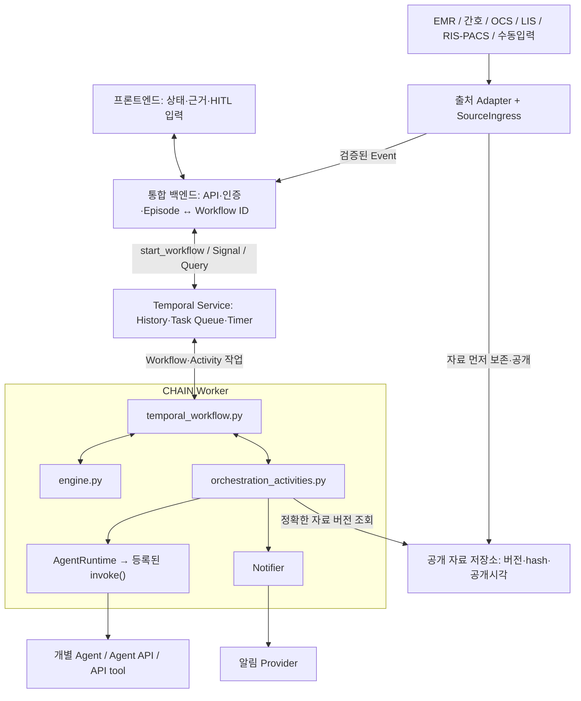

# CHAIN Temporal v0.3 연결 안내

CHAIN은 외부 기록·검사 Event를 받아 Context와 State를 관리하고,
필요한 Agent 호출과 의료진 확인(HITL)을 진행하는 Orchestrator다.
이 저장소는 Temporal Worker, Workflow, 공통 엔진과 연결 계약을 제공한다.

**Agent 팀은 개별 Agent의 실제 구현을 연결하고, 통합 팀은 백엔드·프론트엔드·병원 API·알림을 연결한다.**
현재 Screening/tPA는 가상 출력 파일을 사용하는 Mock, Summary는 구조화 자료 조합,
Notifier는 SQLite 기록 방식이다. HTTP 서버와 프론트엔드는 통합 팀이 구현한다.

**데모 실행기와 합성 자료도 이 전달본에 포함된다.** 패키지를 설치한 뒤 [4절의 데모](#4-데모로-전체-workflow-실행)를
먼저 실행하고, 담당 연결 작업의 입출력 계약을 확인한다.
데모 실행기·가상 병원·콘솔 화면은 `demo/`에 있으며, 실제 통합의 실행 진입점은 `chain_demo.worker`다.

| 확인할 내용 | 읽을 곳 |
|---|---|
| 설치하고 전체 흐름 직접 보기 | [설치](#3-설치와-worker-실행), [데모 실행·단계별 설명](#4-데모로-전체-workflow-실행) |
| 프론트·백엔드의 생성·조회·의료진 결정 | [백엔드 연결과 HITL](#5-백엔드와-프론트엔드-연결) |
| Agent의 입력·출력과 구현 등록 | [Agent 계약](#6-agent-구현-연결) |
| 자료 API·API tool·알림 연결 | [자료·tool 계약](#7-병원-apiapi-tool-연결), [Notifier 계약](#8-notifier-연결) |
| State·분기·조건 수정, 새 Agent/tool 추가 | [YAML 작성 안내](#9-yaml로-state분기agent를-바꾸기) |

## 1. 팀별 작업 위치

| 담당 | 구현할 내용 | 먼저 확인할 파일 |
|---|---|---|
| Agent 팀 | Screening·tPA의 실제 구현 또는 Agent API 호출 | [stroke_screening.py](chain_demo/agents/stroke_screening.py), [tpa_decision_support.py](chain_demo/agents/tpa_decision_support.py) |
| Agent 팀 | 요청 범위의 Context 구조화 | [clinical_summary.py](chain_demo/agents/clinical_summary.py) |
| Agent 팀 + 통합 팀 | Agent 입출력·버전·호출 시점 등록 | [agents_v03.yaml](config/agents_v03.yaml), [plugins.yaml](config/plugins.yaml), [policy_v03.yaml](config/policy_v03.yaml), [workflow_v03.yaml](config/workflow_v03.yaml) |
| 통합 팀 | Worker 구성과 외부 연결 객체 조립 | [worker.py](chain_demo/worker.py), [orchestration_activities.py](chain_demo/orchestration_activities.py) |
| 통합 팀 | Episode 생성·Event 입력·상태 조회·HITL 응답 API | [temporal_workflow.py](chain_demo/temporal_workflow.py), [contracts.py](chain_demo/contracts.py) |
| 통합 팀 | 병원 자료 수집·버전 저장·공유 저장소 | [adapters/](chain_demo/adapters/), [source_contracts.py](chain_demo/source_contracts.py) |
| 통합 팀 | 실제 알림 Provider와 발송 결과 연결 | [notifier.py](chain_demo/notifier.py) |

[engine.py](chain_demo/engine.py)는 State·Context·결과 수락을 처리하는 공통 엔진이다.
지원하는 작업 안의 새 State·전이·Agent는 YAML과 등록 모듈로 연결한다.
Agent별 분기나 HTTP 호출은 공통 엔진과 Workflow에 추가하지 않는다.

## 2. 실행 구조



프론트엔드·백엔드·병원 API·알림 Provider와의 연결은 각 팀이 구현한다.
Workflow/Activity의 Python 코드는 Worker에서 실행되고, Temporal Service는 실행 이력과 작업을 관리한다.
백엔드가 Episode의 Workflow를 시작하면 그 안에 Engine이 생성된다.
이후 Event·의료진 결정은 Signal로 보내고, 상태는 Query로 조회한다.

## 3. 설치와 Worker 실행

모든 명령은 프로젝트 루트에서 실행한다. Python **3.12 권장, 최소 3.11**이다.
처음 흐름을 볼 때는 3.1절 설치 후 4절 데모를 실행한다.
3.2–3.4절의 별도 Service/Worker 구성은 실제 백엔드 연결을 시작할 때 사용한다.

### 3.1. Python 패키지 설치

```bash
python3.12 -m venv .venv
.venv/bin/python -m pip install -r requirements.txt
```

[requirements.txt](requirements.txt)는 Temporal Python SDK와 PyYAML을 설치한다.
실제 Agent·병원 API의 SDK 또는 HTTP 클라이언트가 필요하면 해당 패키지를 추가한다.

### 3.2. 초기 입력 준비

저장소의 [initial.json](episodes/stroke_reference_001_v03/initial.json)은 **데모용 합성 초기 데이터**다.
그 파일의 **8필드 입력 형식은 데모와 실제 백엔드 통합에 공통으로 적용**된다.
Temporal Workflow는 파일을 읽지 않고 `initial` 데이터 객체를 받는다.
실제 백엔드는 DB/병원 시스템의 값으로 객체를 만들어 파일 저장 없이 전달할 수 있다.
[5.1절](#51-episode-workflow-시작--터미널-c)에 필드별 형식과 백엔드 호출 예제를 정리했다.

백엔드는 생성 시점에 알려진 다음 8필드만 초기 입력으로 만든다.

```text
site_id, patient_id, encounter_id, episode_id, age, sex, bed, arrival_time
```

기록·검사결과는 생성 후 Event로 유입시킨다. 허용 필드는 [source_contracts.py](chain_demo/source_contracts.py)의
`validate_initial()`로 검증한다.

3.4절의 기본 Worker CLI와5.1절의 터미널 연결 확인 예제는 파일로 값을 읽는다.
이 연결 확인에는 아래 명령으로 제공된 합성 식별자의 초기 입력을 만들 수 있다.
`runtime/initial.json`이 이미 있으면 덮어쓰지 않는다.

```bash
.venv/bin/python - <<'PY'
import json
from datetime import datetime, timezone
from pathlib import Path
from chain_demo.data_io import load_initial

initial = load_initial("episodes/stroke_reference_001_v03/initial.json")
initial["arrival_time"] = datetime.now(timezone.utc).isoformat()
Path("runtime").mkdir(exist_ok=True)
with Path("runtime/initial.json").open("x", encoding="utf8") as stream:
    json.dump(initial, stream, ensure_ascii=False, indent=2)
PY
```

### 3.3. Temporal Service 시작 — 터미널 A

이미 준비된 Service가 있으면 그 주소를 사용한다. 로컬에서는 Temporal CLI로 시작한다.
macOS의 CLI 설치 명령은 `brew install temporal`이다. [공식 설치·개발 서버 안내](https://docs.temporal.io/cli/setup-cli)

```bash
temporal server start-dev --db-filename runtime/temporal.db
```

기본 주소는 `127.0.0.1:7233`, namespace는 `default`, UI는 `http://localhost:8233`이다.

### 3.4. CHAIN Worker 시작 — 터미널 B

```bash
.venv/bin/python -m chain_demo.worker \
  --address 127.0.0.1:7233 \
  --task-queue chain-v03 \
  --initial runtime/initial.json \
  --receipt-db runtime/notices.sqlite
```

`Worker ready`가 출력되면 Service 연결과 Worker 구성이 끝난 것이다. Episode의 Workflow 시작은 다음 단계에서 수행한다.
Worker는 상시 실행하며, 백엔드는 Episode마다 Workflow를 시작한다.

현재 CLI는 **한 Episode에 묶인 메모리 저장소**를 만든다.
외부 자료를 공개하는 API와 복수 Episode 처리는 통합 팀이 7절의 저장소·자료 연결을 구현해야 한다.
Temporal DB와 별도로 원천자료 저장소를 영속화해야 Worker 재시작 후에도 조회할 수 있다.
namespace·TLS·API key를 사용하는 환경은 `worker.serve()`의 `Client.connect()`와 백엔드 연결 설정을 맞춘다.
현재 CLI에는 이 옵션들이 없다.

## 4. 데모로 전체 Workflow 실행

### 4.1. 전달본의 데모 구성

다음 경로를 함께 전달하면 가상 에피소드로 전체 연결을 확인할 수 있다.

```text
README.md, requirements.txt
chain_demo/                          공통 엔진·Worker·Workflow·Activity·연결 계약
config/                              Workflow·Agent·Policy·Plugin Registry
demo/                                실행기·콘솔·Simulator·Replay·시나리오·사용 안내
episodes/stroke_reference_001_v03/
  initial.json                       생성 시점의 합성 초기 입력
  sources/                           나중에 공개할 합성 원천자료
  simulation.yaml, provenance.json   가상 병원의 선행 사건·상대시간·자료 출처
  fixtures/cli/                      현재 Mock Agent의 입력별 출력과 설치 manifest
```

공통 엔진은 외부 Event를 처리한다. `demo/`가 가상 병원과 콘솔을 연결해 이 Event·결정을 제공한다.
실제 통합에서는 백엔드와 병원 Adapter가 같은 입력 경계를 사용한다.

### 4.2. 콘솔에서 직접 실행

3.1절의 패키지 설치 후 아래 명령을 프로젝트 루트에서 실행한다.
이 명령이 임시 Temporal Service와 Worker를 함께 시작하므로 데모용 Worker를 따로 실행할 필요가 없다.
첫 실행에는 SDK가 Temporal 실행 파일을 내려받을 수 있다.

```bash
.venv/bin/python -m demo \
  --backend temporal --start-local \
  --test-mode --test-timer-scale 0.01 \
  --run-timeout 1800 \
  --output-dir "output/demo-$(date +%Y%m%d-%H%M%S)"
```

`--test-mode`는 합성 에피소드의 가상 시계를 사용한다. `--test-timer-scale 0.01`은 실제 Workflow
타이머를 데모에서100배 줄인다. HOLD/DEFER의 원래10분 재요청은 실제6초가 된다.
`--run-timeout 1800`은 최대30분 실행 후 부분 결과를 보존한다. 출력 폴더는 매번 새 경로를 사용한다.
기존 Service를 사용할 때는 `--start-local` 대신 `--address 127.0.0.1:7233`을 지정한다.

병원 자료·Screening/tPA 출력·알림은 Mock이다. Temporal Service·Worker·Signal·Activity·Timer는 실제로 실행한다.
현재 fixture는 입력과 평가시각을 정확히 대조하므로 **`DEMO_DECISION_READY` 표시를 기다린 뒤 결정한다.**
이 표시는 데모 시계의 입력 안내다.

### 4.3. 화면을 따라 진행하기

| 순서·State | 엔진과 가상 병원의 처리 | 콘솔에서 확인·입력할 내용 |
|---|---|---|
| 1. S0 | 초기 식별정보로 시작. 초진기록이 공개된 뒤 Summary와 Stroke Screening 실행 | 자료의 출처·시각과 Screening 결과 확인. 기본 시나리오는 POSITIVE |
| 2. S1 / HITL #1 | Screening POSITIVE 후 고정 근거로 CT 경로 결정 요청. 선행 채혈에 따른 CBC/COAG는 입력 대기 중에도 유입 | `DEMO_DECISION_READY \| HITL_1_PROCEED_TO_CT`를 기다린다. `PROCEED_TO_CT` 또는1 → `EM_PHYSICIAN` 또는1 → 모의 ID → 사유 입력 |
| 3. S2 | HITL #1 승인 후 진입. 가상 의료진이 OCS 오더를 입력하고 새 근거마다 tPA interim 실행 | 오더·검사 수신 기록과 미확보 항목 확인. CHAIN이 CT 오더를 생성하는 동작은 없음 |
| 4. S2_1 | 해당 NCCT 완료와 오더 일치로 진입. tPA final 결과를 수락한 뒤 HITL #2 요청 | 다른 검사 완비나 `review_ready`가 이 전이조건에 추가되지 않음. 고정 근거의 미확보·충돌도 그대로 표시 |
| 5. HITL #2 | 최종 시행 계획에 대한 의료진 결정 대기 | `DEMO_DECISION_READY \| HITL_2_THROMBOLYSIS`를 기다린다. YES/NO/HOLD 선택 → YES이면 네 확인사항 → `NEUROLOGIST` 역할 → 모의 ID → 사유 입력 |
| 6. 경로 완료 | YES면 S3, NO면 S3N. 감사 기록과 실행 결과 저장 | `RUN_OUTCOME \| COMPLETED`, 최종 State와 `REAL_HISTORY_REPLAY \| PASSED` 확인 |

YES의 입력 코드는 `THROMBOLYSIS_YES`이고 NO는 `THROMBOLYSIS_NO`다.
YES에는 기존 YAML이 정한 네 확인사항이 필요하다: `NCCT_NO_HEMORRHAGE_PHYSICIAN_READ`,
`LKW_RECONFIRMED_WITH_FAMILY`, `BP_RECHECK_BELOW_185_110`, `NO_ANTICOAGULANT_RECONFIRMED`.
데모의 확인 입력은 합성 의료진 역할이며 실제 인증·치료 수행을 뜻하지 않는다.

| 다른 선택·상황 | 동작 |
|---|---|
| Screening NEGATIVE | S0X에서 경로 종료. 선택한 합성 입력을 지원하는 fixture가 있어야 함 |
| HITL #1 `NOT_STROKE_PATHWAY` | S1X에서 경로 종료 |
| HITL #1 `DEFER` | S1 유지 → 재요청 타이머 → 새 HITL #1 요청 |
| HITL #2 `HOLD` | S2_1 유지 → 재요청 타이머 → 새 HITL #2 요청 |
| `docs` / `json` | 현재 요청에 고정된 문서 전문 / 전체 근거 JSON 보기 |
| `q` | 결정을 생성하지 않고 콘솔 입력 종료. 부분 결과 저장 |

HOLD/DEFER 후에는 상태 유지 안내와 타이머가 표시된다. 진행 막대의 남은 시간은 실제 Temporal 경과시간이고,
원래 설정 시간과 가상 병원 시계를 함께 구분한다. 0초는 History에서 발생을 확인할 때까지 만료 처리 대기로 표시한다.
새 요청이 열리면 새 Request ID를 확인해 결정한다. 단순 자료 추가는 열린 HITL 근거를 교체하지 않는다.

### 4.4. 입력 없이 자동 확인하고 결과 읽기

기록된 합성 응답을 사용하려면 아래처럼 명시적으로 recorded 모드를 지정한다.

```bash
.venv/bin/python -m demo \
  --backend temporal --start-local --test-mode \
  --hitl recorded \
  --recorded demo/scenarios/recorded_hitl.json \
  --expected demo/scenarios/expected.json \
  --run-timeout 180 \
  --output-dir "output/demo-check-$(date +%Y%m%d-%H%M%S)"
```

기본 경로는 `S0 → S1 → S2 → S2_1 → S3`다. 성공 시 종료코드0과 `RUN_OUTCOME | COMPLETED`가 출력된다.
미지원 입력은 `FIXTURE_NOT_FOUND` 등 명시적 시험 오류이며 임의 성공 결과로 대체되지 않는다.
Service 없는 Local Engine 확인은 `--backend local`로 바꾸고 `--start-local`을 뺀다.

| 출력 파일 | 확인할 내용 |
|---|---|
| `outcome.json`, `snapshot.json` | 성공·실패·중단, 최종 State, Context·Agent·HITL·audit |
| `commands.jsonl`, `manifest.json` | 요청·응답, 실제 Activity 실행/재시도 정보, 고정된 구성·구현 버전 |
| `publications.json`, `simulation.json` | 자료 공개와 실제 관찰한 가상 병원 사건 |
| `comparison.json` | `--expected`를 사용한 실행의 사후 비교 |
| `temporal_history.json`, `replay.json` | 실제 실행 History와 결정적 Replay 결과 |
| `notices.sqlite` | 실제 발송 없이 기록한 Mock 알림 |

시간 제한·콘솔 종료의 부분 Replay 통과와 전체 경로 완료는 다르다. `outcome.json`과 `replay.json`을 함께 확인한다.
임시 Service는 데모 종료 시 내려간다. 추가 옵션과 별도 Replay 명령은 [demo/README.md](demo/README.md)에 있다.

## 5. 백엔드와 프론트엔드 연결

### 5.1. Episode Workflow 시작 — 터미널 C

#### 백엔드가 준비할 Episode 생성 데이터

**실제 백엔드는 `initial.json` 파일을 제출할 필요가 없다.**
생성 handler에서 아래8필드의 JSON 객체/Python dict를 준비해 `initial` 인자로 전달한다.
예를 들어 통합 팀이 `POST /episodes` API를 만든다면 DB·병원 시스템·요청 값을 대조해 이 객체를 구성한다.
HTTP 경로·인증·DB 저장은 통합 팀이 구현하며 이 저장소에 해당 HTTP endpoint가 구현돼 있지는 않다.

| 필드 | 형식·현재 검증 | 백엔드가 넣을 값 |
|---|---|---|
| `site_id` | 비어 있지 않은 문자열. Workflow/Policy의 site_id와 일치 | 기관/사이트 ID |
| `patient_id` | 비어 있지 않은 문자열 | 기관 내 환자 식별자 |
| `encounter_id` | 비어 있지 않은 문자열 | 해당 내원 식별자 |
| `episode_id` | 비어 있지 않은 문자열 | 이번 Orchestrator 실행을 구분하는 Episode ID. 동일 생성 요청의 재시도에서도 유지 |
| `age` | 0이상의 정수. 문자열·소수·bool·null 불가 | 생성 시점에 알려진 나이 |
| `sex` | 비어 있지 않은 문자열. 현재 고정 enum 검증 없음 | 연결 시스템과 합의한 성별 코드. 예: M/F |
| `bed` | 비어 있지 않은 문자열 | 생성 시점에 알려진 병상 ID/표기 |
| `arrival_time` | 시간대가 포함된 ISO8601 문자열 | 해당 내원의 도착시각. Workflow를 시작하는 현재시각과 구분 |

아래 값은 **가상 통합 예제**다. 실제 연결에서는 백엔드가 실제 생성 시점에 알려진 값을 넣는다.
HYUMC_GURI는 현재 기본 설정의 site_id에 맞춘 값이다.

```json
{
  "site_id": "HYUMC_GURI",
  "patient_id": "TEST-PATIENT-001",
  "encounter_id": "TEST-ENCOUNTER-001",
  "episode_id": "TEST-EPISODE-001",
  "age": 68,
  "sex": "F",
  "bed": "TEST-BED-02",
  "arrival_time": "2026-10-03T09:30:00+09:00"
}
```

8필드는 모두 필수이며 추가 key는 거부된다. 생년월일·원문 기록·검사결과·Agent 정답·
시뮬레이션 일정·미래 자료를 이 객체에 함께 넣지 않는다. 후속 자료는7절의 Event 계약으로 유입시킨다.
현재 초기 입력에는 null이나 Fact의 UNKNOWN/PENDING 상태를 표현하는 양식이 없다.
확보하지 못한 나이를0처럼 채우지 않는다. 실제 운영에서 초기 항목 누락을 허용해야 한다면
그 입력 계약과 초기 Context 처리부터 별도로 합의·구현해야 한다.

arrival_time은 과거 내원시각이어도 된다. 초기 자료가 CHAIN에 알려진 시각은 Workflow 실행 시각으로 기록된다.
Workflow 시각보다 미래인 arrival_time은 Context 초기화에서 거부된다.
`initial` 안에 `known_at`이나 가상 시계 필드를 추가하지 않는다.

#### 파일 없이 백엔드 handler에서 시작하기

백엔드 기동 시 Client와 `load_orchestration_bundle()`의 configuration을 준비한다.
생성 handler에서는 다음 함수를 호출한다. configuration은 백엔드가 관리하는 고정 설정이며
프론트엔드가 임의로 보낸 YAML/설정 객체를 사용하지 않는다.

```python
from copy import deepcopy
from temporalio.common import WorkflowIDConflictPolicy, WorkflowIDReusePolicy
from chain_demo.source_contracts import validate_initial
from chain_demo.temporal_workflow import ConfigurableClinicalWorkflow


async def start_episode(client, configuration, initial, *, task_queue="chain-v03"):
    validate_initial(initial)
    engine_bundle = configuration["engine"]
    if initial["site_id"] != engine_bundle["workflow"]["site_id"]:
        raise ValueError("Initial site not admitted")
    workflow_id = "chain-" + initial["site_id"] + "-" + initial["episode_id"]
    handle = await client.start_workflow(
        ConfigurableClinicalWorkflow.run,
        {"bundle": deepcopy(engine_bundle), "initial": deepcopy(initial)},
        id=workflow_id,
        task_queue=task_queue,
        id_reuse_policy=WorkflowIDReusePolicy.REJECT_DUPLICATE,
        id_conflict_policy=WorkflowIDConflictPolicy.FAIL,
    )
    return {"episode_id": initial["episode_id"], "workflow_id": handle.id}
```

Temporal 시작 인자의 필수 구조는 `{"bundle": 실행 설정, "initial": 위8필드 객체}`다.
실제 운영 호출에는 `test_mode`·`test_now`·`test_timer_scale`을 넣지 않는다.
Workflow/Engine은 initial을 다시 검증한다. 백엔드는 입력 오류를 HTTP 오류로 변환하고,
시작 이후 초기화 실패도 실행 상태로 추적한다.

함수의 반환은 백엔드 응답 예시이며 Engine의 공통 Result 계약과 구분한다.
start_workflow가 반환됐다는 것은 Service가 시작 요청을 수락했다는 뜻이다.
S0 준비나 Agent 성공을 뜻하지 않는다. 프론트에는 생성된 ID를 반환하고5.2절의 snapshot 조회로 진행을 확인한다.
기본 Workflow는 S0에서 초진기록을 기다리며, 시작 State를 바꾼 설정은 그 initial_state를 따른다.

백엔드는 기관·환자·내원·Episode와 Workflow ID 연결을 저장하고
후속 Event에 동일한 네 식별자를 사용한다. 재시도에서 새 episode_id를 발급하지 않는다.
중복 시작 오류(`temporalio.exceptions.WorkflowAlreadyStartedError`)는 해당 Episode에 매핑된 기존 Workflow를 조회해 처리한다.
다른 초기 입력을 같은 생성 요청으로 취급하지 않도록 초기 데이터·실행 설정도 함께 대조한다.
준비 상태 조회가 지연되거나 timeout이어도 새 ID로 다시 생성하지 않고 기존 Workflow를 조회한다.
위 함수는 중복 오류를 자동으로 처리하지 않으므로 handler에서 이 분기를 구현한다.

생성 Workflow와 해당 자료를 공개/조회하는 Store·Ingress의 식별자를 일치시킨다.
현재3.4절 Worker CLI는 `--initial` 파일로 **한 Episode의 메모리 Store**를 구성한다.
여러 Episode를 운영하려면 통합 팀이 Episode별 저장소 라우팅·공유·영속화와
Activity 연결을 구현해야 한다. Activity가 Event의 네 식별자로 해당 Episode의 Store/view를 선택한 뒤
기존 `resolve_source()`를 호출하는 라우팅 경계가 필요하다.
서로 다른 Episode 전용 Store의 Worker를 같은 Queue에 둔다고 자료가 해당 Worker로 자동 배정되지는 않는다.
Episode 전용 Worker를 유지한다면 Queue도 분리하고, 공용 Worker라면 Activity의 Episode 라우팅을 구현한다.
연결 위치는 [worker.py](chain_demo/worker.py)의 `create_worker()`와 [7.4절](#74-운영-store와-api-tool의-연결-경계)이다.

#### 터미널에서 첫 연결 확인하기

다음은3.2절에서 만든 합성 `runtime/initial.json`을 읽어 같은 시작 계약을 확인하는 예시다.
백엔드의 운영 API가 파일을 반드시 사용해야 한다는 뜻은 아니다.

```bash
.venv/bin/python - <<'PY'
import asyncio
from temporalio.client import Client
from temporalio.common import WorkflowIDReusePolicy
from chain_demo.data_io import load_initial
from chain_demo.orchestration_config import load_orchestration_bundle
from chain_demo.temporal_workflow import ConfigurableClinicalWorkflow

async def main():
    initial = load_initial("runtime/initial.json")
    configuration = load_orchestration_bundle()
    client = await Client.connect("127.0.0.1:7233")
    handle = await client.start_workflow(
        ConfigurableClinicalWorkflow.run,
        {"bundle": configuration["engine"], "initial": initial},
        id="chain-" + initial["site_id"] + "-" + initial["episode_id"],
        task_queue="chain-v03",
        id_reuse_policy=WorkflowIDReusePolicy.REJECT_DUPLICATE,
    )
    async with asyncio.timeout(10):
        while True:
            snapshot = await handle.query("snapshot")
            if snapshot.get("state") is not None:
                break
            await asyncio.sleep(0.1)
    print("workflow_id:", handle.id)
    print("state:", snapshot["state"], "done:", snapshot["done"])

asyncio.run(main())
PY
```

예상 초기 결과는 `state: S0 done: False`다. 초진기록 Event를 기다리는 상태다.
백엔드는 Episode와 Workflow ID의 연결을 보존하고, 후속 요청에
`client.get_workflow_handle(workflow_id)`를 사용한다.
같은 ID를 다시 시작하면 중복 시작 오류가 발생한다. 생성 요청 재시도는 기존 실행을 조회하도록 처리한다.

Worker와 백엔드는 **같은 실행 설정, Task Queue, namespace**를 사용한다.
설정·구현 버전은 실행별로 고정된다. 새 버전은 새 Queue/Worker로 배포하고 진행 중 실행의 구성은 유지한다.

### 5.2. 백엔드 API 내부의 호출

아래 코드는 백엔드의 async handler에서 사용한다.
프론트엔드는 통합 팀이 만든 HTTP/WebSocket API를 호출한다.

| 백엔드가 받을 요청 | 내부 처리 |
|---|---|
| Episode 생성 | 초기 8필드 검증 → Workflow 시작 → Workflow ID 보존 |
| 새 기록·검사 Event | 자료 공개 → Ingress 검증 → `submit_event` |
| 의료진 결정 | 로그인 사용자·역할 확인 → 응답 검증 → `submit_decision` |
| 범위별 Context 요청 | 요청 ID·scope를 지정해 `request_context` |
| 상태 조회 | `snapshot` Query → 프론트엔드에 전달 |

```python
handle = client.get_workflow_handle(workflow_id)

# SourceIngress.receive()가 반환한 표준 Event
await handle.signal("submit_event", accepted_event)

# 고정된 HITL 요청을 참조하는 의료진 응답
await handle.signal("submit_decision", decision)

# 필요한 항목만 구조화 요청
await handle.signal("request_context", {"request_id": request_id, "scope": scope})

snapshot = await handle.query("snapshot")
```

Signal 전송 완료는 엔진 처리 완료와 다르다. Event/request ID로 Snapshot의
`audit`, `context_requests`, `hitl_history`를 확인해 처리·수락·거절 상태를 화면에 전달한다.
API 인증, RPC timeout, 화면 갱신 방식은 백엔드에서 구현한다.

`request_context`의 입력은 정확히 다음 두 필드다. `scope`는 비어 있지 않은 중복 없는 문자열 배열이다.
진행 중 State에서 이 요청을 처리한다. 성공하면 `snapshot["context_requests"][request_id]`에
`output`(공통 Agent Result), 입력 `snapshot`, `alias`, `mode`, `generation`을 저장하고
`STRUCTURED_CONTEXT_SERVED`를 기록한다. 준비 중·실패 상태를 포함하는 별도 응답 enum은 아직 없다.

```json
{
  "request_id": "UI-CONTEXT-001",
  "scope": ["age", "glucose", "inr"]
}
```

백엔드는 재전송 시 같은 Request ID와 scope를 유지하고, 다른 요청에는 새 ID를 사용한다.
현재 Context 요청에는 동일 ID의 내용 충돌을 거부하는 영속 dedup 계약이 없다.
Summary 실행 실패 audit는 내부 Agent request_id로 기록되며 외부 Context request_id의 실패 응답·연계는
제공되지 않는다. 화면의 실패·대기 표시, 외부/내부 ID 연계와 제한시간은 백엔드에서 구현한다.
`snapshot` Query에는 요청 인자를 보내지 않는다. 주요 반환 항목은 다음과 같다.

| Snapshot 조회 항목 | 프론트·백엔드에서 사용할 내용 |
|---|---|
| `state`, `done`, `state_history` | 현재 State·종료 여부·경로 |
| `facts`, `context_version` | 현재 원천 Context와 버전. Agent 입력의 scoped Snapshot과 구분 |
| `open_hitl` | 열린 결정의 고정 Request·Snapshot·Agent Results |
| `hitl_history`, `context_requests` | 결정 Request ID별 이력·범위별 구조화 성공 결과 |
| `audit` | 수신·적용·Agent 결과·결정 수락/거절의 처리 기록 |

현재는 HTTP endpoint/공통 HTTP 응답 형식이 제공되지 않는다. 통합 팀이 위 Temporal 계약을 호출하는
handler와 프론트용 응답 모델을 구현한다. RPC별 시간 제한을 두고 다음 결과를 ID별로 확인한다.

| 보낸 입력 | 처리 결과를 확인할 audit |
|---|---|
| `submit_event` | `event_id`의 `EVENT_ADMITTED` 이후 `CONTEXT_APPLIED`; 거절/조회 실패는 `EVENT_REJECTED`/`CONTEXT_RESOLUTION_FAILED` |
| `submit_decision` | `request_id`의 `HITL_DECISION_RECORDED` 또는 `HITL_REJECTED` |

자료 수신과 Context 적용, 결정 전송과 결정 수락을 각각 구분한다.
관련 자료 정정이 먼저 처리 중이면 `HITL_DECISION_DEFERRED_FOR_SOURCE` 이후 최종 결과가 기록될 수 있다.
수락 확인 구현은 [demo/console.py](demo/console.py)의 `serve_console()`을 참고하되 콘솔 입력을 백엔드에 연결하지 않는다.

### 5.3. HITL 화면과 응답

화면에는 `snapshot["open_hitl"][checkpoint]`에서 `status == "OPEN"`인 항목의
`request`, 고정 `snapshot`, `results`를 표시한다.
열린 요청의 근거를 최신 전체 Context로 교체하지 않는다.

`request`의 schema는 `chain-hitl-request/v0.3`이고 필수 필드는 다음과 같다.

| Request 필드 | 화면·응답 연결 |
|---|---|
| `contract_schema`, `request_id`, `checkpoint` | 계약 버전·결정 요청 ID·결정 지점 |
| `evidence_snapshot_id`, `dependencies`, `result_ids` | 고정 근거 Snapshot hash·Field ref 배열·Agent Result의 request_id 배열 |
| `roles`, `options` | 이 요청에 허용된 역할·결정 코드 배열 |
| `required_confirmations`, `confirmations_on_decisions` | 확인항목과 이를 요구하는 결정 코드 배열 |
| `question` | 표시할 질문 문자열 |

응답은 다음 필드를 포함하며 정확한 검증 규칙은 [contracts.py](chain_demo/contracts.py)의
`validate_hitl_decision_shape()`와 `validate_hitl_decision()`을 따른다.

| 응답 필드 | 채울 값 |
|---|---|
| `contract_schema` | `chain-hitl-decision/v0.3` |
| `request_id`, `evidence_snapshot_id` | 화면에 표시한 고정 요청의 ID |
| `decision` | 해당 요청의 `options` 중 선택한 코드 |
| `actor` | 인증된 사용자의 `role`, `staff_id` |
| `confirmed_items` | 실제 확인한 항목 코드의 중복 없는 문자열 배열. 없는 경우 `[]` |
| `evidence_viewed` | 실제 열람한 고정 Snapshot ID/Result request_id의 비어 있지 않은 중복 없는 배열 |
| `comment`, `recorded_at` | 비어 있지 않은 입력 사유와 timezone을 포함한 응답 시각 |

다음 함수는 프론트의 실제 선택·확인·열람 기록과 인증된 actor를 응답 dict로 변환하는 예시다.
`open_record`에는 Query가 반환한 해당 `open_hitl` 항목을 전달한다. UI 표시만으로 모든 근거를 열람했다고 채우지 않는다.

```python
from chain_demo.contracts import validate_hitl_decision

def build_decision(open_record, *, choice, actor, confirmed_items,
                   evidence_viewed, comment, recorded_at):
    request = open_record["request"]
    decision = {
        "contract_schema": "chain-hitl-decision/v0.3",
        "request_id": request["request_id"],
        "evidence_snapshot_id": request["evidence_snapshot_id"],
        "decision": choice,
        "actor": {"role": actor["role"], "staff_id": actor["staff_id"]},
        "confirmed_items": confirmed_items,
        "evidence_viewed": evidence_viewed,
        "comment": comment,
        "recorded_at": recorded_at,
    }
    validate_hitl_decision(decision, request)
    return decision
```

백엔드는 로그인 사용자·권한과 실제 열람 기록을 검증하고 `submit_decision`으로 이 dict를 보낸다.
엔진은 여전히 열린 요청인지, 요청 State가 유효한지, 응답 시각이 요청 이후·현재 시각 이전인지 확인한다.
현재 actor 검증은 역할 문자열 검사이며 사용자 인증은 통합 팀이 연결해야 한다.

HITL #2의 화면 YES/NO는 `THROMBOLYSIS_YES`/`THROMBOLYSIS_NO` 코드로 보낸다.
일반 정보 추가는 열린 요청을 유지한다. 참조 근거의 명시적 정정 등으로 요청이 무효화되면
구 요청의 응답이 거절될 수 있으므로 화면에서도 요청 ID와 상태를 갱신한다.
`DEFER`/`HOLD`는 현재 State를 유지하며 설정된 타이머 후 재확인을 요청한다.

## 6. Agent 구현 연결

### 6.1. Agent 팀이 구현할 함수

[agents/runtime.py](chain_demo/agents/runtime.py)가 Registry에 등록한 `module:function`을 호출한다.
각 Agent 모듈은 아래 **동기 함수**를 구현한다. 아래는 작성할 함수의 형식이다.

```python
def invoke(request, snapshot, services) -> dict:
    # 1. snapshot["facts"]를 Agent 입력으로 변환
    # 2. 실제 Agent 실행 또는 API 호출
    # 3. 응답 검증 후 도메인 결과 dict 반환
    raise NotImplementedError("Agent 구현 또는 API 호출을 연결하세요")
```

| 입력·출력 | 계약 |
|---|---|
| `request` | `request_id`, Agent ID/version, `mode`, `scope`, 입력 Snapshot ID, 근거 의존성, 평가시각 |
| `snapshot["facts"]` | 요청 scope의 자료만 포함. 각 항목의 `value`, `status`, 원천 버전·시각을 함께 확인 |
| `services` | 현재 `cache`/`backend`만 제공. API client가 필요하면 [services.py](chain_demo/agents/services.py)와 Runtime의 서비스 생성 경계를 확장 |
| 반환값 | Workflow의 `agents.<alias>.outputs.<mode>`에 맞는 도메인 결과 dict |

공통 Result envelope의 식별자·status·evidence는 Runtime이 조립한다.
외부 API의 전체 envelope를 그대로 반환하지 않는다. 미확보 자료는 UNKNOWN/PENDING으로 유지한다.
오류 dict를 정상 반환하면 성공 결과로 감싸지므로, 현재 출력·업무 검증 실패는 `ValueError`로 전달한다.
통신 예외는 Activity 실패·재시도로 전달된다. API 자체의 timeout과 `request_id` 기반 중복 방지를 구현한다.
현재 Runtime은 `async def invoke()`를 await하지 않으므로 비동기 SDK는 Activity/Runtime 호출 경계를 확장해야 한다.

Summary는 요청 범위만 구조화하고 Snapshot·scope·구현 버전 기준 캐시를 유지한다.
현재 Summary는 NLP 구현이 아니며, Structured Context의 값은 요청한 원천 facts와 일치해야 한다.

### 6.2. 공통 입력과 공통 응답

형식의 정본은 [contracts.py](chain_demo/contracts.py)의 `validate_agent_request()`,
`validate_snapshot()`, `validate_agent_result()`다. 아래 객체는 JSON으로 직렬화 가능한 dict다.
명시한 필수·선택 필드 외의 최상위 key는 거부된다. 모든 시각은 timezone을 포함한 ISO8601 문자열,
hash는 `sha256:` + 소문자16진수64자리다. `NaN`/무한대는 허용하지 않는다.

**Agent 함수가 받는 `request`**

| 필드 | 형식·채우는 주체 |
|---|---|
| `contract_schema` | 고정 문자열 `chain-agent-request/v0.3` |
| `request_id` | 엔진이 만든 요청 ID. 재시도에도 같은 ID를 사용 |
| `agent_id`, `agent_version` | Catalog·Registry의 등록 ID/version과 같은 문자열 |
| `manifest_hash` | 호출한 설치 구현의 manifest hash |
| `mode` | 등록된 mode 문자열. 현재 `context`, `screening`, `interim`, `final` |
| `input_snapshot_id` | 아래 `snapshot.snapshot_id`와 같은 hash |
| `scope` | 요청 항목 이름의 비어 있지 않은 중복 없는 문자열 배열 |
| `dependencies` | Fact에 dependencies가 있으면 그 배열, 없으면 source_ref를 모은 합집합과 정확히 같은 중복 없는 배열 |
| `evaluated_at` | 평가시각. wire validator에서는 선택이지만 **실제 Worker 호출에는 필수** |

**Agent 함수가 받는 `snapshot`**

| 필드 | 형식·규칙 |
|---|---|
| `contract_schema` | `chain-context/v0.3` |
| `snapshot_id` | 이 객체에서 `snapshot_id` 자신을 제외해 계산한 canonical hash |
| `known_at` | 이 Snapshot까지 알려진 자료의 기준 시각 |
| `facts` | `{항목 이름: Fact}`. 실제 Runtime은 **key 집합이 request.scope와 정확히 같은 입력만** 허용 |

Fact의 형식은 다음과 같다. 아래는 제공된 합성 Episode의 나이 항목 예시다.

```json
{
  "value": 68,
  "status": "AVAILABLE",
  "source_ref": {
    "system": "CHAIN_INITIAL",
    "record_id": "EP-HYG-261006-058",
    "version": 1,
    "field": "age"
  },
  "source_time": "2026-10-06T15:12:41+09:00",
  "known_at": "2026-10-06T15:12:41+09:00"
}
```

| Fact 필드 | 형식·규칙 |
|---|---|
| 필수 `value` | JSON 값. 미확보면 `null`. `false`, `0`, `null`을 구분 |
| 필수 `status` | 비어 있지 않은 문자열. 현재 `AVAILABLE`, `UNKNOWN`, `PENDING`, `CONFLICT`, `ERROR`, `RETRACTED`, `INVALIDATED`, `NO_EVIDENCE` 등을 사용 |
| 필수 `source_ref` | 정확히 `{system, record_id, version, field}`. version은 양의 정수 |
| 필수 `source_time`, `known_at` | 원천 발생/측정 시각과 엔진이 사용할 수 있게 된 시각 |
| 선택 `unit`, `confirmation_status` | 원천이 제공한 단위·확인 상태 문자열 |
| 선택 `dependencies` | 병합·파생 항목의 구체적인 Field ref 배열. 출처를 지우거나 빈 배열로 대체하지 않음 |

`status`와 `confirmation_status`는 공통 validator의 닫힌 enum이 아니다. 등록 모듈은 사용할 상태의
의미와 허용 값을 명시적으로 검증한다. 미확보 scope도 명시적 UNKNOWN Fact로 전달된다.
평가시각보다 미래인 근거, Snapshot hash 불일치, 요청 scope 밖의 입력은 거부된다.
각 Fact.known_at은 Snapshot.known_at 이하이고 evaluated_at은 Snapshot.known_at 이상이어야 한다.
출처·버전·시각·상태를 제거한 값만 Agent로 넘기면 이러한 구분을 잃는다.

**Runtime이 반환하는 공통 Result envelope**

| 필드 | 형식·규칙 |
|---|---|
| `contract_schema` | `chain-agent-result/v0.3` |
| `request_id`, `agent_id`, `agent_version`, `manifest_hash`, `input_snapshot_id` | Request에서 그대로 복사. 일치 검증 |
| `status` | 정확히 `SUCCESS` 또는 `FAILED` |
| `result` | SUCCESS면 **Agent 함수의 도메인 결과 dict**, FAILED면 `null` |
| `evidence` | Request dependencies 안의 Field ref 배열. Runtime의 정상 반환은 전체 dependencies를 사용. SUCCESS이고 Request에 dependencies가 있으면 비어 있을 수 없음 |
| `produced_time` | 현재 Runtime은 `request.evaluated_at`을 사용. 실제 API 완료시각으로 설명하지 않음 |
| 선택 `error` | FAILED에는 필수인 비어 있지 않은 오류 문자열. SUCCESS에는 없어야 함 |

Agent 팀은 이 envelope를 직접 반환하지 않는다. `mode`, 환자 ID, API의 HTTP 상태·응답 전체를
envelope에 임의로 추가할 수 없다. 내부 Activity job의 `{catalog_hash, agent, request, snapshot}`와
Agent 함수의 세 인자도 구분한다. job은 [agent_requests.py](chain_demo/agent_requests.py)의 `make_job()`이 만든다.
현재 Request에는 환자·내원 ID가 별도 필드로 없다. 외부 API가 이 정보를 요구하면
허용 scope·Policy·Registry를 맞춰 해당 식별자 Fact를 입력에 포함하거나 Worker의 client 구성에서
Episode와 API 호출의 연결을 구현한다. Request ID 문자열을 임의로 분해해 환자 ID를 추측하지 않는다.

### 6.3. Agent별 도메인 반환과 실행 가능한 예제

| Agent·구현 위치 | mode / 현재 backend | 함수가 반환할 정확한 key와 현재 의미 |
|---|---|---|
| [clinical_summary.py](chain_demo/agents/clinical_summary.py) | `context` / `structured` | `structured_context`, `missing_information`, `cache`. structured_context는 요청한 `snapshot.facts`의 복사본. cache는 `{key, hit, computed_at}` |
| [stroke_screening.py](chain_demo/agents/stroke_screening.py) | `screening` / `fixture` | `screening_result`, `mock_only`, `basis`. 현재 POSITIVE/NEGATIVE, `mock_only: true`, 비어 있지 않은 중복 없는 근거 문자열 배열 |
| [tpa_decision_support.py](chain_demo/agents/tpa_decision_support.py) | `interim`, `final` / `fixture` | `mode`, `evidence_package`, `assessment`, `mock_only`. 현재 evidence_package는 요청 facts와 정확히 같고 mock_only는 true |

현재 Screening의 **완전한 도메인 반환 예시**:

```json
{
  "screening_result": "POSITIVE",
  "mock_only": true,
  "basis": ["EXPLICIT_SYNTHETIC_TEST"]
}
```

현재 tPA 반환의 `mode`는 요청과 같아야 한다. `value: null` 또는
`UNKNOWN`/`PENDING`/`CONFLICT`/`UNAVAILABLE` 항목이 있으면 assessment는 `PENDING_MOCK`,
그렇지 않으면 `STRUCTURED_MOCK_ONLY`다. 이 값이나 `final/SUCCESS`는 치료 적합성·시행 승인이 아니다.

Summary는 같은 미확보 조건의 항목 이름을 `missing_information`에 넣는다.
현재 엔진은 Context service의 `structured_context == job.snapshot.facts`를 검사한다.
실제 NLP로 값을 추론·바꾸거나 새 원천 facts를 추가하는 Summary는 이 계약에서 지원되지 않는다.
값의 임상 해석 결과를 추가하려면 별도 도메인 출력 계약과 사용 정책을 합의해야 한다.

아래 명령은 합성 초기 입력의 `age`만 요청해 **완전한 Request·Snapshot·Result JSON**을 출력한다.
프로젝트 파일과 외부 API에 쓰지 않으며, 실제 validator·Runtime·YAML 출력 key 검사를 거친다.
같은 입력을 다른 Request ID로 다시 요청해 Summary 캐시 재사용도 확인한다.

```bash
.venv/bin/python - <<'PY'
import json
from chain_demo.data_io import load_initial
from chain_demo.context import ContextLedger
from chain_demo.orchestration_config import load_orchestration_bundle
from chain_demo.agent_requests import make_job
from chain_demo.agents.runtime import AgentRuntime
from chain_demo.contracts import validate_agent_request, validate_agent_result
from chain_demo.validation import fields

configuration = load_orchestration_bundle()
initial = load_initial("episodes/stroke_reference_001_v03/initial.json")
snapshot = ContextLedger(initial, known_at=initial["arrival_time"]).snapshot()
runtime = AgentRuntime(configuration["agents"])

def invoke(request_id):
    job = make_job(
        configuration["agents"], "clinical_summary", snapshot, ["age"],
        request_id=request_id, mode="context", evaluated_at=initial["arrival_time"],
    )
    validate_agent_request(job["request"], job["snapshot"])
    result = runtime.invoke(job)
    validate_agent_result(result, job["request"])
    assert result["status"] == "SUCCESS", result
    outputs = configuration["engine"]["workflow"]["agents"]["clinical_summary"]["outputs"]["context"]
    fields(result["result"], set(outputs))
    assert result["result"]["structured_context"] == job["snapshot"]["facts"]
    return job, result

job, result = invoke("HANDOFF-SUMMARY-1")
print(json.dumps({"request": job["request"], "snapshot": job["snapshot"], "result": result},
                 ensure_ascii=False, indent=2))
_, second = invoke("HANDOFF-SUMMARY-2")
assert second["result"]["cache"]["hit"] is True
print("SUMMARY_CACHE_REUSED", second["result"]["cache"]["hit"])
PY
```

Screening/tPA는 [fixture_backend.py](chain_demo/agents/fixture_backend.py)가
[현재 manifest](episodes/stroke_reference_001_v03/fixtures/cli/manifest.json)에서 Agent ID/version·mode·입력 hash·평가시각을
맞춰 [출력 파일](episodes/stroke_reference_001_v03/fixtures/cli/outputs/)을 선택한다.
입력 hash는 `input_commitment(snapshot, scope, mode)`이고 Snapshot ID와 다른 계산이다.
원천자료와 Agent 출력은 별개다. 미일치·모호한 fixture는 명시적 FAILED 결과로 반환한다.
임의 현재시각을 넣어 기존 fixture를 호출하면 대응 파일이 없을 수 있으므로 전체 Mock 실행은 4절의 데모를 사용한다.

실제 모듈은 자기 도메인 값의 type·enum·의미를 검증해야 한다. 공통 엔진은 envelope와
YAML `outputs.<mode>`의 **key 집합이 정확히 일치하는지** 검사한다.
현재의 `mock_only`/`PENDING_MOCK` 등은 Mock 출력 계약이다. 실제 구현은 모듈·YAML 출력·버전과
결과를 쓰는 전이를 함께 맞춘다. 임상 기준이나 Gate 변경이 필요한 경우에는 임상팀이 확정해야 한다.

### 6.4. 구현을 YAML과 Registry에 등록

1. 프로젝트 안에 실제 Agent 호출 모듈을 작성한다. 예: `chain_demo/agents/<agent_name>.py`.
2. 다음 설정을 실제 구현 계약에 맞춘다.
3. Registry의 설치 파일 SHA-256과 `manifest_hash`를 갱신하고 설정을 로딩한다.
4. 고정된 새 구성으로 Worker와 새 Workflow를 시작한다.

| 설정 파일 | 맞출 내용 |
|---|---|
| [agents_v03.yaml](config/agents_v03.yaml) | Agent ID/version, 구현 ID, 지원 mode·scope·action, backend |
| [plugins.yaml](config/plugins.yaml) | 구현 ID, `module:function`, 계약, 설치·승인 상태, 설치 파일 해시 |
| [policy_v03.yaml](config/policy_v03.yaml) | 승인 Agent version·scope·action |
| [workflow_v03.yaml](config/workflow_v03.yaml) | 호출 시점, mode별 입력 scope와 결과 필드, 결과를 사용하는 전이 |

현재 backend는 `structured`/`fixture`만 지원한다. 실제 API 호출 모듈은 fixture가 필요 없으면
`structured`로 등록할 수 있다. URL이나 `kind: api` 선언만으로 HTTP 연결이 생성되지는 않는다.
기존 Screening/tPA는 fixture 전용이므로 실제 모듈 entrypoint로 교체하고,
현재 `mock_only` 등 결과 필드도 실제 계약에 맞춘다.
Screening의 `document:DOC-2610060412` scope는 합성 문서 ID이므로 실제 문서 참조 규약과 맞춰야 한다.

Registry entrypoint는 프로젝트 내부의 설치 파일을 가리켜야 한다.
파일 해시와 manifest 계산·검증은 [validation.py](chain_demo/validation.py)의 `canonical_hash()`와
[registry.py](chain_demo/registry.py)의 `verify_installation()`을 확인한다.
등록 후 아래 명령으로 설정·설치·Runtime 로딩을 확인한다.

```bash
.venv/bin/python - <<'PY'
from chain_demo.orchestration_config import load_orchestration_bundle
from chain_demo.agents.runtime import AgentRuntime

configuration = load_orchestration_bundle()
AgentRuntime(configuration["agents"])
print("Agent configuration and installation OK")
PY
```

설치 파일 hash와 출력 JSON hash를 구분한다. `plugins.yaml`의 `files`는 **파일 bytes**의 SHA256,
`manifest_hash`는 자신을 제외한 manifest 객체의 `canonical_hash()`다.
추가한 client/shim 파일도 manifest에 명시하고 공통 의존 파일을 바꾸면 그 파일을 포함하는 각 manifest를 갱신한다.

아래는 **구현을 연결한 뒤** 해당 implementation의 갱신 내용을 계산해 출력하는 명령이다.
`plugin_id`를 실제 수정한 ID로 바꾸고 출력된 내용을 검토해 `plugins.yaml`에 반영한다.
ID/version/mode/scope/action과 설치·승인 상태는 팀이 검토한 등록 내용으로 맞춘다.

```bash
.venv/bin/python - <<'PY'
import copy
import hashlib
from pathlib import Path
import yaml
from chain_demo.validation import canonical_hash

registry = yaml.safe_load(Path("config/plugins.yaml").read_text(encoding="utf8"))
plugin_id = "v03-screening"
manifest = copy.deepcopy(registry["implementations"][plugin_id])
for name in manifest["files"]:
    manifest["files"][name] = "sha256:" + hashlib.sha256(Path(name).read_bytes()).hexdigest()
manifest["manifest_hash"] = canonical_hash(
    {key: value for key, value in manifest.items() if key != "manifest_hash"}
)
print(yaml.safe_dump({plugin_id: manifest}, allow_unicode=True, sort_keys=False))
PY
```

현재 등록이 지원하는 backend는 `structured`/`fixture`다. `structured`는 fixture 선택 서비스를
생성하지 않는다는 뜻이며 실제 API 모듈은 자기 client로 호출한다. `kind: api`/`url`을 YAML에 추가하면 거부된다.
Registry의 `contract`는 `chain-agent/v0.3`, callable은 `module:function`이다.
실제 호출에는 설치된 파일과 `installed: true`, `status: APPROVED`, Policy의 version/scope/action 승인이 모두 필요하다.
hash 계산은 승인 상태를 변경하지 않는다. 새 구현 파일은 전달본과 설치 manifest에 함께 포함한다.

### 6.5. API 실패·시간 제한·재시도

| 상황 | 현재 처리와 구현체의 책임 |
|---|---|
| Plugin 내부 입력/도메인 검증 실패 | Plugin의 `ValueError`는 `FAILED`, `error: AGENT_INVALID_OUTPUT`으로 변환 |
| fixture 부재·모호함·잘못된 출력 | `FixtureError`의 명시적 code로 FAILED. 임의 POSITIVE/NEGATIVE/PASS 대체 없음 |
| 통신 예외·Activity timeout | Activity 실패·제한된 재시도로 전달. 같은 request_id로 재호출될 수 있음 |
| 오류 dict를 정상 반환 | Runtime이 SUCCESS로 감쌀 수 있으므로 오류를 업무 성공 dict로 반환하지 않음 |

Runtime의 Request·등록·설치 파일/hash 검증과 import 오류는 FAILED envelope 생성 전에 예외로 전파된다.

기본 Workflow는 Screening/tPA30초, Summary120초의 `timeout_s`를 사용한다.
Temporal Activity는 최대2회, start-to-close=`timeout_s`, schedule-to-close=`timeout_s*2+5`로 설정된다.
FAILED envelope 반환은 Activity 통신 실패와 다르며 자동 재시도를 의미하지 않는다.
동기 SDK를 실행하는 thread는 Activity timeout만으로 반드시 종료되는 것은 아니므로
실제 client에 연결·응답 timeout과 `request_id` 기반 중복 효과 방지를 구현한다.
현재 Runtime에는 Agent 결과의 영속 dedup 저장소가 없고 Summary cache는 Worker 메모리다.

## 7. 병원 API·API tool 연결

### 7.1. 담당 코드와 교체 순서

출처별 구현 위치는 [emr.py](chain_demo/adapters/emr.py), [nursing.py](chain_demo/adapters/nursing.py),
[ocs.py](chain_demo/adapters/ocs.py), [lis.py](chain_demo/adapters/lis.py),
[ris_pacs.py](chain_demo/adapters/ris_pacs.py), [manual.py](chain_demo/adapters/manual.py)다.
현재 파일 기반 자료 공개를 실제 API 수집·정규화로 연결한다.

| 연결 위치 | 통합 팀이 구현할 내용 |
|---|---|
| [adapters/base.py](chain_demo/adapters/base.py) `publish()` | 자료를 먼저 공개한 뒤 표준 Event를 생성·전달하는 순서 |
| [adapters/store.py](chain_demo/adapters/store.py) `publish()/resolve()` | Episode별 자료의 버전·hash·공개시각을 보존하는 공유·영속 저장소 |
| [adapters/ingress.py](chain_demo/adapters/ingress.py) `SourceIngress.receive()` | identity·중복·수신시각·순번을 검증하는 수신 경계 |
| 같은 파일의 `resolve_source()` | Event가 참조한 정확한 자료 버전 조회와 Context completion 생성 |
| [source_contracts.py](chain_demo/source_contracts.py) | 실제 자료·정정·철회·충돌의 출처 계약과 검증 |
| [orchestration_activities.py](chain_demo/orchestration_activities.py) `resolve()` | Worker의 외부 자료 조회 |
| [worker.py](chain_demo/worker.py) `create_worker(..., store=...)` | 동일 Store를 Worker와 외부 수집 경계에 연결 |

연결 순서는 **자료 보존·공개 → 표준 Event → Ingress → Signal → Activity 조회 → Context 반영**이다.
Event의 정확한 필드·hash·버전 참조는 `contracts.validate_event()`를 따른다.
과거 발생 자료도 CHAIN에 유입된 시점부터 사용한다.

현재 `validate_record()`는 `synthetic: true` 자료만 허용한다.
실제 병원 자료에는 운영용 출처 계약과 검증기를 구현해야 한다.
백엔드와 Worker가 별도 프로세스이면 같은 자료를 조회할 공유 Store/resolver와 Episode routing이 필요하다.
같은 프로세스 구성에서는 `create_worker()`와 Publisher/Ingress에 동일 Store 객체를 주입할 수 있다.

출처별 Adapter의 `source_ref.system`은 현재 EMR=`ER_EMR`, 간호=`NURSING_EMR`, OCS=`OCS`,
검사실=`LIS`, 영상=`RIS_PACS`, 수동입력=`MANUAL_INPUT`이다.
현재 Worker CLI는 자료 publication API나 listener를 만들지 않는다. 실제 API 수집부는 통합 팀이 구성한다.

### 7.2. 원천자료·Event·Context의 입출력 형식

병원 API 응답을 아래 **Source record**로 정규화하고, 먼저 정확한 버전을 조회 가능하게 공개한다.
그다음 **참조만 담은 Event**를 Ingress/Signal로 보낸다. Worker가 조회한 뒤 **Context completion**을 만든다.
식별자 네 개는 항상 `site_id`, `patient_id`, `encounter_id`, `episode_id`이며 초기 입력과 같아야 한다.
표의 필수·선택 필드 외 최상위 key는 거부된다.

| 객체 | 필수 필드 | 선택 필드 |
|---|---|---|
| Record ref | `system`, `record_id`, `version` | 없음 |
| Source record | `record_schema`, `synthetic`, 식별자4개, `source_ref`, `event_type`, `source_time`, `payload`, `raw`, `facts`, `annotation`, `content_hash` | `source_sequence_no`, `revision` |
| Source fact | `value`, `status`, `source_time` | `unit`, `confirmation_status`, `dependencies` |
| Event | `contract_schema`, `event_id`, `event_type`, 식별자4개, `source_ref`, `sequence_no`, `source_event_time`, `published_at`, `emitted_time`, `received_at`, `payload`, `payload_hash` | `source_sequence_no` |
| Context completion | `completion_schema`, 식별자4개, `event_id`, `event_type`, `sequence_no`, `source_ref`, `source_time`, `published_at`, `received_at`, `content_hash`, `facts`, `payload`, `completion_hash` | `revision` |

| 값·필드 | 구체적인 규칙 |
|---|---|
| `record_schema`, `synthetic` | 현재 정확히 `chain-source/v0.3`, `true`. 이 예제의 합성 제한은 운영용 출처 계약에서 확장해야 함 |
| Event `contract_schema` | `chain-event/v0.3` |
| `completion_schema` | `chain-context-resolved/v0.3` |
| `source_ref.version`, sequence | bool을 제외한 양의 정수. Event의 sequence_no는 Episode 공통 Ingress가 부여 |
| `raw`, `payload`, `facts` | 각각 JSON object. raw는 원문, record.payload는 routing metadata, facts는 정규화 항목 |
| Event `payload` | 정확히 `{"data_ref": <Record ref>, "content_hash": <record hash>}`. data_ref는 Event의 source_ref와 동일 |
| `source_time` / `source_event_time` | 원천 발생·저장 시각. Fact의 측정 시각은 record.source_time 이후일 수 없음 |
| `published_at`, `emitted_time`, `received_at` | 공개 ≤ 전송 ≤ 수신. Resolver는 원천 시각 ≤ 공개 시각도 검사 |
| Completion `facts` | Source facts에 Field ref와 known_at=received_at을 추가. 문서·revision 투영도 수행 |
| `annotation` | 비어 있지 않은 출처·가상 설정 설명 |

`document_type`, `study_type`, `order_id` 등 State routing 값은 **Source record.payload**에 넣는다.
wire Event.payload에 임의 임상 필드를 추가하면 현재 Resolver가 거부한다.
조회된 record.payload가 completion으로 넘어간 뒤 엔진의 내부 Event에서 사용된다.
Event type의 문자열 검증과 실행 구독은 별개이며 [workflow_v03.yaml](config/workflow_v03.yaml)의 `subscriptions`와 조건을 맞춘다.

hash는 [validation.py](chain_demo/validation.py)의 `canonical_hash()`로 계산한다.
record의 content_hash·completion_hash·Snapshot ID는 각 hash 필드 자신을 제외한 객체를 대상으로 한다.
Event.payload_hash는 payload만을 대상으로 한다. Registry의 파일 bytes hash와 혼동하지 않는다.
외부 record는 `CHAIN_INITIAL`, `CHAIN_CONTEXT`, `CHAIN_MISSING` namespace를 사용할 수 없다.

**복사해 실행할 수 있는 자료 계약 예제**

다음은 가상 수동입력의 혈당 한 항목을 공개하고 완전한 Record·Event·Completion·Fact를 출력한다.
새 임시 디렉터리와 메모리 Store만 사용한다. 실제 병원 API 호출이나 Workflow Signal 전송은 수행하지 않는다.
실제 수집부는 `record` 생성 부분을 자신의 API 응답 정규화로 연결하면 된다.

```bash
.venv/bin/python - <<'PY'
import json
from datetime import timedelta
from pathlib import Path
from tempfile import TemporaryDirectory
from chain_demo.data_io import load_initial
from chain_demo.validation import canonical_hash, timestamp
from chain_demo.source_contracts import identity, validate_record, validate_completion
from chain_demo.contracts import validate_event, validate_snapshot
from chain_demo.adapters.manual import ManualAdapter
from chain_demo.adapters.store import PublishedStore
from chain_demo.adapters.ingress import SourceIngress
from chain_demo.context import ContextLedger

initial = load_initial("episodes/stroke_reference_001_v03/initial.json")
source_at = timestamp(initial["arrival_time"]) + timedelta(seconds=169)
received_at = (source_at + timedelta(seconds=1)).isoformat()
applied_at = (source_at + timedelta(seconds=2)).isoformat()
record = {
    "record_schema": "chain-source/v0.3", "synthetic": True,
    **identity(initial),
    "source_ref": {"system": "MANUAL_INPUT", "record_id": "SYNTHETIC-GLUCOSE-1", "version": 1},
    "event_type": "MANUAL_DATA_AVAILABLE", "source_time": source_at.isoformat(),
    "payload": {"data_type": "POC_GLUCOSE"},
    "raw": {"measurement": {"glucose": 120, "unit": "mg/dL"}},
    "facts": {"glucose": {"value": 120, "status": "AVAILABLE", "unit": "mg/dL",
                          "source_time": source_at.isoformat()}},
    "annotation": "계약 연결 확인을 위한 합성 수동입력",
}
record["content_hash"] = canonical_hash(record)
validate_record(record)
with TemporaryDirectory() as folder:
    Path(folder, "record.json").write_text(json.dumps(record, ensure_ascii=False), encoding="utf8")
    store = PublishedStore(initial)
    adapter = ManualAdapter(folder, store)
    event = adapter.publish("record.json", not_before=source_at.isoformat(),
                            at=source_at.isoformat(), event_id="SYNTHETIC-EVENT-1")
    ingress = SourceIngress(initial, store)
    accepted = ingress.receive(event, received_at=received_at)
    validate_event(accepted)
    completion = ingress.resolve(accepted["event_id"])
    validate_completion(completion)
    ledger = ContextLedger(initial, known_at=initial["arrival_time"])
    snapshot = ledger.apply(completion, applied_at=applied_at)
    validate_snapshot(snapshot)
    print(json.dumps({"record": record, "event": accepted, "completion": completion,
                      "applied_fact": snapshot["facts"]["glucose"]}, ensure_ascii=False, indent=2))
PY
```

Completion의 Fact.known_at은 수신 시각이고, Ledger에 적용한 현재 Fact.known_at은 실제 적용 시각이다.
원천 발생·수신·적용 시각을 각각 보존한다. 과거 사실을 뒤늦게 받아도 이전 Snapshot에 소급 삽입하지 않는다.

초진·협진 원문 문서는 record.raw.document에 다음 필드를 제공한다.

| 필드 | 값 |
|---|---|
| `document_id`, `version`, `source_system` | record.source_ref의 record_id/version/system과 같음 |
| `saved_time` | 문서 저장 시각. record.source_time 이하 |
| `text`, `text_hash` | 비어 있지 않은 원문과 **원문 문자열 UTF8 bytes**의 SHA256 |

Resolver는 문서 metadata·text hash를 검사한 뒤 `document:<record_id>` Fact로 투영한다.
같은 이름의 Fact를 record.facts에 중복으로 넣지 않는다. 이 처리는 원문 접근이며 NLP 추출은 아니다.

### 7.3. 정정·철회·충돌과 재전송

정정은 같은 record의 새 version과 명시적 revision으로 공개한다. 아래 형식의 `revision`을 Source record에 넣고
record.event_type을 맞춘다. targets에는 실제 알려진 이전 version의 Field ref를 넣는다.

```json
{
  "kind": "CORRECTION",
  "targets": [
    {"system": "MANUAL_INPUT", "record_id": "SYNTHETIC-GLUCOSE-1", "version": 1, "field": "glucose"}
  ],
  "reason": "합성 측정값의 입력 오류 정정"
}
```

| revision.kind | record.event_type | 대상 항목의 결과 |
|---|---|---|
| `CORRECTION` | `SOURCE_CORRECTED` | facts에 수정 값·상태 명시 |
| `ERROR` | `SOURCE_ERROR_REPORTED` | `value: null`, `status: ERROR` |
| `RETRACTION` | `SOURCE_RETRACTED` | `value: null`, `status: RETRACTED` |
| `CONFLICT` | `SOURCE_CONFLICT_DECLARED` | `value: null`, `status: CONFLICT` |

targets는 비어 있지 않은 중복 없는 배열이며 새 record와 같은 system/record_id의 이전 version만 참조한다.
새 version은 해당 record의 현재 version보다 커야 하고 target field/version은 이미 알려진 근거여야 한다.
현재 record의 target이 아닌 기존 필드는 보존한다. 무관한 기존 필드를 함께 변경·삭제하면 Context 적용이 거부된다.
version 증가 자체는 명시적 정정이 아니다. 일반 자료 추가와 무관한 정정은 열린 HITL을 유지하고,
참조 근거의 명시적 revision만 관련 요청을 무효화한다. 서로 다른 출처의 값 불일치로 생긴 Context의
자동 병합 CONFLICT와 `SOURCE_CONFLICT_DECLARED` Event도 구분한다.
파생 Fact가 있으면 실제 입력 Field ref를 dependencies로 보존해 관련 정정이 전파될 수 있게 한다.
파생 dependencies의 빈 배열·중복·자기 참조·미확보 참조·순환은 거부된다.

같은 `(system, record_id, version)`은 같은 content hash여야 한다.
같은 event_id 재시도는 **최초 Ingress가 반환한 accepted Event 전체를 그대로 재전송**한다.
수신시각·sequence를 새로 만들어 붙이면 엔진의 동일 Event 검사와 충돌할 수 있다.
동일 Event 재전송은 전송 중복 방지이며, Resolve Activity가 최종 실패한 뒤 같은 event_id를 다시 보내도
조회가 재실행되지 않는다. 통합 팀은 `CONTEXT_RESOLUTION_FAILED`의 원인을 확인하고 재처리 정책을 구현해야 한다.
한 Episode의 출처들이 공통 수신 sequence를 사용하도록 Ingress를 구성한다.
현재 Store·Adapter outbox·Ingress는 메모리이므로 재시작·복수 프로세스용 저장과 복원은 통합 팀이 구현한다.

### 7.4. 운영 Store와 API tool의 연결 경계

현재 Store의 조회 계약은 `store.identity`와 `store.resolve(ref, at=..., content_hash=...)`이며,
반환값은 정확한 `record`와 첫 `published_at`을 포함하는 dict다.
수집 경계의 publication은 `store.publish(record, at=...)`를 사용한다. 최신 버전을 임의 선택하는 조회는 없다.
공유·영속 Store와 같은 조회 규칙을 Worker의 resolve Activity에 연결한다.

Agent가 쓰는 API tool의 호출 코드는 Agent 모듈 또는 주입된 client에 둔다.
Policy의 `READ_DATA_API`는 허용 범위 선언이며 API 호출 구현은 아니다.
이 버전에는 별도 Tool Request/Result schema나 HTTP/FHIR/HL7/PACS 호출기가 없다.
AgentServices에도 API client가 아직 없다. 실제 SDK client를 Agent 모듈에 구성하거나
`agents/services.py`와 `agents/runtime.py`의 생성 경계에 주입하고 Worker/Activity에서 호출한다.
API 자체의 URL·인증·입출력은 제공 팀의 명세를 따르고 그 응답을 6절의 Agent 도메인 결과 또는
7.2절의 원천자료 형식으로 변환한다. API 조회로 열린 근거 Snapshot을 덮어쓰지 않는다.
지원 문법은 [orchestration_schema.py](chain_demo/orchestration_schema.py)와
[expressions.py](chain_demo/expressions.py)에서 확인한다.
새 작업 종류를 추가할 때는 Engine Command와 Activity 계약도 확장해야 한다.

## 8. Notifier 연결

[notifier.py](chain_demo/notifier.py)의 `MockNotifier.record()`는 실제 발송 없이
SQLite에 `MOCK_RECORDED`를 남긴다. 실제 Provider 연결은 다음 위치를 함께 수정한다.

| 위치 | 연결할 내용 |
|---|---|
| `notifier.py` | Provider 호출, 실제 전송 결과, 동일 request ID의 중복 효과 방지 |
| `worker.create_worker()`, `OrchestrationActivities.notify()` | 실제 Notifier 객체 구성과 Activity 호출 |
| `orchestration_schema.py`, `engine.py` | 새 채널과 발송 결과 상태의 검증 계약 |
| `workflow_v03.yaml`, `policy_v03.yaml` | 채널·template·recipient와 승인 범위 |

현재 채널은 CONSOLE/LOG, 엔진의 수락 상태는 `MOCK_RECORDED`다.
실제 발송 상태를 반환하려면 receipt 계약도 확장해야 한다.
발송·접수·의료진 확인 상태는 Provider가 확인한 결과에 대응시킨다.

### 8.1. 현재 요청과 반환 형식

Notifier의 호출은 **동기** `record(request, *, recorded_at) -> receipt`다.
Activity가 별도 thread에서 호출하며 `recorded_at`은 request에 넣는 필드가 아니라 별도 인자다.
Request는 아래 여섯 필드만 허용한다.

```json
{
  "request_schema": "chain-notification/v0.3",
  "request_id": "SYNTHETIC-NOTICE-1",
  "episode_id": "EP-HYG-261006-058",
  "template": "CT_ROOM_PREALERT_L1",
  "channel": "CONSOLE",
  "recipient": "CT_ROOM_BOARD"
}
```

| 입력·출력 필드 | 형식·규칙 |
|---|---|
| Request `request_schema` | `chain-notification/v0.3` |
| `request_id` | 엔진이 만든 요청 ID. 재시도에도 같은 값 |
| `episode_id`, `template`, `channel`, `recipient` | 비어 있지 않은 문자열. template은 Policy 등록 목록, channel은 `CONSOLE`/`LOG` |
| Receipt `receipt_schema` | `chain-notification-receipt/v0.3` |
| Receipt `request_id`, `episode_id`, `template`, `channel`, `recipient` | Request에서 복사 |
| Receipt `payload_hash` | 전체 Request의 canonical hash |
| Receipt `status`, `recorded_at` | 현재 `MOCK_RECORDED`와 별도 인자로 받은 timezone 포함 시각 |

recipient는 현재 논리 문자열이다. `SMS_GATEWAY`·`CT_ROOM_BOARD`의 주소 해석이나 실제 SMS 전송은 없다.
free text·환자정보·Provider payload를 Request에 추가하면 현재 schema가 거부한다.

아래 명령은 임시 SQLite에 모의 알림을 기록해 **완전한 receipt**를 출력하고,
같은 요청을 다시 실행해 최초 receipt 한 개만 남는지 확인한다.

```bash
.venv/bin/python - <<'PY'
import json
from pathlib import Path
from tempfile import TemporaryDirectory
from chain_demo.data_io import load_initial
from chain_demo.notifier import MockNotifier
from chain_demo.orchestration_config import load_orchestration_bundle

configuration = load_orchestration_bundle()
initial = load_initial("episodes/stroke_reference_001_v03/initial.json")
request = {
    "request_schema": "chain-notification/v0.3", "request_id": "SYNTHETIC-NOTICE-1",
    "episode_id": initial["episode_id"], "template": "CT_ROOM_PREALERT_L1",
    "channel": "CONSOLE", "recipient": "CT_ROOM_BOARD",
}
with TemporaryDirectory() as folder:
    notifier = MockNotifier(Path(folder, "notices.sqlite"),
                            configuration["engine"]["policy"]["notification_templates"],
                            write=lambda line: None)
    first = notifier.record(request, recorded_at=initial["arrival_time"])
    again = notifier.record(request, recorded_at=initial["arrival_time"])
    assert again == first and len(notifier.receipts()) == 1
    print(json.dumps({"request": request, "receipt": first}, ensure_ascii=False, indent=2))
    print("NOTIFICATION_RETRY_SINGLE_RECEIPT")
PY
```

SQLite는 같은 request_id와 같은 payload의 재시도에 최초 recorded_at의 receipt를 반환한다.
같은 ID에 다른 payload를 보내면 거부한다. 로그는 재시도 때 다시 출력될 수 있지만 receipt 효과는 한 개다.

### 8.2. 실제 Provider를 연결할 때

Agent Plugin Registry는 Agent용이며 Notifier를 자동 교체하지 않는다.
`worker.create_worker()`는 현재 `MockNotifier`를 직접 생성한다. 이 생성부와
`OrchestrationActivities(..., notifier)`의 구성에서 실제 구현을 연결한다.
현재 Activity는 `.templates`와 `.record(request, recorded_at=...)`를 사용한다.

실제 Provider를 도입할 때는 다음을 함께 맞춘다.

1. Provider API 요청·수신자/메시지 변환과 필요한 환자·근거 payload의 계약.
2. Request/Receipt·채널·template의 schema/Policy와 엔진의 결과 수락 검증.
3. 실제 발송·접수·확인 상태의 의미와 Provider가 그 상태를 확인하는 방법.
4. 같은 request_id 재시도에서 원격 효과 중복을 막는 Provider idempotency와 영속 기록.

현재 엔진은 `MOCK_RECORDED`만 수락하므로 `DELIVERED`/`ACKNOWLEDGED`는 거부된다.
Provider message ID·callback의 의미와 검증 계약은 제공되지 않는다.
현재 엔진의 receipt 검증은 status·request_id·payload_hash에 한정된다.
실제 발송·callback 계약은 이 경계에서 별도로 구현·검증해야 한다.

## 9. YAML로 State·분기·Agent를 바꾸기

**지원하는 문법 안의 State·분기·조건·등록된 Agent 변경은 공통 엔진 코드를 수정하지 않고 설정으로 처리한다.**
새 Agent의 실제 기능은 개별 모듈에 구현하고 YAML에 연결한다.
새 종류의 실행 작업이나 독립 Tool 호출 문법을 추가하는 것은 엔진 확장의 경계다.

이 절은 YAML을 처음 수정하는 사람을 위한 안내다. 예제의 자료 확인은 비임상 연결 확인용이며
기존 뇌졸중 경로의 판단 기준이나 전이 Gate를 바꾸는 제안이 아니다.

### 9.1. 먼저 어떤 파일을 바꿀지 정하기

사용자가 말하는 `workflow.yaml`과 `safety.yaml` 역할을 현재 프로젝트에서는 다음 파일이 담당한다.
파일 이름을 바꾸지 않아도 내용으로 흐름과 정책을 변경할 수 있다.

| 파일 | 쉬운 의미 | 수정할 때 |
|---|---|---|
| [workflow_v03.yaml](config/workflow_v03.yaml) | **진행 순서표**: State·Event·조건·할 일·다음 State | State 추가, 분기/조건 변경, Agent 호출 시점·입력·출력 변경 |
| [policy_v03.yaml](config/policy_v03.yaml) | **허용 조건표**: Agent 권한·전이 제한·HITL 역할·확인사항 | 새 Agent/버전 승인, 보호할 전이조건·역할·허용 작업 변경 |
| [agents_v03.yaml](config/agents_v03.yaml) | **Agent 목록**: 이름·버전·구현 ID·지원 mode | 새 Agent 또는 mode 추가, 실제 구현 교체 |
| [plugins.yaml](config/plugins.yaml) | **코드 연결표**: 구현 ID가 실행할 파일·함수·파일 해시 | 새 모듈 설치, 구현 코드/버전 변경 |

예를 들어 이미 등록된 Agent를 새 State에서 호출하는 변경은 주로 Workflow를 수정한다.
새 Agent를 처음 연결한다면 개별 코드와 네 YAML을 함께 맞춘다.
Workflow의 전이조건을 바꾸더라도 같은 전이에 Policy 조건이 있으면 그 조건도 적용된다.

### 9.2. YAML의 기본 양식 읽기

```yaml
states:                  # 여러 State를 담는 묶음
  RECEIVED:              # State를 구별하는 코드
    name: "자료 수신 대기" # 사람이 읽는 설명
    on_enter: []         # 진입 시 할 일이 없는 경우
    on_event:            # Event를 받았을 때 검사할 규칙 목록
      - when:            # '-' 하나가 규칙 한 개
          event_type: MANUAL_DATA_AVAILABLE
        transition: CHECKING
```

- `key: value`는 항목 이름과 값이다. `:` 뒤에 공백을 둔다.
- 들여쓰기는 소속 관계다. 이 안내처럼 공백2칸씩 쓰고 탭을 사용하지 않는다.
- `-`는 목록의 항목이다. `on_event`와 `do`는 목록, `states`와 `agents`는 이름별 묶음이다.
- `[]`는 빈 목록, `{}`는 빈 묶음이다. 아무 내용이 없음을 명시할 때 사용한다.
- `#` 뒤는 설명 주석이다. 실행 조건을 주석이나 자연어 문장으로 쓰면 동작하지 않는다.
- `true`/`false`는 참/거짓, `30`은 숫자다. `"30"`은 문자열이므로 timeout 값으로 사용하지 않는다.
- 현재 YAML loader에서 `YES`/`NO` 같은 단어는 따옴표 없이 쓰면 bool로 해석될 수 있다.
  결정 코드·설명처럼 문자열이 목적이면 `"YES"`, `"NO"`로 쓴다.
- State·Agent·mode 이름은 철자와 대소문자가 정확히 같아야 한다. Agent 별칭에는 점(`.`)을 넣지 않는다.
- 같은 묶음에 동일한 key를 두 번 만들지 않는다. 새 항목은 기존 `states:`/`agents:` 아래에 추가한다.
  중복 key와 `<<`로 다른 묶음을 합치는 YAML merge는 로딩 시 거부된다.

YAML 묶음의 key 순서는 실행 의미를 정하지 않는다. 다만 `on_event`와 `do` **목록의 순서에는 의미가 있다.**
수정한 파일은 9.9절의 명령으로 먼저 검사한다.

### 9.3. State 추가와 분기 변경

State는 “지금 어떤 단계인가”, Event는 “새로 어떤 일이 알려졌는가”, transition은 “다음에 어디로 갈 것인가”다.

| Workflow 항목 | 의미 |
|---|---|
| `initial_state` | 시작할 State 코드. states 안에 있어야 함 |
| `subscriptions` | 엔진이 받아들일 **외부 자료 Event** 목록 |
| `states.<코드>.name` | 표시용 설명. name만 바꾸어도 실행 조건은 바뀌지 않음 |
| `on_enter` | 이 State에 진입하자마자 실행할 작업 목록 |
| `on_event` | 이 State에서 Event를 보고 검사할 규칙 목록 |
| `when` | 해당 Event인지 고르는 조건 |
| `guard` | when이 맞은 뒤 추가로 검사할 조건 |
| `do` | 조건이 맞았을 때 실행할 작업 목록 |
| `transition` | 다음 State의 코드 |
| `terminal: true` | 경로를 끝내는 State. 여기에 on_event·timeout을 추가하지 않음 |

다음은 자료 수신→확인→완료/추가정보 필요의 **예제 조각**이다. 네 YAML에 등록한 `receipt_check`를 사용한다.
실제 임상 Workflow 파일 전체를 이 조각으로 덮어쓰지 않는다.
`subscriptions` 항목은 기존 목록에, State들은 기존 `states` 묶음에 추가한다.
별도 예제 실행을 만들 때만 `initial_state: RECEIVED`로 시작점을 지정한다.

```yaml
subscriptions:
  - event_type: MANUAL_DATA_AVAILABLE

states:
  RECEIVED:
    name: "예제 자료 수신 대기"
    on_event:
      - when:
          event_type: MANUAL_DATA_AVAILABLE
          payload.purpose: RECEIPT_CHECK
        transition: CHECKING

  CHECKING:
    name: "예제 입력 확보 여부 확인"
    on_enter:
      - authorize_and_run: receipt_check
        mode: check
    on_event:
      - when:
          event_type: AGENT_RESULT_AVAILABLE
          agent: receipt_check
          mode: check
          result.input_present: true
          result.source_status: AVAILABLE
        transition: DONE
      - when:
          event_type: AGENT_RESULT_AVAILABLE
          agent: receipt_check
          mode: check
        transition: NEEDS_INFO

  DONE:
    name: "예제 확인 완료"
    terminal: true
    on_enter:
      - seal_audit_trail

  NEEDS_INFO:
    name: "예제 입력 미확보로 종료"
    terminal: true
    on_enter:
      - seal_audit_trail
```

여기서 `payload.purpose`는 7절의 **Source record.payload**에 있는 metadata다.
wire Event는 참조만 담으므로 subscriptions에 `payload.purpose` 조건을 넣으면 자료 조회 전에 거부될 수 있다.
외부 자료의 업무 조건은 State의 when/guard에 넣는다.
`AGENT_RESULT_AVAILABLE`은 엔진이 검증한 Agent 응답에서 만드는 내부 Event이므로 외부 자료 구독에 추가할 필요가 없다.

**State 하나를 중간에 넣으려면** 새 State를 정의하고 앞 규칙의 `transition`을 새 코드로 바꾼 뒤,
새 State에서 다음 Event·작업·전이를 정의한다. 연결 규칙 없이 State 이름만 추가하면 그 State에는 진입하지 않는다.
State를 삭제·이름 변경하면 initial_state·transition·Policy의 from/to 참조도 함께 바꾼다.

**분기 목적지만 바꾸려면** 해당 when 아래의 transition을 바꾼다.
**분기를 하나 더 넣으려면** on_event 목록에 when과 transition 규칙을 추가한다.
겹치는 조건은 구체적인 규칙을 위에 두고 넓은 규칙을 아래에 둔다.

on_event는 위→아래로 검사한다. guard가 false인 규칙은 다음 규칙으로 넘어간다.
transition 없는 규칙은 do 실행 후 계속 검사하므로 여러 작업 규칙이 적용될 수 있다.
transition이 있는 규칙은 **do 실행→Policy 검사→전이 시도** 후 그 Event의 탐색을 끝낸다.
Policy가 전이를 막아도 이미 실행한 do가 되돌려지거나 아래 대체 분기가 실행되는 것은 아니다.

새 State에서 쓸 Agent는 그 State의 on_enter에서 호출하는 것이 이 예제에 맞다.
이전 State의 do에서 호출하고 바로 전이하면 이전 State에 묶인 결과가 폐기될 수 있다.
전이와 Agent 완료의 동기화가 필요하면 결과 Event를 기다린 뒤 전이하도록 순서를 구성한다.

### 9.4. 전이조건을 표현하는 방법

when은 Event 항목과 기대 값을 쓰는 양식이다. 같은 when 안의 여러 항목은 **모두 일치**해야 한다.
값을 목록으로 쓰면 그중 하나와 일치하면 된다.

```yaml
when:
  event_type: AGENT_RESULT_AVAILABLE
  agent: receipt_check
  mode: check
  result.source_status: [AVAILABLE, COMPLETED]
```

guard는 아래처럼 연산자 한 개로 시작한다. `$`로 시작하는 값은 현재 자료를 찾아 읽는 참조다.

```yaml
guard:
  all:
    - eq: ["$result.input_present", true]
    - exists: "$episode.context.age"
```

이 조건은 예제 입력이 확보됐고 age 값이 존재하는지 확인한다. 나이의 임상 기준을 판단하지 않는다.

| 참조 경로 | 읽는 내용 |
|---|---|
| `$event.event_type` | 이번 Event 종류 |
| `$payload.purpose` | 이번 자료/결정 Event의 업무 metadata |
| `$result.input_present` | 이번에 수락한 Agent 도메인 결과의 항목 |
| `$episode.state` | 현재 State 코드 |
| `$episode.context.age` | 현재 원천 Context의 age **값** |
| `$execution.status`, `$execution.request_id` | 이번 Agent 결과의 실행 상태·요청 ID |

`$episode.context`는 값만 담는다. `.age.value`나 `.age.status`를 덧붙이는 경로는 현재 형식이 아니다.
Fact의 상태까지 판단해야 한다면 이를 읽는 Agent의 명시적 출력으로 반환하고 `$result`로 검사한다.
이전 모든 Agent 결과를 `$agents` 같은 임의 경로로 조회하는 문법도 없다.

| 지원 연산자 | 뜻·양식 |
|---|---|
| `all` | 하위 조건 모두 참. `all: [조건1, 조건2]` |
| `any` | 하위 조건 중 하나 이상 참. `any: [조건1, 조건2]` |
| `eq` / `ne` | 같은 타입에서 값이 같은지/다른지. `eq: ["$result.source_status", AVAILABLE]` |
| `in` | 왼쪽 값이 오른쪽 목록에 포함. `in: ["$result.source_status", [AVAILABLE, COMPLETED]]` |
| `gte` | 왼쪽 숫자가 오른쪽 숫자 이상. 예: 비임상 개수 비교 `gte: ["$payload.item_count", 1]` |
| `exists` | 경로가 존재하고 값이 null이 아님. false·0·빈 문자열도 존재하는 값 |
| `contains_all` | 왼쪽 목록이 오른쪽 목록의 모든 값을 포함 |

없는 경로는 비교를 만족하지 않는다. `eq`에서 숫자1과 문자열`"1"`은 다르다.
`gt`/`lt`/`lte`/`not`, Python 수식, 자연어 문장은 현재 guard 문법에 없다.
지원하는 연산자로 표현할 수 없는 새 조건 연산은 코드 확장과 검증이 필요하다.

### 9.5. 안전 정책과 시간·의료진 요청 수정

Policy는 Workflow와 별개로 전이를 검사한다. `runtime.transition_rules`의 예제는 다음과 같다.
이 규칙은 예제의 CHECKING→DONE 전이에서 Agent 결과까지 확인한다.

```yaml
runtime:
  transition_rules:
    - id: RECEIPT-CHECK-BEFORE-DONE
      from: CHECKING
      to: DONE
      guard:
        eq: ["$result.input_present", true]
```

기존 runtime/transition_rules에 항목을 추가하는 조각이다. 기존 임상 보호 규칙 전체를 삭제하는 지시가 아니다.
같은 from/to에 해당하는 Policy 규칙은 **모두 통과**해야 한다.
해당 규칙이 없으면 Policy는 그 전이에 별도 제한을 걸지 않으며 Workflow의 규칙은 계속 적용된다.
`from`/`to`에는 State 코드 또는 `"*"`를 쓸 수 있다. 넓은 wildcard 규칙은 적용 범위까지 확인한다.

HITL 승인을 요구하는 Policy 규칙에는 `checkpoint`와 `decision`을 함께 지정한다.
질문·역할·선택지·확인사항은 Workflow의 `hitl_checkpoints`, 허용 역할·최소 확인 요구는
Policy의 `runtime.hitl_rules`를 같이 맞춘다. Workflow에서 Policy가 금지한 역할을 추가할 수 없다.
확인항목이 필요한 결정은 `confirmations_on_decisions`, 항목 목록은 `required_confirmations`에 적는다.

시간을 바꾸려면 State의 timeout을 수정한다. 아래는 예제의 완료 지연을 알리는 Mock이다.
알림 template도 Policy의 `runtime.notification_templates`에 등록해야 한다.

```yaml
timeout:
  after_min: 5
  do:
    - notify:
        template: RECEIPT_CHECK_OVERDUE
        channel: LOG
        recipient: DEMO_DESK
  repeat: false
```

after_min은 분, Agent의 timeout_s는 초다. timeout은 목록의 do를 실행하며 자동 전이를 만들지 않는다.
repeat를 생략하면 false다. `repeat: true`이면 같은 State에서 반복 예약하므로 의도한 경우에만 쓴다.
HOLD/DEFER 재요청 시간은 해당 HITL_DECISION 규칙의 `re_request_hitl_after_min`으로 바꾼다.
대기 이유 기록과 재요청은 HITL 결정 규칙에서만 사용할 수 있다.

| 지원 작업 | 의미·주요 값 |
|---|---|
| `authorize_and_run` | 등록 Agent 별칭 + `mode`로 호출 |
| `ensure_context` | `scope`의 자료 구조화. 선택 request_id |
| `request_hitl` | 등록 checkpoint. after는 `Agent별칭.mode` 결과 참조 |
| `notify` | 승인 template·CONSOLE/LOG·recipient로 Mock 알림 기록 |
| `record_reason`, `record_hold_reason` | HITL_DECISION Route 전용. 의료진 입력 사유 기록. 추가 인자 없음 |
| `re_request_hitl_after_min` | HITL_DECISION Route 전용. 해당 결정을 설정한 분 뒤 다시 요청 |
| `seal_audit_trail` | 감사 기록 종료 요청. 추가 인자 없음 |

작업 목록은 순서대로 시작하지만 앞 Agent의 완료를 자동으로 기다리지는 않는다.
HITL은 `hitl_checkpoints.<이름>.after`의 `Agent별칭.mode` 수락 결과를 기다린다.
request_hitl의 after는 선택이며 적었다면 checkpoint의 after와 같아야 한다.
after를 모든 작업에 붙이는 일반적인 실행 순서 문법으로 사용하지 않는다.

이 목록 밖의 `call_tool`, 자동 오더·처방·투약 같은 key는 지원되지 않는다.
Clinical Summary의 `available_states`는 현재 `"*"`만 지원하며 모든 진행 중 State에서 요청 범위를 처리한다.

### 9.6. 새 Agent를 추가하는 순서

먼저 역할을 나눈다. 흐름 담당자는 **언제 호출할지·무엇을 줄지·무슨 결과를 쓸지**를 YAML에 적는다.
Agent 개발자는 그 입출력 계약을 구현하는 Python 모듈을 제공한다.

예제 `receipt_check`는 age 항목의 확보 여부와 상태만 반환한다. 치료 판단을 하지 않는다.
다음 파일은 추가할 모듈의 형식이며 현재 기본 엔진에 이 Agent가 설치돼 있다는 뜻은 아니다.

**① 개별 모듈 만들기 — `chain_demo/agents/receipt_check.py`**

```python
"""Connection example: reports whether a requested Fact was received."""


def invoke(request, snapshot, services) -> dict:
    if request["mode"] != "check" or request["scope"] != ["age"]:
        raise ValueError("receipt_check supports mode check and scope age")
    fact = snapshot["facts"]["age"]
    return {
        "checked_field": "age",
        "input_present": fact["value"] is not None,
        "source_status": fact["status"],
    }
```

세 인자의 상세 형식은 [6.2절](#62-공통-입력과-공통-응답)에 있다.
함수는 도메인 결과 dict만 반환한다. 공통 Request/Result envelope는 Runtime이 검증·구성한다.
예제는 값의 존재와 자료 상태를 분리한다. 9.3절의 첫 분기는 **값이 있고 상태도 AVAILABLE**일 때 DONE,
나머지 수락된 check 결과는 NEEDS_INFO로 보낸다. 실패 결과는 이 성공 분기에 들어가지 않는다.
정상 초기 입력에는 age가 이미 있으므로 기본 실행은 보통 DONE으로 간다.
NEEDS_INFO는 Fact 미확보·충돌 같은 별도 시험 입력으로 확인한다.

**② Agent 목록에 등록 — `config/agents_v03.yaml`의 기존 `agents:` 아래**

```yaml
  receipt_check:
    agent_id: receipt-check-agent
    version: 1.0.0-guide
    implementation: guide-receipt-check
    data_scopes: [context:read]
    actions: [RETURN_RESULT]
    modes: [check]
    backend:
      kind: structured
```

`receipt_check`는 흐름에서 부를 별칭, `receipt-check-agent`는 구현 식별자,
`guide-receipt-check`는 Registry에서 찾을 구현 ID다. `check`는 이 Agent가 제공하는 작업 mode다.
backend의 structured는 fixture 선택 서비스를 만들지 않는다는 뜻이다. API 호출을 자동 구현하지 않는다.

**③ 호출 입력·출력 선언 — `config/workflow_v03.yaml`의 기존 `agents:` 아래**

```yaml
  receipt_check:
    timeout_s: 30
    needs_context: false
    scopes:
      check: [age]
    outputs:
      check: [checked_field, input_present, source_status]
```

`scopes.check`는 check 호출에 제공할 **실제 Fact 이름 목록**이다. Snapshot의 age만 전달한다.
`outputs.check`는 성공 결과 dict에 있어야 하는 정확한 key 목록이다.
mode를 늘리면 Catalog.modes와 Workflow.scopes/outputs에 모두 추가하고 모듈도 구현한다.

`needs_context: false`는 이 예제에서 Summary 선행 요청을 하지 않는다는 뜻이다.
true이면 요청 범위의 Summary 성공·범위 검증을 선행한다.
현재 Agent에 전달하는 Snapshot은 원천 Fact 형식이며 Summary의 result/cache dict 자체를 추가로 전달하지 않는다.
이와 달리 Catalog의 `data_scopes: [context:read]`는 **자료 접근 권한 이름**이다.
권한 문자열을 선언했다고 모든 Fact나 병원 API를 사용할 수 있게 되는 것은 아니다.
현재 Policy는 권한 이름의 등록·승인을 대조하며 Fact 이름별 권한을 자동 추론하지 않는다.

**④ 허용 버전·권한 지정 — `config/policy_v03.yaml`의 `runtime.approved_agents:` 아래**

```yaml
    receipt-check-agent:
      versions: [1.0.0-guide]
      data_scopes: [context:read]
```

이 예제의 RETURN_RESULT는 기존 `runtime.allowed_actions_for_agents`에 있다.
새 작업 권한을 사용할 때는 이 목록과 `forbidden_actions_for_agents`도 확인한다.
Workflow 선언만으로 Policy가 금지한 작업을 실행할 수는 없다.

**⑤ 설치된 파일·함수 연결 — `config/plugins.yaml`의 기존 `implementations:` 아래**

아래는 **검토·승인이 끝난 모듈의 등록 형태**다.
파일/manifest hash의 꺾쇠괄호 값은 계산 결과로 바꿔야 하므로 이 조각은 그대로 실행할 수 없다.

```yaml
  guide-receipt-check:
    version: guide-1
    entrypoint: chain_demo.agents.receipt_check:invoke
    contract: chain-agent/v0.3
    installed: true
    status: APPROVED
    agent_id: receipt-check-agent
    agent_version: 1.0.0-guide
    data_scopes: [context:read]
    actions: [RETURN_RESULT]
    files:
      chain_demo/agents/receipt_check.py: "<파일 bytes의 sha256:...>"
    manifest_hash: "<manifest의 sha256:...>"
```

entrypoint는 `Python모듈:함수`다. `.py` 경로를 그대로 넣거나 함수 뒤에 괄호를 쓰지 않는다.
`files`는 이 모듈과 구현이 사용하는 추가 client/helper 파일의 경로→해시 목록이다.
파일을 저장한 다음 [6.4절](#64-구현을-yaml과-registry에-등록)의 계산 명령에서
`plugin_id = "guide-receipt-check"`로 바꾸고, 출력된 files·manifest_hash를 반영한다.
해시 계산은 검토나 승인을 대신하지 않는다. 미승인 PENDING 또는 철회 REVOKED 구현은 호출할 수 없다.
코드·설치 상태·승인 상태·버전을 변경하면 manifest hash도 다시 계산한다.

| 꼭 같은 값을 써야 하는 이름 | 맞출 위치 |
|---|---|
| 별칭 `receipt_check` | Catalog/Workflow의 agents key, Action의 authorize_and_run, 결과 when의 agent |
| ID `receipt-check-agent` | Catalog.agent_id, Registry.agent_id, Policy.approved_agents의 key |
| 버전 `1.0.0-guide` | Catalog.agents.receipt_check.version, 해당 Registry.agent_version, 해당 Policy.versions |
| 구현 `guide-receipt-check` | Catalog.implementation, Registry.implementations의 key |
| mode `check` | Catalog.modes, Workflow.scopes/outputs의 key, 호출 mode, 결과 when의 mode |

Registry의 `version: guide-1`은 manifest 자체의 버전이며 Agent 버전 필드와 구분한다.
등록만 해서는 실행되지 않는다. 9.3절처럼 호출 State의 on_enter와 결과 분기를 연결해야 한다.
현재 저장소는 전달 파일을 명시적으로 허용하므로 새 모듈·helper·설정 파일을 전달할 때는
해당 경로가 `.gitignore`의 허용 목록에도 포함됐는지 확인한다.

### 9.7. 새 Tool·외부 API를 추가할 때

현재 `plugins.yaml`은 **Agent 함수 등록부**다. 독립 Tool Registry·Tool Request/Result·`call_tool` Action은 없다.
따라서 현재 지원되는 방식은 **개별 Agent 모듈 안에서 필요한 tool/API client를 호출**하고,
결과를 공통 Agent 계약으로 돌려주는 것이다.

| 작업 | 수정할 곳 |
|---|---|
| API/SDK client 작성 | 예: `chain_demo/agents/record_api.py` 같은 개별 파일. 함수 인자·응답은 연결할 API 명세에 맞춤 |
| Agent에서 client 호출 | 해당 Agent의 invoke 함수. 허용 Snapshot/식별자와 request_id를 전달하고 응답을 검증해 도메인 dict로 변환 |
| 설치 파일 등록 | 해당 Plugin.files에 Agent와 client/helper 파일을 추가하고 모든 해시 재계산 |
| 권한·출력 연결 | Catalog·Registry의 actions/data_scopes, Policy 승인, Workflow.scopes/outputs/결과 분기 일치 |
| 흐름에서 호출 | 기존 `authorize_and_run` + mode 사용. 엔진에 Agent 이름별 if문을 추가하지 않음 |

읽기 API를 사용하는 모듈은 승인 계약에 맞게 READ_DATA_API를 선언할 수 있다.
이 문자열은 권한 이름이며 HTTP 요청·인증·SDK 실행을 만드는 기능은 아니다.
개별 client에서 endpoint·인증·제한시간·오류 검증을 구현한다.
Activity 재시도를 고려해 같은 request_id의 중복 효과도 막는다.
공통 Workflow 안에서 네트워크 요청을 하거나 비밀키를 YAML에 넣지 않는다.

현재 AgentServices에는 cache/backend만 있다. `services.api_client`를 사용하려면
[services.py](chain_demo/agents/services.py)·[runtime.py](chain_demo/agents/runtime.py)의
서비스 생성 경계를 추가로 구현해야 한다. 이것은 YAML 변경만으로 생기는 기능이 아니다.
이미 사용 가능한 client를 개별 모듈에서 호출하는 방식과 구분한다.

**Tool을 Agent와 별개인 Workflow 작업으로 실행하고 싶다면** 새 계약·Action 문법·엔진 Command·
Worker Activity·결과 처리·Policy 검증이 필요하다. 현재 YAML에 `tools:`/`call_tool`/`kind: api`/`url`을
추가하면 지원되지 않는 설정으로 거부된다. 이 확장은 기존 문법을 쓰는 State/Agent 추가와 별도 개발 범위다.
병원 원천자료를 유입시키는 API 연결은 [7절](#7-병원-apiapi-tool-연결),
알림 Provider 연결은 [8절](#8-notifier-연결)의 계약을 따른다.

### 9.8. 변경 범위를 판단하는 표

| 바꾸려는 내용 | 설정·개별 모듈로 가능한 범위 | 함께 확인할 것 |
|---|---|---|
| State 추가·분기 목적지 변경 | Workflow의 states/on_event/transition | 연결된 Event와 Policy의 from/to, 종료 여부 |
| 전이조건 변경 | when + 지원 guard 연산자, Policy의 runtime.transition_rules | 실제 입력 경로·값·type, 기존 임상 승인 기준 |
| 등록된 Agent를 새 State에서 사용 | Workflow의 on_enter/결과 분기 | 해당 mode·scope·output이 이미 등록돼 있는지 |
| 새 Agent·새 mode 추가 | 개별 모듈 + 위 네 설정 파일 | 입력/출력 계약, 승인, 설치 해시, 실제 응답/fixture |
| 시간·HITL 질문/선택지/역할 변경 | Workflow.timeout/hitl_checkpoints + Policy의 runtime.hitl_rules | 결정 Route·필수 확인사항·반복 여부 |
| Agent가 사용하는 API/tool 추가 | 개별 client/Agent + Registry·권한 등록 | API 명세, 인증 주입, timeout, 재시도·오류 |
| 독립 Tool Action | 엔진 Command·Activity·계약·validator 확장 필요 | 문법·실행·실패·재시도 테스트를 별도로 개발 |
| 새 조건 연산자 | expression validator/evaluator 확장 필요 | 값·type·없는 경로·잘못된 표현 테스트 |

YAML은 정해진 문법으로 흐름을 선언하는 파일이다. 새로운 Agent의 알고리즘이나
자연어 안전 정책을 자동 구현하지 않는다. 임상 전이조건 변경은 임상팀이 확정한 내용을 반영한다.

### 9.9. 저장 후 검증하고 새 실행에 적용하기

**설정 검증**은 YAML 문법 검사에서 끝나지 않는다. 프로젝트 루트에서 다음 명령으로
State 참조·Agent mode·Policy·설치 파일과 함수 선언의 일치를 확인한다.
이 명령은 Agent 함수를 호출하거나 외부 API를 실행하지 않는다.

```bash
.venv/bin/python - <<'PY'
from chain_demo.orchestration_config import load_orchestration_bundle
from chain_demo.agents.runtime import AgentRuntime

configuration = load_orchestration_bundle(
    workflow_path="config/workflow_v03.yaml",
    catalog_path="config/agents_v03.yaml",
    policy_path="config/policy_v03.yaml",
    registry_path="config/plugins.yaml",
)
AgentRuntime(configuration["agents"])
workflow = configuration["engine"]["workflow"]
print("CONFIGURATION_OK", workflow["version"])
print("States:", ", ".join(workflow["states"]))
print("Agents:", ", ".join(workflow["agents"]))
PY
```

다른 이름의 설정 복사본을 사용할 때는 네 path를 해당 파일로 바꾼다.
성공하면 CONFIGURATION_OK와 로딩된 State·Agent 목록이 출력된다.
이는 설정/설치 확인이며 실제 업무 동작의 성공 판정은 아니다.

| 흔한 오류 | 고칠 곳 |
|---|---|
| Duplicate YAML key / unsupported | 같은 key 중복·미지원 필드를 제거하고 들여쓰기 확인 |
| Undefined State / Unknown Agent/mode | State/Agent 별칭·mode 선언과 참조 철자 일치 |
| Unknown guard operator / Guard must be a one-operator mapping | 지원 연산자와 구조로 조건 작성 |
| Unknown/ambiguous Action / explicit Agent mode | 지원 Action 사용, Agent 호출 mode 명시 |
| Agent/version/scope/action 승인 오류 | Catalog·Registry·Policy의 허용 범위 일치 |
| 설치 파일/manifest hash 불일치 | 검토한 실제 파일로 해시 재계산·등록 |
| guard가 맞지 않아 전이되지 않음 | 이번 Event의 실제 경로·값·type 확인. 없는 경로가 로딩 오류로 잡힌다는 보장은 없음 |
| fixture 부재/불일치 FAILED | 새 입력에 맞는 합성 fixture 또는 실제 Agent 구현을 준비. 성공값으로 대체하지 않음 |

**동작 확인**에는 새 State 진입, 각 분기, 누락/잘못된 입력, Agent/API 실패,
HITL 대기와 정정, timeout·중복 Event·재시도를 포함한다.
합성 데모에서 호출 입력·출력·시각을 바꾸면 fixture와 Simulator 일정,
기록 HITL 응답·기대 경로도 그 변경에 맞춰 별도로 준비해야 한다.
임의로 바꾼 Workflow에 기존 뇌졸중 데모의 응답 파일이 자동으로 대응하지는 않는다.

현재 데모 CLI는 `--workflow`, `--agents`, `--policy`, `--registry`로 네 설정 파일을 선택한다.
기본 파일을 수정했다면 4절의 명령으로 새 데모 실행을 시작한다.
실제 통합 코드는 위처럼 로딩한 configuration을 [create_worker()](chain_demo/worker.py)에 전달하고,
동일 구성의 engine bundle로 새 Workflow를 시작한다. 자세한 실행 연결은 [5절](#5-백엔드와-프론트엔드-연결)에 있다.
기본 Worker CLI는 config의 기본 파일을 로딩하며 별도 설정 경로 옵션을 제공하지 않는다.

**실행 중 파일을 저장해도 기존 Workflow에 즉시 적용되지 않는다.**
Workflow.version·Policy.policy_version·Agent/Plugin 버전을 변경 내용에 맞춰 올리고,
새 구성에 대응하는 Worker/task queue와 새 Workflow 실행을 준비한다.
기존 실행은 고정된 구성·구현으로 완료할 수 있도록 배포를 분리한다.

## 10. 통합 작업 순서

1. 패키지 설치 → 4절의 합성 데모 완주와 Replay 확인.
2. 실제 통합의 Service/Worker 기동 → 백엔드에서 초기 S0 Workflow 연결.
3. Agent 팀의 구현과 입력·출력 명세를 받아 모듈·Registry·YAML 연결.
4. 병원 자료 계약과 공유 저장소·Ingress·Episode routing 구현.
5. 백엔드의 생성·Event·상태 조회·Context 요청·HITL 응답 API 구현.
6. 프론트의 상태·고정 근거·의료진 결정 입력 연결.
7. 실제 알림 Provider와 채널·receipt 계약 연결.
8. 중복 입력, API 실패·재시도, 관련 근거 정정, Worker 재시작 후 복구를 확인.

현재 흐름은 Screening → HITL #1 → CT 완료 → tPA final → HITL #2다.
S2→S2_1은 해당 NCCT 완료와 오더 일치만 사용한다.
CT 오더는 의료진이 OCS에 입력하며 CHAIN은 오더·처방·투약을 자동 생성하지 않는다.
임상 기준과 추가 전이 Gate는 임상팀의 확정 없이 변경하지 않는다.
