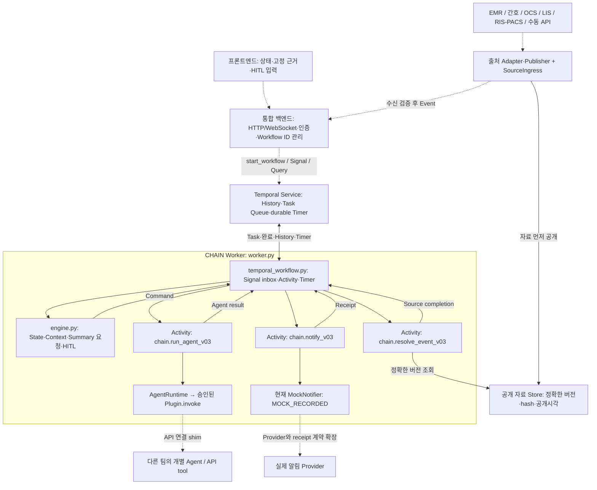

# CHAIN Temporal v0.3 통합팀 인계 안내

이 프로젝트는 외부 Event를 처리하는 Orchestrator와 Temporal Workflow/Activity를 제공한다.
현재 구현 버전은 `0.3-cleanup1`이다. 개별 Agent 구현은 Agent 팀에서 받고,
통합팀은 백엔드·프론트엔드·원천자료 API·알림 API를 아래 계약에 연결한다.

현재 Screening/tPA는 합성 fixture, Summary는 공개 구조화 자료 조합, Notifier는 SQLite 기록이다.
이들은 빈 함수가 아니라 교체할 Mock 구현이다. HTTP 서버·프론트엔드·실제 Agent 호출·실제 병원 API·
실알림 전달은 아직 없다. 이번 안내의 실행 명령은 **Worker 기동과 초기 Workflow 연결**을 확인한다.
실서비스 연결이나 전체 임상 흐름 완료를 의미하지 않는다.

실제 통합에서 실행하는 것은 다음 세 가지다.

1. **Temporal Service**: 실행 이력과 타이머를 보관하는 서버.
2. **CHAIN Worker**: 전달본의 `chain_demo.worker`를 상시 실행해 Workflow/Activity를 처리한다.
3. **통합 백엔드**: 프론트의 요청을 받아 환자별 Workflow를 시작하고 자료·결정·조회 요청을 전달한다.

환자별 Engine은 백엔드가 Workflow를 시작했을 때 Worker 안에서 생성된다.
`run_v03.py`가 대신하던 가상 병원·콘솔 입력·전체 실행 조립은 실제 통합에서 백엔드와 원천자료
연결 코드가 맡는다. 현재 제공된 것은 Worker와 Workflow 계약이며 **HTTP 백엔드 서버는 아직 없다.**
[실행 주체와 백엔드 연결표](#40-실제-통합의-실행-주체와-순서)를 먼저 읽고 아래 설치·연결 명령을 따른다.

## 1. 설치

프로젝트 루트에서 실행한다. Python **3.12 권장**, 현재 확인한 환경은 Python3.12.4다.
코드가 `asyncio.timeout()`을 사용하므로 최소 Python3.11이 필요하다.
[Python timeout 문서](https://docs.python.org/3/library/asyncio-task.html#asyncio.timeout)를 참고한다.

```bash
# 새 전달 폴더에서 구성한다. 개발 환경의 .venv는 전달하지 않는다.
python3.12 -m venv .venv
.venv/bin/python -m pip install -r requirements.txt
.venv/bin/python -c "import temporalio, yaml; print('runtime dependencies OK')"
```

| 패키지 | 용도 |
|---|---|
| `temporalio==1.31.0` | Python Client·Worker·Workflow·Activity |
| `PyYAML>=6.0.2,<7` | 설정과 Registry 로딩 |

pytest는 엔진 실행 의존성이 아니다. Agent API SDK나 HTTP 클라이언트 패키지는 실제 제공된
Agent/API 명세에 맞춰 통합팀이 `requirements.txt`에 추가한다.

Temporal Service는 Python 패키지와 별개다. 이미 준비된 Service가 있으면 그 주소를 사용한다.
로컬 개발에서는 [공식 CLI 설치 안내](https://docs.temporal.io/cli/setup-cli)를 따른다.

```bash
# macOS에서 CLI가 없을 때만 설치
brew install temporal

# 터미널 A: 로컬 개발 Service. runtime/은 실행 중 생성하는 자료다.
mkdir -p runtime
temporal server start-dev --db-filename runtime/temporal.db
```

기본 Service 주소는 `127.0.0.1:7233`, 개발 UI는 `http://localhost:8233`, namespace는 `default`다.
개발 서버 DB를 남겨도 아래의 메모리 PublishedStore가 영속화되는 것은 아니다.
현재 Worker CLI에는 namespace/TLS/API key 옵션이 없으므로 그런 연결은 `worker.py`의
`Client.connect()` 구성에서 추가해야 한다.

## 2. 전달할 파일과 제외할 파일

권장 전달 대상은 **독립 Temporal Worker와 통합용 계약 코드**다. 개발 저장소 전체를 복사하지 않는다.
이번에는 전달 범위를 문서화했으며 실제 전달 폴더·압축파일 생성이나 원본 삭제는 수행하지 않는다.

현재 Mock 설정을 그대로 두고 Worker를 시작할 수 있는 최소 전달 구조는 다음과 같다.

```text
chain_delivery/
  .gitignore                          # Git에서 전달 파일만 추적하는 허용 목록
  README.md
  requirements.txt
  chain_demo/                         # 아래 데모 전용 4개를 제외한 Python 코드 36개
  config/
    workflow_v03.yaml
    agents_v03.yaml
    policy_v03.yaml
    plugins.yaml
  episodes/stroke_reference_001_v03/
    initial.json                      # 합성 연결 확인용 초기 입력
    fixtures/cli/                     # 현재 등록 Mock의 설치 파일 38개 전체
```

`fixtures/cli/`는 테스트 자료지만 현재 기본 Agent/Registry가 읽고 hash를 검사한다.
**현재 설정에서는 삭제할 수 없다.** 실제 Agent 모듈을 등록하고 fixture backend·Registry 참조를
제거한 전달 설정을 검증한 뒤에는 이 디렉터리도 제외한다. 초기 입력은 통합 백엔드가 생성하도록
바꾸면 합성 `initial.json`도 제외할 수 있다. 모듈 내부 URL만 채우고 fixture를 삭제하는 방식은 동작하지 않는다.

`chain_demo/`에서는 아래 데모 전용 4개를 제외하고 나머지 Python 코드 36개를 유지한다.
Worker·Workflow·Activity·Agent 경로는 이 4개를 import하지 않는다.
전달 디렉터리에서 설정을 새로 로딩해 그 소스 목록으로 실행 manifest를 생성한다.
개발 저장소의 40개 소스를 이미 고정한 bundle이나 진행 중 Activity를 전달본에서 재개하는 방식은
지원하지 않는다. 기존 History의 결정적 Replay와 기존 Activity 재개 호환성은 별개다.

| 전달에서 제외할 경로 | 이유 |
|---|---|
| `chain_demo/run_v03.py` | Simulator·콘솔·시험 Driver를 묶는 데모 진입점 |
| `chain_demo/local_runtime.py` | Temporal Service 없이 실행하는 Local Harness |
| `chain_demo/temporal_runtime.py` | Simulator 데모의 embedded Worker/Client 수명 관리 |
| `chain_demo/hitl_console.py` | 데모의 콘솔 입력. 통합 프론트/백엔드는 HITL 계약에 직접 연결 |
| `tests/` 전체 | 자동 시험·Harness·기대 결과·시험 fixture |
| `tools/` 전체 | 시험용 Activity/Workflow·Replay·변환·fixture 생성·기록 응답·Driver |
| `archive/` 전체 | 이전 버전·과거 증거·백업 |
| `output/` 전체 | 기존 실행의 Snapshot·로그·History·SQLite |
| `reference/` 전체 | 개발 중 변환·검증에 사용한 원본 |
| `simulator/` 전체 | 가상 병원. 독립 Worker에는 불필요 |
| `examples/` 전체 | 데모와 비임상 확장 예제 |
| `docs/` 전체 | 개발·검증·추가 설명 자료. 통합 필수 절차는 이 README에 포함 |
| `episodes/stroke_reference_001_v03/sources/` | 가상 병원 원천자료 |
| `episodes/stroke_reference_001_v03/simulation.yaml` | 가상 일정 |
| `episodes/stroke_reference_001_v03/provenance.json`, `README.md` | 합성 에피소드 개발 설명 |
| `AGENTS.md`, `CHANGES.md` | 우리 개발 지침과 변경 기록 |
| `requirements-dev.txt`, `pytest.ini` | 개발 의존성과 시험 수집 설정 |
| `.venv/`, `__pycache__/`, `.pytest_cache/`, `*.pyc`, `.DS_Store` | 환경·캐시 |
| `.git/`, `.agents/`, `.codex/`, `.aws/`, `.env*`, 인증서·키·기존 DB·실환자 자료 | 실행 코드에 포함되지 않는 로컬 설정·자료 |

위 최소 구조를 허용 목록으로 복사한다. Simulator를 제외한 전달본에서
`python -m chain_demo.run_v03` 또는 `--test-mode` 데모를 실행하는 것은 지원하지 않는다.
`runtime/`은 수신 팀의 환경에서 생성하며 기존 실행 DB를 전달하지 않는다.

이 Git 저장소는 위 전달 파일81개와 `.gitignore`를 합한82파일을 추적하도록 준비했다.
테스트·개발 문서·이전 버전은 로컬에 보존하며 원격 저장소와 새 clone에는 포함되지 않는다.
새 백엔드나 Plugin 파일을 추가할 때는 `.gitignore`의 파일·상위 디렉터리 허용 목록도 갱신한다.

## 3. Temporal 엔진 구조

실선은 제공 코드의 처리 경로다. 점선은 통합팀이 구현하거나 실제 서비스로 교체할 부분이다.
Temporal Service는 별도 프로세스이며 Workflow/Activity의 Python 코드는 Worker에서 실행된다.



현재 Store는 `PublishedStore` 메모리 구현이다. 현재 독립 Worker에는 Publisher API가 없다.
그림의 출처 Publisher·백엔드·Worker가 서로 다른 프로세스이면 공유 Store/resolver를 구현해야 한다.
현재 구조에서는 `create_worker()`와 Publisher/Ingress에 **동일한 Store 객체를 주입하는 구성**이 가능하다.
공통 Engine과 Workflow 안에는 파일 조회·HTTP 호출·Plugin import를 추가하지 않는다.

| 코드 | 책임 |
|---|---|
| [worker.py](chain_demo/worker.py) | Worker 생성·Activity/Workflow 등록·연결 객체 조립 |
| [temporal_workflow.py](chain_demo/temporal_workflow.py) | `ChainOrchestratorV03`, Signal inbox·Activity scheduling·Timer |
| [engine.py](chain_demo/engine.py) | 순수 reducer·State·Context·결과 수락·HITL 의존성 |
| [orchestration_activities.py](chain_demo/orchestration_activities.py) | resolve/invoke/notify 외부 I/O 경계 |
| [orchestration_config.py](chain_demo/orchestration_config.py), [agent_config.py](chain_demo/agent_config.py), [registry.py](chain_demo/registry.py) | 설정 검증·설치/승인·실행별 hash 고정 |
| [contracts.py](chain_demo/contracts.py), [source_contracts.py](chain_demo/source_contracts.py), [validation.py](chain_demo/validation.py) | Event·Context·Agent·HITL 계약과 검증 |
| [context.py](chain_demo/context.py), [evidence.py](chain_demo/evidence.py), [agent_requests.py](chain_demo/agent_requests.py) | Snapshot·원천 근거·범위 제한·정정 의존성 |
| [orchestration_schema.py](chain_demo/orchestration_schema.py), [expressions.py](chain_demo/expressions.py) | 지원 YAML Action·조건 문법 |

## 4. 엔진 실행과 백엔드 연결

### 4.0. 실제 통합의 실행 주체와 순서

`python -m chain_demo.worker`는 **엔진 코드를 실행하는 상시 프로세스**다.
새 Episode의 Workflow를 최초 시작할 때 백엔드가 `start_workflow()`를 호출하면,
Worker의 `ConfigurableClinicalWorkflow.run()`이 해당 Episode의 `Engine`을 생성한다.
Worker를 환자마다 새로 켜는 것이 최종 통합 구조는 아니다.

```text
프론트 → 통합 백엔드 → Temporal Service → CHAIN Worker
          생성 요청       작업 전달        Workflow 안에서 Engine 생성
          Event/결정      Signal 전달      Context·State·Agent·HITL 처리
          상태 조회       Query 전달       Snapshot 반환
```

| 언제 | 실행 주체 | 실제 연결 코드 |
|---|---|---|
| 시스템 기동 | 운영 환경 | Temporal Service와 Worker를 시작한다. Worker 명령은4.2절 |
| 백엔드 기동 | 통합팀의 백엔드 앱 | `Client.connect()`로 Service에 연결하고 Worker와 같은 실행 설정을 준비한다 |
| 새 Episode 생성 | 백엔드의 생성 handler | initial8필드를 검증하고 `Client.start_workflow()`를 호출한다. 계약과 실행 예시는4.3절 |
| 새 기록·검사 도착 | 원천자료 연결 코드와 백엔드 | 자료를 먼저 보존·공개하고 Ingress를 거쳐 `submit_event` Signal을 보낸다 |
| 의료진 선택 | 프론트 → 백엔드 | 고정 요청 ID·근거 ID를 포함해 `submit_decision` Signal을 보낸다 |
| 화면 갱신·요약 요청 | 백엔드 → 프론트 | `snapshot` Query 또는 `request_context` Signal을 사용한다. SDK 호출은4.4절 |

통합팀이 작성할 백엔드의 API 경계를 아래처럼 둘 수 있다. **다음 URL은 연결 설계 예시이며,
현재 프로젝트에 구현된 endpoint가 아니다.** 백엔드 프레임워크·기동 명령은 해당 팀의 앱에서 정한다.

| 백엔드 API 예시 | 내부에서 할 일 |
|---|---|
| `POST /episodes` | Episode→Workflow ID를 고정·보존하고 Workflow를 최초 시작 |
| `POST /episodes/{id}/events` | 공개 자료와 버전 참조 검증·Ingress 수신·Event Signal |
| `POST /episodes/{id}/decisions` | 사용자/역할 확인·HITL 응답 검증·Decision Signal |
| `POST /episodes/{id}/context-requests` | 요청 ID·scope를 포함해 Context Signal |
| `GET /episodes/{id}` | 저장한 Workflow ID로 handle을 얻어 Snapshot Query |

프론트는 이 백엔드 API를 호출한다. Worker의 함수나 `Engine` 객체를 프론트에서 직접 호출하지 않는다.
후속 API 요청은 `client.get_workflow_handle(workflow_id)`로 기존 실행을 찾는다.
생성 API 재시도에도 동일 Episode의 Workflow ID를 사용하며 중복 Workflow 생성 방지를 구현한다.
아래4.3절의 UUID 예시는 연결 확인용이다. 운영에서 재시도마다 새 UUID를 만들어 실행하지 않는다.

**현재 독립 Worker CLI는 한 Episode의 메모리 Store에 묶인 기동 확인용 구성이다.**
Temporal은 여러 Workflow를 실행할 수 있지만 현재 자료 Store는 다른 Episode의 자료를 거부한다.
백엔드와 Worker를 별도 프로세스로 운영하고 여러 Episode를 처리하려면,6절의 공유·영속 Store,
버전 조회 resolver, Episode별 Ingress/조회 routing, Publisher API를 먼저 연결해야 한다.
한 Episode의 초기 연결에서는 `create_worker()`에 Publisher와 동일한 Store 객체를 주입할 수 있다.
CLI 자체에는 외부에서 그 Store에 자료를 공개하는 API가 없다.

독립 Workflow에는 데모 CLI의 전체600초 실행 제한이 없다. 다음 Event·HITL 응답을 기다리고
YAML에 선언한 타이머를 처리한다. 실제 통합에서는 시험 시계·기록된 자동 응답을 넣지 않는다.
현재 Mock Agent는 임의의 운영 입력을 평가할 수 없으므로 실제 Agent 연결도5절에 따라 완료해야 한다.

### 4.1. 초기 입력 준비

현재 기본 `initial.json`의 날짜는 합성 시나리오 날짜다. 아래 연결 확인에서는 초기 입력만 복사하고
도착시각을 현재로 설정한다. 미래 문서·검사·Agent 정답을 추가하지 않는다.
운영에서는 백엔드가 실제 생성 시점에 알려진 아래 8필드만 생성한다.

```bash
.venv/bin/python - <<'PY'
import json
from datetime import datetime, timezone
from pathlib import Path
from chain_demo.data_io import load_initial

initial = load_initial("episodes/stroke_reference_001_v03/initial.json")
initial["arrival_time"] = datetime.now(timezone.utc).isoformat()
Path("runtime").mkdir(exist_ok=True)
with Path("runtime/initial.json").open("x", encoding="utf8") as stream:
    json.dump(initial, stream, ensure_ascii=False, indent=2)
PY
```

허용 필드: `site_id`, `patient_id`, `encounter_id`, `episode_id`, `age`, `sex`, `bed`, `arrival_time`.
추가 필드는 거부된다. 파일이 이미 있으면 위 명령도 덮어쓰지 않는다.

### 4.2. Worker 시작

터미널 A의 Service를 유지하고 터미널 B에서 실행한다.

```bash
.venv/bin/python -m chain_demo.worker \
  --address 127.0.0.1:7233 \
  --task-queue chain-v03 \
  --initial runtime/initial.json \
  --receipt-db runtime/notices.sqlite
```

`Worker ready`는 Worker가 연결·등록됐다는 뜻이다. Workflow 시작이나 자료 공개는 별도다.
이 CLI는 initial 1건에 묶인 빈 Store를 만들며 HTTP API·복수 Episode routing을 제공하지 않는다.
현재 Worker는 한 설정의 `engine_hash`에 고정되어 있다. 다른 bundle의 Worker를 같은 Task Queue에
섞으면 Activity가 거부될 수 있다. 새 버전 배포는 새 Queue/Worker로 구성하고, 진행 중 실행은
기존 고정 설정·소스·Store를 유지한다. 자동 다중 버전 routing은 아직 구현되어 있지 않다.

### 4.3. 초기 Workflow 시작과 조회

터미널 C에서 아래 SDK 연결 코드를 실행한다. 통합 백엔드의 Episode 생성 handler도 이 계약을 사용한다.
Worker와 동일한 설정·초기 입력·Task Queue를 사용한다.
실행 구성은 백엔드 기동 또는 배포 시 고정하고, 운영 생성 API는 해당 고정 구성을 사용한다.

```bash
.venv/bin/python - <<'PY'
import asyncio
from uuid import uuid4
from temporalio.client import Client
from chain_demo.data_io import load_initial
from chain_demo.orchestration_config import load_orchestration_bundle
from chain_demo.temporal_workflow import ConfigurableClinicalWorkflow

async def main():
    initial = load_initial("runtime/initial.json")
    configuration = load_orchestration_bundle()
    client = await Client.connect("127.0.0.1:7233")
    handle = await client.start_workflow(
        ConfigurableClinicalWorkflow.run,
        {"bundle": configuration["engine"], "initial": initial},
        id="chain-" + initial["episode_id"] + "-" + uuid4().hex,
        task_queue="chain-v03",
    )
    async with asyncio.timeout(10):
        while True:
            state = await handle.query("snapshot")
            if state.get("state") is not None:
                break
            await asyncio.sleep(0.05)
    print("workflow_id:", handle.id)
    print("state:", state["state"], "done:", state["done"])

asyncio.run(main())
PY
```

예상 결과는 `state: S0 done: False`다. 초진 Event를 기다리는 정상 대기 상태이며 임상 경로 완료가 아니다.
백엔드는 반환한 Workflow ID를 Episode에 연결해 보존한다.
위 코드의 기본 Client namespace는 `default`이며 Worker와 일치해야 한다.

### 4.4. 프론트엔드·백엔드의 입출력

아래는 백엔드의 **async handler 내부**에서 사용할 SDK 호출이다. 해당 객체는 handler가 구성한다.
REST/WebSocket URL은 아직 구현되어 있지 않으며 통합팀이 설계한다.

```python
# accepted_event: 자료 공개 후 SourceIngress.receive()가 반환한 표준 Event
await handle.signal("submit_event", accepted_event)

# decision: 현재 열린 요청을 참조하는 검증된 HITL 응답
await handle.signal("submit_decision", decision)

# scope: 필요한 항목만 요청
await handle.signal("request_context", {"request_id": request_id, "scope": scope})

snapshot = await handle.query("snapshot")
```

Signal 전송 완료는 엔진의 수락·처리 완료가 아니다. 백엔드는 request/event ID로 Snapshot의
`audit`, `context_requests`, `hitl_history`와 결과를 대조해 프론트엔드에 상태를 알려야 한다.
RPC timeout·HTTP 응답 deadline·상태 갱신 전송은 백엔드에서 구현한다.
시험 전용 `advance_test_time` Signal은 일반 서비스 API로 노출하지 않는다.
[Temporal Client 공식 안내](https://docs.temporal.io/develop/python/client/temporal-client)를 참고한다.

## 5. Agent 팀의 구현 연결

현재 [agents/runtime.py](chain_demo/agents/runtime.py)의 `AgentRuntime.invoke()`는 Registry의
`module:function`을 호출한다. Plugin은 다음 **동기 함수 계약**을 구현한다.

```python
def invoke(request, snapshot, services) -> dict:
    # 제공된 scope의 Snapshot을 Agent API 입력으로 변환하고 호출한다.
    # Agent 응답을 workflow.agents.<alias>.outputs의 도메인 결과 dict로 변환한다.
    # request_id를 재시도 식별자로 사용한다.
    # 이 함수의 본문은 통합팀이 실제 Agent/API 명세에 맞춰 구현한다.
    raise NotImplementedError("Register the approved Agent/API implementation")
```

이 코드는 구현할 계약을 설명하는 예시이며 설치된 모듈이 아니다.
`async def invoke()`는 현재 Runtime이 await하지 않으므로 그대로 등록할 수 없다.
비동기 SDK가 필요하면 Activity/Runtime 경계의 비동기 호출 방식을 별도로 구현한다.
동기 호출은 `OrchestrationActivities.invoke()`의 `asyncio.to_thread()`에서 실행된다.
Activity timeout과 별도로 API 클라이언트 자체의 연결·응답 timeout이 필요하다.

`request`에는 `request_id`, Agent ID/version, `manifest_hash`, `mode`, `input_snapshot_id`, `scope`,
근거 `dependencies`, `evaluated_at`이 있다. `snapshot['facts']`는 요청 scope만 포함한다.
미확보 자료는 UNKNOWN/PENDING으로 보존하고 성공값으로 채우지 않는다.
Plugin은 **도메인 결과 dict만 반환**한다. 공통 `chain-agent-result/v0.3` envelope의 식별자·status·
evidence는 Runtime이 조립하고 [contracts.py](chain_demo/contracts.py)에서 검증한다.
외부 API의 전체 envelope를 내부 `result`로 그대로 넣지 않는다.

현재 Runtime은 `ValueError`를 `FAILED/AGENT_INVALID_OUTPUT`으로, `FixtureError`를
`FAILED/해당 오류 코드`로 반환한다. 그 외 통신 예외는 Activity 실패·설정된 재시도로 전달된다.
Plugin이 오류 dict를 정상 반환하면 Runtime은 먼저 `SUCCESS`로 감싸므로 오류를 성공 payload로
반환하지 않는다. API의 업무 실패·전송 실패를 어떻게 구분할지 shim 계약에 명시한다.

| 확인·수정 위치 | 통합 작업 |
|---|---|
| [agents/stroke_screening.py](chain_demo/agents/stroke_screening.py) | 현재 Screening fixture 구현. 실제 Screening shim으로 교체할 기준 |
| [agents/tpa_decision_support.py](chain_demo/agents/tpa_decision_support.py) | 현재 evidence-only fixture 구현. interim/final API 응답 정규화 기준 |
| [agents/clinical_summary.py](chain_demo/agents/clinical_summary.py) | scope 기반 Context 구조화·캐시. 현재 실제 NLP 아님 |
| [agents/services.py](chain_demo/agents/services.py) | 현재 cache/backend만 제공. API/tool client 주입이 필요하면 여기와 Runtime 생성 경계 확장 |
| [config/agents_v03.yaml](config/agents_v03.yaml) | Agent ID/version, implementation, mode, backend |
| [config/plugins.yaml](config/plugins.yaml) | 설치 entrypoint·계약·승인 상태·파일 SHA·manifest_hash |
| [config/policy_v03.yaml](config/policy_v03.yaml) | 승인 version·scope·actions |
| [config/workflow_v03.yaml](config/workflow_v03.yaml) | mode별 input scope·outputs와 State에서 호출할 작업 |

현재 `backend.kind`는 `structured`와 `fixture`만 지원한다. `kind: api`나 URL key를 YAML에 추가하면
거부된다. 동기 API shim을 새 설치 Plugin으로 등록하고 fixture가 필요 없는 `structured` backend를
사용할 수 있다. 이 이름은 HTTP 자동 연결을 뜻하지 않는다. 기존 Screening/tPA 모듈은 fixture와
`mock_only`를 강제하므로 backend 값만 바꾸지 말고 실제 구현 entrypoint로 교체한다.

권장 작업 순서는 다음과 같다.

1. Agent 팀과 mode별 입력 scope·응답 필드·실패 의미를 합의한다.
2. 전달 루트 안의 `chain_demo/agents/<new_agent>.py` 같은 Python shim 모듈에서
   입력 변환·API 호출·응답 검증·도메인 결과 변환을 구현한다. 현재 Registry는 entrypoint 파일이
   전달 루트 내부의 설치 파일과 정확히 일치하는지 검사한다. 외부 패키지를 설치하는 것만으로 등록되지 않는다.
3. Agent YAML과 Registry entrypoint·Policy 승인 version/scope/action을 맞춘다.
4. API 응답에 맞는 `workflow.agents.<alias>.outputs`를 선언한다. Mock 전용 필드를 실 결과라고 유지하지 않는다.
5. Registry `files`의 SHA-256과 `manifest_hash`를 갱신한다. `canonical_hash()`와 `verify_installation()`은
   [validation.py](chain_demo/validation.py)·[registry.py](chain_demo/registry.py)에 있다.
6. 설치 검증과 새 실행을 확인한 뒤 fixture 등록·파일을 전달본에서 제거한다.

새 State/Agent는 지원 YAML 문법 안에서 추가한다. 공통 Engine·Temporal에 Agent 이름 분기를 넣지 않는다.
Summary는 scope·Snapshot·구현 버전 기반 캐시와 원천 Context 분리를 유지한다.
현재 엔진은 반환 Structured Context가 요청한 원천 facts와 일치하는지 검사하므로
임의 추론값을 원천 facts로 추가하는 NLP 연결은 별도 계약 설계가 필요하다.

## 6. 병원 API와 API tool 연결

출처별 연결 기준은 [adapters/emr.py](chain_demo/adapters/emr.py),
[nursing.py](chain_demo/adapters/nursing.py), [ocs.py](chain_demo/adapters/ocs.py),
[lis.py](chain_demo/adapters/lis.py), [ris_pacs.py](chain_demo/adapters/ris_pacs.py),
[manual.py](chain_demo/adapters/manual.py)다. 현재는 모두 파일 공개 Mock을 사용한다.

| 연결 지점 | 작업 |
|---|---|
| [adapters/base.py](chain_demo/adapters/base.py) `MockSourceAdapter.publish()` | 공개 후 Event 생성·emit 순서 참고. 실제 API Adapter는 파일 읽기를 API 수집/정규화로 교체 |
| [adapters/store.py](chain_demo/adapters/store.py) `PublishedStore.publish()/resolve()` | 원천 자료의 정확한 버전·content hash·공개시각 보존. 공유·영속 Store로 교체할 경계 |
| [adapters/ingress.py](chain_demo/adapters/ingress.py) `SourceIngress.receive()` | identity·중복·수신시각·수신 sequence 검증 |
| 같은 파일의 `resolve_source()` | Event 참조와 조회된 자료 일치 확인·Context completion 구성 |
| [source_contracts.py](chain_demo/source_contracts.py) | 원천 record·정정·completion 계약 |
| [orchestration_activities.py](chain_demo/orchestration_activities.py) `resolve()` | Worker에서 정확한 버전을 조회하는 외부 I/O 경계 |
| [worker.py](chain_demo/worker.py) `create_worker()` | 동일 Store/resolver를 Worker와 수집 경계에 주입할 구성 지점 |

통합 순서는 **원천자료 공개·보존 → 표준 Event 생성 → Ingress 수신 검증 → submit_event Signal →
Activity의 정확한 버전 조회 → Context 반영**이다. 과거 발생 사실도 CHAIN에 유입된 이후에만 사용한다.
Event에는 identity, event_id, event_type, source_ref, sequence, 발생/공개/유입시각,
payload의 data_ref/content_hash와 payload_hash를 유지한다. 정확한 필드는 `contracts.validate_event()`를 따른다.

현재 `validate_record()`는 `synthetic: true`인 합성 record만 허용한다.
실제 병원 자료에는 운영용 출처 계약을 명시적으로 정의하고 Adapter/Store/검증을 개정해야 한다.
실자료를 `synthetic: true`로 표시해 통과시키지 않는다. 최종 Context completion 계약을 지키면
공통 Workflow의 입출력 경계를 유지할 수 있다.

현재 독립 Worker의 메모리 Store에는 외부 입력 API가 없다. 백엔드가 다른 프로세스의 Store에
자료를 넣고 Signal만 보내면 Worker의 조회는 실패한다. 같은 Store를 주입하는 backend bootstrap을
구현하거나, 공유 저장소와 resolver 및 Episode routing을 구현한다. 재시작 복구도 이 작업에 포함된다.

Agent가 호출하는 API tool도 HTTP 배선이 자동 생성되는 구조가 아니다. Policy의 `READ_DATA_API`는
등록 인가 metadata이며 실제 호출 코드는 승인된 shim/client와 Activity 계층에 둔다.
현재 Policy의 오더·투약·EMR 쓰기·Agent 직접 알림 금지를 API 연결로 우회하지 않는다.
새 Action/tool primitive는 `orchestration_schema.py`·Engine Command·Activity 계약 확장 대상이다.

## 7. Notifier 연결

[notifier.py](chain_demo/notifier.py)의 `MockNotifier.record()`는 SQLite에 요청별 receipt를 기록하고
콘솔에 `MOCK_RECORDED`를 남긴다. 실제 전송 함수는 없다. 생성 지점은 `worker.create_worker()`이고,
호출 지점은 `OrchestrationActivities.notify()`다.

실알림 연결은 Provider 클라이언트 구현과 함께 다음 계약을 확장해야 한다.

- `notifier.py`: provider 호출·명시적 전송 결과·동일 request_id 중복 효과 방지.
- `orchestration_schema.py`: 현재 CONSOLE/LOG 전용 channel 검증과 새 채널 선언.
- `engine.py`의 notify 완료 수락: 현재 `MOCK_RECORDED`만 허용하는 receipt 상태 검증.
- `config/workflow_v03.yaml`, `policy_v03.yaml`: channel·template·recipient·승인 범위.
- `orchestration_activities.py`, `worker.py`: 실제 구현 객체 주입과 Activity 실행.

Notifier만 바꿔 `DELIVERED`를 반환하면 현재 엔진은 거부한다. 발송·접수·의료진 확인은 Provider가
실제로 확인한 상태에만 대응하도록 계약을 정의한다. 재시도 식별자는 기존 `request_id`를 유지한다.
Mock SQLite의 중복 방지는 실제 Provider의 원격 전송 중복 방지를 자동 보장하지 않는다.

## 8. 프론트 HITL 연결과 통합 순서

프론트에는 `snapshot['open_hitl'][checkpoint]` 중 `status == 'OPEN'`인 기록의
`request`, 고정 `snapshot`, `results`를 표시한다. 최신 전체 Context로 열린 요청의 근거를 덮어쓰지 않는다.
응답에는 `contract_schema: chain-hitl-decision/v0.3`, `request_id`, `evidence_snapshot_id`, decision, actor의 role/staff_id,
confirmed_items, evidence_viewed, comment, recorded_at을 포함한다.
정확한 형식은 [contracts.py](chain_demo/contracts.py)의 `validate_hitl_decision_shape()`와
`validate_hitl_decision()`을 확인한다. 전달에서 제외한 콘솔 모듈을 복원할 필요는 없다.

백엔드는 실제 로그인 사용자·역할을 actor에 연결하고 형식을 검증한 뒤 `submit_decision`으로 보낸다.
현재 콘솔의 역할 입력은 인증 구현이 아니다. 명시적 정정으로 무효화된 구 요청 응답은 거부될 수 있으므로
UI는 request_id·상태 갱신을 반영한다. 단순 정보 추가는 열린 요청을 새로 만들지 않는다.
decision 값은 해당 `request['options']`를 사용한다. 현재 HITL #2의 화면 YES/NO에 대응하는 코드는
`THROMBOLYSIS_YES`/`THROMBOLYSIS_NO`다. 임의로 `YES`/`NO` 문자열을 보내면 거부된다.

통합팀의 작업 순서는 다음과 같다.

1. 설치·bundle 검증·Worker 연결·초기 S0 Workflow를 확인한다.
2. Agent 팀의 모듈/API 명세를 받아 shim·Registry·YAML을 연결한다.
3. 원천자료 계약과 공유 Store/resolver·Publisher/Ingress를 구현한다.
4. Episode 생성·Event 입력·상태 조회·Context 요청·HITL 응답의 백엔드 API를 구현한다.
5. 프론트의 상태·고정 근거·결정 입력을 연결한다.
6. 실제 Notifier의 채널·receipt 계약과 Provider를 연결한다.
7. 통합팀 환경에서 중복 Event·API 실패/재시도·관련 정정·Worker 재시작·History Replay를 검증한다.
8. 실제 구현을 사용하는 전달 설정에서 fixture·합성 initial을 제거하고 최종 허용 목록을 확정한다.

유지할 임상 흐름은 Screening POSITIVE/NEGATIVE, HITL #1의 PROCEED/거절/DEFER,
NCCT 완료와 해당 오더 일치에 따른 S2→S2_1, final 결과 이후 HITL #2의 YES/NO/HOLD다.
CT 오더·처방·투약을 CHAIN이 자동 생성하지 않는다. 새 임상 기준이나 전이 Gate는 통합 과정에서
임의로 추가하지 않는다.

실제 Agent·병원 API·알림·사용자 인증·프론트/백엔드 서버·영속 자료 Store는 통합 구현 범위다.
현재 코드의 실행·검증 기록과 이전 버전은 우리 개발 저장소에서 별도로 유지한다.
